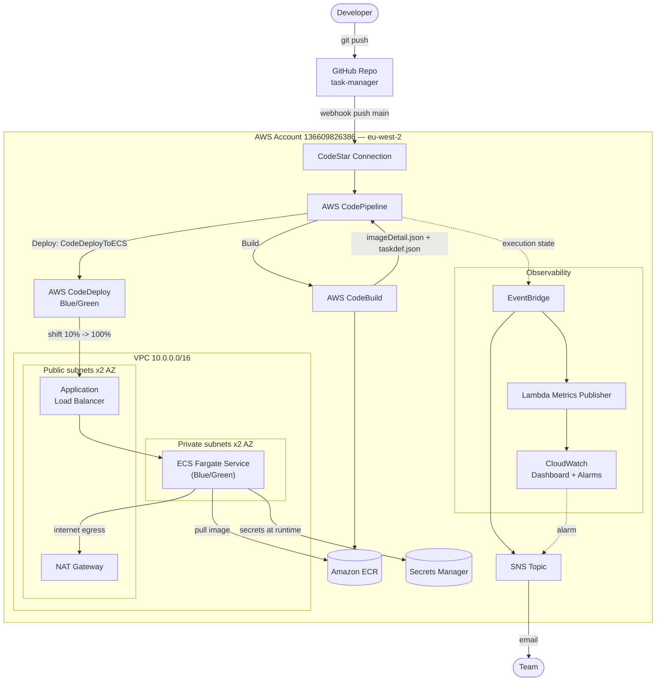
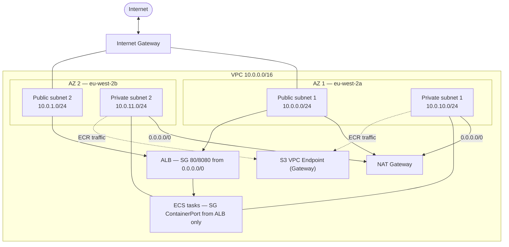
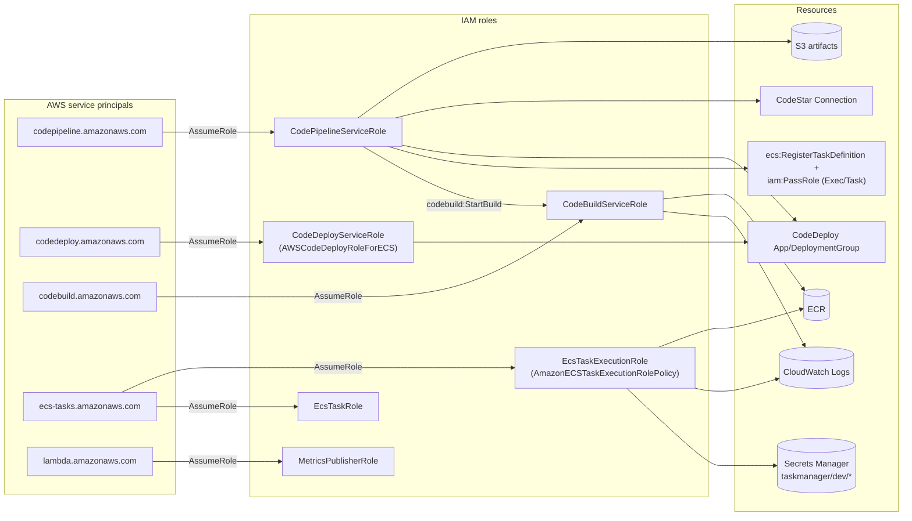
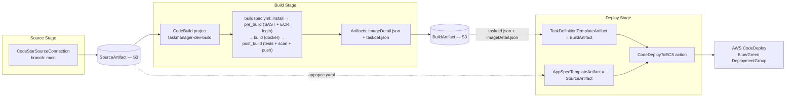
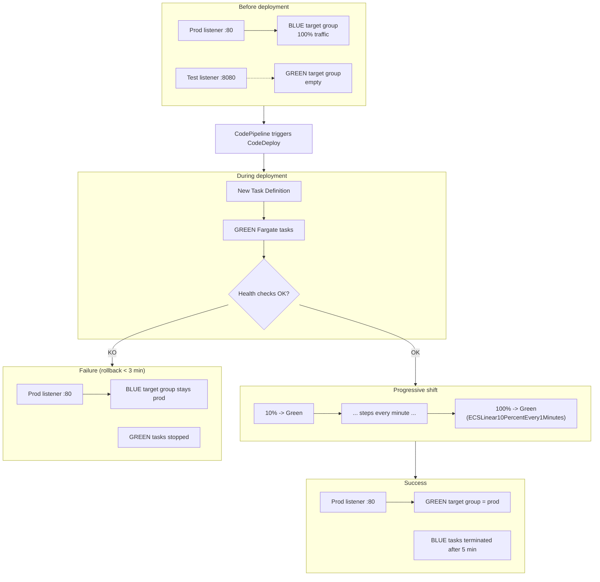

# INTERNSHIP REPORT

## Complete CI/CD Pipeline with AWS CodePipeline and Amazon ECS Fargate

**Field:** DevOps & Cloud Infrastructure
**Internship duration:** 8 weeks — July / August 2026
**Host organization:** [TO BE COMPLETED — COMPANY INFORMATION]
**Written by:** Khaoula MECHRIA
**Industry supervisor:** [TO BE COMPLETED]
**Academic supervisor:** [TO BE COMPLETED]
**Project repository:** `khaoula-mechria/Pipeline-CI-CD-complet-avec-CodePipeline-ECS-Fargate` (GitHub)
**Date written:** August 2026

---

## Acknowledgements

*[TO BE COMPLETED — acknowledgements to the industry supervisor, the academic supervisor, and the host team. This version of the report was built exclusively from the verifiable technical artifacts of the repository (code, CloudFormation, progress logs, screenshots); information about the host organization and supervising individuals is not included here and must be added by the author.]*

---

## Summary

This report documents an eight-week internship dedicated to designing, implementing, and validating a fully automated Continuous Integration / Continuous Deployment (CI/CD) pipeline on AWS for a containerized web application (`task-manager`, Node.js/Express). The target architecture relies on AWS CodePipeline, AWS CodeBuild, Amazon ECR, AWS CodeDeploy, and Amazon ECS Fargate, with zero-downtime Blue/Green deployment, security quality gates (Semgrep SAST, Amazon Inspector v2 vulnerability scanning via ECR), secret management through AWS Secrets Manager, CPU-driven auto scaling, and a complete observability layer (CloudWatch, SNS, EventBridge, a metrics-publishing Lambda).

The entire infrastructure was codified as twelve independent AWS CloudFormation templates, deployed in a strict dependency order. The approach favoured exhaustive local validation — static analysis (`cfn-lint`) and partial emulation through LocalStack Community — before any real deployment, in order to control the cost and risk of a production AWS account. This approach made it possible to identify and fix roughly a dozen genuine defects (incomplete IAM permissions, incorrectly resolved file paths, inconsistencies between ECS task templates) before the very first deployment attempt.

On August 15, 2026, a complete deployment cycle was executed on a real AWS account: all twelve stacks were successfully provisioned, four additional blocking bugs — specific to the real behaviour of AWS services and undetectable by static tools — were diagnosed and fixed (ECR tag immutability incompatible with BuildKit, a scan waiter incompatible with Amazon Inspector v2's continuous scanning mode, missing IAM permissions for Inspector v2, software vulnerabilities in the base Docker image), and a real CodePipeline execution was then observed end-to-end: source retrieval, build and test of the image (63 tests, 100% coverage), SAST analysis (0 findings out of 242 rules), a blocking vulnerability scan, manual approval, and a complete Blue/Green deployment on ECS Fargate with a progressive shift of 100% of traffic to the new version, irrefutably verified through a `/version` endpoint returning the deployed commit's SHA. The entire infrastructure was then torn down to avoid any residual cost.

This report systematically compares the requirements of the specification document to what was actually implemented and validated, documents the difficulties encountered together with their diagnosis and resolution, and offers a synthesis of the skills acquired and possible improvements.

---

## Abstract

This report documents an eight-week internship dedicated to designing, implementing and validating a fully automated CI/CD pipeline on AWS for a containerized web application. The target architecture relies on AWS CodePipeline, AWS CodeBuild, Amazon ECR, AWS CodeDeploy and Amazon ECS Fargate, with zero-downtime Blue/Green deployment, security quality gates (Semgrep SAST, Amazon Inspector v2 vulnerability scanning via ECR), secret management through AWS Secrets Manager, CPU-based auto scaling, and a complete observability layer built on CloudWatch, SNS, EventBridge and a metrics-publishing Lambda function.

The entire infrastructure was codified as twelve independent AWS CloudFormation templates, deployed in a strict dependency order. The methodology favoured exhaustive local validation — static analysis (`cfn-lint`) and partial emulation through LocalStack Community — before any real deployment, to control cost and risk on a real AWS account. This approach surfaced and fixed roughly a dozen genuine defects before the first deployment attempt.

On 2026-08-15, a full deployment cycle was executed on a real AWS account: all twelve stacks reached `CREATE_COMPLETE`, four additional blocking bugs specific to real AWS service behaviour were diagnosed and fixed, and a real CodePipeline execution was observed end-to-end — source retrieval, build and test (63 tests, 100% coverage), SAST analysis (0 findings out of 242 rules), a blocking vulnerability scan, manual approval, and a complete Blue/Green deployment on ECS Fargate with a full traffic shift to the new revision, conclusively verified through a `/version` endpoint returning the deployed commit SHA. The whole infrastructure was then torn down to avoid residual cost.

This report systematically compares the requirements specification to what was actually implemented and validated, documents the difficulties encountered with their diagnosis and resolution, and proposes a synthesis of acquired skills and improvement perspectives.

---

## List of Acronyms

| Acronym | Meaning |
|---|---|
| ALB | Application Load Balancer |
| AMI | Amazon Machine Image |
| ARN | Amazon Resource Name |
| CDC | *Cahier des Charges* (Requirements Specification) |
| CI/CD | Continuous Integration / Continuous Deployment |
| CPU | Central Processing Unit |
| CVE | Common Vulnerabilities and Exposures |
| ECR | Elastic Container Registry |
| ECS | Elastic Container Service |
| HPA | Horizontal Pod Autoscaler (Kubernetes term used by analogy in the CDC) |
| IaC | Infrastructure as Code |
| IAM | Identity and Access Management |
| JSON | JavaScript Object Notation |
| KPI | Key Performance Indicator |
| NAT | Network Address Translation |
| SAST | Static Application Security Testing |
| SG | Security Group |
| SLA | Service Level Agreement |
| SNS | Simple Notification Service |
| SSO | Single Sign-On |
| TG | Target Group |
| US | User Story |
| VPC | Virtual Private Cloud |
| YAML | Yet Another Markup Language |

---

## Table of Contents

- General Introduction
- Chapter 1 — Internship and Project Context
  - 1.1 Host Organization
  - 1.2 Project Context
  - 1.3 Problem Statement
  - 1.4 Proposed Solution
  - 1.5 Objectives and Scope
  - 1.6 Methodology / Project Management
  - Chapter Conclusion
- Chapter 2 — Study, Analysis and Design
  - 2.1 State of the Art / Theoretical Background
  - 2.2 Requirements Analysis
  - 2.3 Existing Solutions / Approaches
  - 2.4 Choice of Solution
  - 2.5 System Architecture and Design
  - Chapter Conclusion
- Chapter 3 — Implementation
  - 3.1 Work Environment
  - 3.2 Technologies and Tools
  - 3.3 Implementation of the Different Components
  - 3.4 Integration
  - Chapter Conclusion
- Chapter 4 — Testing and Results
  - 4.1 Testing Strategy
  - 4.2 Test Scenarios
  - 4.3 Results and Evaluation
  - 4.4 Performance / Metrics
  - 4.5 Discussion and Limitations
  - Chapter Conclusion
- General Conclusion and Future Work
- Bibliography / Webography
- Appendices

---

## List of Figures

*(Continuous numbering; each figure is referenced in the text of the section where it appears.)*

1. Use case diagram — Complete CI/CD Pipeline
2. Physical architecture and logical architecture of the solution
3. Global AWS architecture (end-to-end flow)
4. Network architecture (VPC, subnets, NAT)
5. Class diagram and object diagram of the domain
6. Collaboration diagram — from push to deployment
7. Detail of the CodePipeline stages (Source → Build → Deploy)
8. Detailed sequence diagrams — trigger, Blue/Green, rollback
9. IAM roles and service principals
10. Activity diagrams — CI/CD Build, Blue/Green Deployment, Alerting
11. State diagram — lifecycle of a deployment
12. Detailed Blue/Green deployment (CodeDeploy + ECS)
13. The twelve CloudFormation stacks in the `CREATE_COMPLETE` state
14. SNS subscriptions to the pipeline notifications topic
15. Pipeline running — Source and Build succeeded, approval just validated
16. Pipeline running — approval validated, Deploy stage in progress
17. Semgrep SAST scan summary — 0 findings out of 242 rules
18. SAST validated, ECR login, tag `f7bde5dd`, start of the Build stage
19. Jest test results — 4 suites, 63 tests, all passed
20. Image `f7bde5dd` present in the ECR registry
21. ECR / Amazon Inspector v2 vulnerability scan result
22. CodeDeploy deployment history — `d-E4BM2THZI`, Succeeded
23. Traffic shift progress — 0% → 100%
24. CodeDeploy task set activity (Original vs Replacement)
25. Blue/Green deployment lifecycle events
26. ECS tasks after the shift — GREEN revision active, BLUE revision stopped
27. ECS service overview — active, 1/1, healthy target
28. "Task Manager" application accessible via the ALB DNS name
29. Application Load Balancer listeners and rules
30. ALB resource map (listeners → rules → target groups → targets)
31. Proof of version switch — `/version` moves from `dev` to `f7bde5dd`
32. CloudWatch alarms dashboard after the validation run

## List of Tables

- Table 1 — Project technology stack
- Table 2 — EPIC/Story/Task backlog and actual status
- Table 3 — Internship timeline by period
- Table 4 — Deliverables planned vs. observed
- Table 5 — Integration-time defects found before deployment
- Table 6 — Final validation results
- Table 7 — Summary of the twelve documented bugs
- Table 8 — Vulnerability scan results (chronological)
- Table 9 — CDC / implementation comparative summary

---

# GENERAL INTRODUCTION

Short, reliable, and reproducible software delivery cycles have become a necessity for any organization operating production applications. Automating the build → test → deploy cycle, known as CI/CD (Continuous Integration / Continuous Deployment), reduces human error, speeds up releases, and improves the quality of delivered code. Public cloud providers now offer fully managed services for building such pipelines without having to operate continuous integration servers oneself: this is the choice that shaped the whole internship, using the AWS CodePipeline / CodeBuild / CodeDeploy suite backed by a serverless container runtime, Amazon ECS Fargate.

A manual deployment of a containerized application raises several recurring problems: lack of infrastructure reproducibility from one environment to another, risk of service interruption during an update, absence of systematic quality control before production release, and lack of traceability between a code version and the version actually exposed to users. This internship set out to answer a precise question: *how to design a continuous delivery chain, fully automated and code-driven (Infrastructure as Code), that guarantees a deployment without service interruption, blocks the release of untested or vulnerable code, and leaves irrefutable technical proof that the deployed version is indeed the expected one?*

This report is organized into four chapters. Chapter 1 presents the internship and project context, the problem statement, the proposed solution at a glance, the objectives, and the methodology followed, including how the project was planned and tracked. Chapter 2 covers the study, analysis, and design phase: the technological background, the requirements analysis, the situation prior to the project, the solution actually chosen, and the complete architecture design, illustrated by the diagrams produced with Draw.io and UML. Chapter 3 details the implementation: the work environment, the tools used, how each infrastructure component was built, and how these components were integrated into a working whole — including the defects caught and fixed during that integration effort. Chapter 4 presents the testing strategy, the test scenarios exercised, the results obtained during the real validation run of August 15, 2026, the measured performance, and an honest discussion of the project's limitations. A general conclusion, a bibliography, and technical appendices complete the document.

---

# CHAPTER 1 — INTERNSHIP AND PROJECT CONTEXT

## 1.1 Host Organization

**[TO BE COMPLETED — COMPANY INFORMATION].** No information about the host organization (legal name, sector, headcount, location) is present in the technical sources of the project (code, documentation, logs) made available for writing this report. The requirements specification provided is a generic internship-program document ("July/August 2026 Internship Program") that does not name the host company.

The requirements specification provides for three formal points of contact for the internship: an **industry supervisor**, an **academic supervisor**, and an **HR/Program manager**, whose names and signatures appear on the document's approval page (section 11 of the CDC) but were not filled in on the copy provided. **[TO BE COMPLETED]** with the actual names and roles.

## 1.2 Project Context

The internship is part of a July/August 2026 internship program, formalized by a requirements specification ("cahier des charges", CDC) dated June 28, 2026, titled *"Complete CI/CD Pipeline with AWS CodePipeline + ECS Fargate"*, planned over eight weeks. This document is the contractual reference for the internship: it fixes the technical scope (AWS stack listed in section 1.3 of the CDC), the functional specifications (F1 to F4), five User Stories with acceptance criteria in BDD format, a risk register, and a plan organized into four sprints. The internship falls under the **DevOps & Cloud Infrastructure** field, with a technical scope explicitly bounded by the requirements specification to automating the software delivery chain on AWS (CI/CD, containerization, Infrastructure as Code, observability).

The project aims to replace a hypothetically manual delivery process (local build, manual image upload, manual service restart) with a fully automated chain, triggered by a simple `git push`, and covering the entire cycle: code retrieval, build, tests, security analysis, image publication, deployment without interruption, post-deployment observation, for a containerized web application (`task-manager`, Node.js/Express).

The actual project, as it can be reconstructed from the repository's Git history, started on July 3, 2026 (initial commit), and its last documented activity is dated August 17, 2026 (addition of the validation report in PDF format) — a window of roughly six and a half weeks, consistent with the duration announced by the requirements specification, although slightly shorter than the full eight weeks planned through August 31.

## 1.3 Problem Statement

A manual deployment of a containerized application raises several recurring problems: lack of infrastructure reproducibility from one environment to another, risk of service interruption during an update, absence of systematic quality control before production release (tests, static security analysis, image vulnerability scanning), and lack of traceability between a code version and the version actually exposed to users. The internship's problem statement can therefore be formulated as follows: *how to design a continuous delivery chain, fully automated and code-driven (Infrastructure as Code), that guarantees a deployment without service interruption, blocks the release of untested or vulnerable code, and leaves irrefutable technical proof that the deployed version is indeed the expected one?*

## 1.4 Proposed Solution

The chosen solution relies entirely on managed AWS services, assembled through Infrastructure as Code: AWS CodePipeline orchestrates three stages (Source, Build, Deploy); AWS CodeBuild runs static security analysis, tests, and the image build; Amazon ECR hosts and scans the image; AWS CodeDeploy drives a Blue/Green deployment on Amazon ECS Fargate behind an Application Load Balancer; AWS Secrets Manager, Amazon CloudWatch, Amazon SNS, and Amazon EventBridge complete the chain for secret management, observability, and notifications. The full technical justification for this choice, and the detailed architecture that implements it, are developed in Chapter 2 (§2.4 and §2.5).

## 1.5 Objectives and Scope

The general objective of the internship is to design, implement, and validate — on a real AWS account, not in simulation — a complete CI/CD pipeline covering the entire application lifecycle: from the code push on GitHub to the zero-downtime release on ECS Fargate, with built-in observability and notifications.

The specific objectives, inherited from the F1 to F4 functional requirements of the CDC, are:

- automate the pipeline trigger on a GitHub push (F1);
- build, test (coverage ≥ 80%), and statically analyze the code before any image build (F2);
- build an optimized Docker image (< 200 MB), trace it with the commit SHA, and block its release in the event of a critical vulnerability;
- deploy without service interruption via a Blue/Green strategy driven by AWS CodeDeploy, with automatic rollback on failure (F3);
- manage application secrets exclusively through AWS Secrets Manager, never in plaintext;
- automatically scale the number of Fargate tasks based on CPU load;
- expose metrics, dashboards, and alerts (F4).

The scope of the project is bounded by four constraints, identified and documented throughout the internship:

- **cost constraint**: a real AWS account bills active resources (NAT Gateway, Fargate, ALB) by the minute; the methodology described in §1.6 follows directly from this, as does the choice of `DesiredCount=1` during the validation test and the systematic teardown of the infrastructure after each test campaign;
- **local tooling constraint**: LocalStack Community does not emulate the `AWS::CodeBuild::Project`, `AWS::CodeStarConnections::Connection`, `elbv2` (ALB), `ecs`, `codedeploy`, or `codepipeline` services — that is, most of the pipeline's most critical resources, which severely limited the scope of local validation (detailed in Chapter 4);
- **security constraint**: no sensitive value must appear in the source code, the CloudFormation parameters, or the CodeBuild environment variables (F3 requirement of the CDC);
- **performance constraint**: target Docker image size under 200 MB, minimum test coverage of 80%, target pipeline duration under 15 minutes.

## 1.6 Methodology / Project Management

### 1.6.1 Technical Methodology

The methodology followed throughout the internship was guided by a strong constraint: controlling the cost and risk of a real AWS account while developing an infrastructure made up of dozens of interdependent resources. The approach chosen was to codify the entire infrastructure in AWS CloudFormation (an *Infrastructure as Code* approach), split into twelve independent templates linked by exports/imports (`Fn::ImportValue`), then to validate each template offline before any real deployment, using two complementary tools:

- `cfn-lint`, for static syntactic and semantic validation of each template;
- LocalStack Community, for partial local emulation of certain AWS services (VPC, IAM, S3, SNS, EventBridge, CloudWatch, Lambda, Secrets Manager), documented service by service in nine dedicated test scripts.

This approach made it possible to identify and fix nearly all of the project's structural defects *before* any real spending on AWS. A single complete deployment cycle, followed by a real pipeline trigger and then a full teardown of the infrastructure, was then carried out on August 15, 2026, to empirically validate what neither `cfn-lint` nor LocalStack could verify (CodeBuild, CodeDeploy, ECS, ALB, and CodePipeline itself, all services not emulated — or only partially emulated — by LocalStack Community).

### 1.6.2 Project Tracking

The project was carried out as solo development, with a discipline of continuous documentation unusually thorough for a project of this size: every notable change is both committed to Git with an explicit message and logged in a dedicated chronological journal (`so-far.md`), which effectively acts as a progress-tracking tool in the absence of a dedicated, actually instrumented project-management tool on this repository. It is on this journal, on a compliance audit report against the requirements specification (`CONFORMITE_CDC.md`), and on the source code and real build/deployment logs, that most of this report is based.

**No Jira export, screenshot, or configuration file was found in the project repository.** The requirements specification (section 5) defines a **planned backlog** structured into four EPICs — Cloud Infrastructure & Environment (CICD-EP-01), CodePipeline & CodeBuild Pipeline (CICD-EP-02), Blue/Green Deployment & Rollback (CICD-EP-03), Observability & Notifications (CICD-EP-04) — with six Stories (CICD-ST-01 to 06) and twenty Tasks (CICD-TK-01 to 20). This backlog is a planning deliverable produced by the supervising side ahead of the internship, not proof of actual use of a Jira tracking tool during the project. Table 2 presents this planned structure set against what was actually accomplished, as attested by the Git history and by `CONFORMITE_CDC.md`.

**Table 2 — EPIC/Story/Task backlog (planned CDC structure) and observed actual status**

| EPIC | Story / Task (summary) | Objective | Actual status | Proof |
|---|---|---|---|---|
| CICD-EP-01 | ST-01 — VPC, subnets, security groups | Dedicated network | ✅ Implemented and deployed in real conditions | `vpc.yml`, Figure 4, VPC `vpc-049e88dc...` |
| CICD-EP-01 | ST-02 — ECR, ECS cluster, task definition | Registry + container runtime | ✅ Implemented and deployed in real conditions | `ecr.yaml`, `ecs-cluster.yaml`, `ecs-task-definition.yaml` |
| CICD-EP-02 | ST-03 — Source stage (GitHub → CodePipeline) | Automatic trigger | ✅ Implemented and deployed in real conditions | `iam.yaml` (GitHubConnection), Figures 15-16 |
| CICD-EP-02 | ST-04 — Complete `buildspec.yml` | Build, tests, SAST, ECR push | ✅ Implemented and validated in real conditions | `task-manager/buildspec.yml`, Figures 17-20 |
| CICD-EP-03 | ST-05 — CodeDeploy for ECS Fargate | Blue/Green + rollback | ⚠️ Blue/Green implemented and validated; rollback configured but never triggered in real conditions | Figures 22-26; §4.2.9 |
| CICD-EP-04 | ST-06 — CloudWatch Dashboard | Observability and alarms | ✅ Implemented and deployed in real conditions | `observability.yml`, Figure 32 |

*The detail of the CDC's twenty Tasks (CICD-TK-01 to 20) was not tracked individually in a traceable way in the repository (no `CICD-TK-*` identifier appears in commit messages nor in the documentation): the project's actual tracking was done at the granularity of the CloudFormation templates and the sections of the `so-far.md` journal, a coarser grain than the one planned by the CDC's backlog, but one that faithfully overlaps its functional content, as shown by the mapping above.*

### 1.6.3 Planning and Actual Timeline

The requirements specification plans four two-week sprints (July 1–14, July 15–31, August 1–14, August 15–31, 2026). The project's real Git history (135 identifiable commits) covers the period from July 3 to August 17, 2026, and is reconstructed period by period in Table 3.

**Table 3 — Internship timeline by period (reconstructed from the real Git history)**

| Period | Work carried out | Tools | Result |
|---|---|---|---|
| July 3–13, 2026 | Repository bootstrap (GitHub governance), first application version (Flask/SQLite, task CRUD), first GitHub Actions CI | Git, GitHub Actions, Flask | Functional application, not yet integrated into an AWS pipeline |
| July 21–30, 2026 | Writing and local validation of the ECR, CodeBuild, VPC, IAM, Pipeline/CodeDeploy, ECS/ALB (modular refactor), Observability templates; application unification onto Node.js/Express; addition of Secrets Manager and autoscaling; hardening of coverage quality gates; use of the ECR scan | `cfn-lint`, LocalStack Community, Jest/Supertest, Semgrep | Full 12-stack infrastructure written and validated offline; `CONFORMITE_CDC.md` created |
| August 5–14, 2026 | English translation of the templates, functional enrichment of the application, full repository audit (3 preventive bugs found and fixed), SAST gate fix, GitHub Actions/CodeBuild alignment | Semgrep (WSL), GitHub Actions, cfn-lint | 61 tests / 99% coverage; no known remaining defect detectable without a real deployment |
| August 14–17, 2026 | Real deployment of the 12 stacks on AWS, diagnosis and fix of 4 real blocking bugs, complete pipeline execution (Blue/Green validated), full infrastructure teardown, writing of the validation report | AWS CLI, AWS Console, Docker, Trivy | First fully successful end-to-end run; `VALIDATION_REPORT.md`/`rapport.pdf` produced |

The main gap between the requirements specification's schedule and the actual execution concerns the **pace of real validation on AWS**: the CDC does not explicitly call out a phase of exhaustive local validation ahead of any deployment, whereas this phase took up most of the development time (July to mid-August), with the real deployment happening only at the very end of the period, deliberately concentrated over a few days to control cost. A second gap concerns the `ManualApproval` stage: absent from the initial template (noted by the July 28 compliance audit), it was ultimately enabled and exercised for the real validation run (`EnableManualApproval=true` parameter), which *retroactively* satisfies the F4 criterion regarding the "approval pending" state, initially classified as missing.

### 1.6.4 Deliverables

The deliverables planned by the requirements specification (section 8) and their actual status found in the repository are compared in Table 4.

**Table 4 — Deliverables planned vs. observed**

| Deliverable (CDC) | Observed status |
|---|---|
| Kickoff report | **[TO BE COMPLETED]** — not found in the repository |
| IaC source code (CloudFormation) | ✅ Present — 12 templates, `infrastructure/cloudformation/` |
| `buildspec.yml` & CI scripts | ✅ Present — `task-manager/buildspec.yml`, `.github/workflows/ci.yml` |
| Mid-term report | **[TO BE COMPLETED]** — not found in the repository |
| Functional CloudWatch dashboard | ✅ Implemented and deployed in real conditions — `observability.yml`, Figure 32 |
| Final internship report | This document, complemented by `VALIDATION_REPORT.md`/`rapport.pdf` (technical validation report) |
| Defense slides | **[TO BE COMPLETED]** — not found in the repository |

## Chapter Conclusion

This chapter situated the internship within its contractual framework — a July/August 2026 program governed by a detailed requirements specification — and established the problem this project set out to solve: replacing an implicitly manual, unreliable delivery process with a fully automated, code-driven, zero-downtime pipeline. The methodology adopted, exhaustive offline validation before any real AWS spending, together with a lightweight but disciplined project-tracking approach built around Git and a chronological journal rather than a dedicated ticketing tool, shaped every subsequent decision described in this report. The next chapter turns to the technological background and the detailed design of the solution outlined here.

---

# CHAPTER 2 — STUDY, ANALYSIS AND DESIGN

## 2.1 State of the Art / Theoretical Background

This section presents each technology used strictly through its actual role in the project, without theoretical development disconnected from the implementation.

**DevOps.** The internship applied DevOps practices concretely at three levels: version-controlling the infrastructure itself (Infrastructure as Code), fully automating the delivery cycle (CI/CD), and a short feedback loop between development and operations materialized by the `so-far.md` journal, updated at every notable change and providing traceability between each technical decision and its justification.

**CI/CD.** The project explicitly distinguishes two levels of CI/CD: a lightweight CI on GitHub Actions (`.github/workflows/ci.yml`), run before any merge, which replays the same quality gates as the AWS pipeline without ever touching the AWS account; and the real CD pipeline, orchestrated by AWS CodePipeline, the only one authorized to build and push an image to ECR and to trigger a deployment.

**Git and GitHub.** The code is version-controlled on GitHub, which also serves as the pipeline trigger via a CodeStar connection (`AWS::CodeStarConnections::Connection`) authenticated by webhook. The Git history (135 identifiable commits over the period studied) is the most reliable source for the project's chronology, used in §1.6.3.

**Docker.** The application container is built from a multi-stage `Dockerfile` (see Appendix A): a first stage (`build`) installs the full dependencies and compiles if necessary, a second stage (`production`) keeps only the Node.js runtime, the production dependencies, and the unprivileged execution user. The final measured size went from 48 MB (July 2026) to about 50 MB after the security hardening of August 15, 2026, well under the 200 MB target set by the requirements specification.

**Infrastructure as Code.** The entire AWS infrastructure (network, IAM, registry, build project, cluster, load balancer, pipeline, autoscaling, observability) is codified in AWS CloudFormation — twelve templates versioned in `infrastructure/cloudformation/`. This choice, rather than Terraform or the AWS CDK considered by the requirements specification (§1.3 of the CDC), made it possible to natively use `cfn-lint` and CloudFormation's export/import mechanism to guarantee consistency between templates without hard-coding duplicate values.

**AWS services used.** Table 1 introduces the nine core AWS services required by the requirements specification; each is described in more technical detail alongside the component that implements it in §2.5 and Chapter 3.

**Table 1 — Project technology stack (CDC §1.3 → implementation mapping)**

| # | Technology | Role in the project |
|---|---|---|
| 1 | AWS CodePipeline | CI/CD orchestrator (Source → Build → Deploy) |
| 2 | Amazon ECS Fargate | Serverless container runtime for the application |
| 3 | AWS CodeBuild | Build, test, SAST, and image-publishing environment |
| 4 | Amazon ECR | Private Docker registry with vulnerability scanning |
| 5 | AWS CloudFormation | Infrastructure as Code for all 12 stacks |
| 6 | Docker | Multi-stage containerization of the application |
| 7 | GitHub Actions | Lightweight CI ahead of any AWS deployment |
| 8 | Amazon CloudWatch | Centralized logs, dashboard, and alarms |
| 9 | AWS SNS | Pipeline and alarm notifications |

## 2.2 Requirements Analysis

The need expressed by the requirements specification is carried by five distinct personas, whose interactions with the system are summarized by the use case diagram below.

**Figure 1 — Use case diagram: Complete CI/CD Pipeline**


*This figure presents the four actors identified by the requirements specification (Developer, Tech Lead, DevOps Engineer, Manager) and their interactions with the system. The Developer triggers the pipeline through a push and consults the coverage report; the Tech Lead is limited to quality consultation; the DevOps Engineer configures the infrastructure (ALB, ECR) and drives the Blue/Green deployment, on which the health-check verification (`include` relationship) and the automatic rollback on failure (`extend` relationship) depend; the Manager consults the dashboard and receives notifications. This division of responsibilities directly guided the design of the IAM roles in §2.5.4: a distinct role exists for each service that acts on behalf of one of these actors (CodePipeline for triggering, CodeBuild for build/scan, CodeDeploy for deployment).*

The functional requirements of the CDC are organized into four groups: **F1** (automatic pipeline trigger), **F2** (build & test stage), **F3** (Blue/Green deployment on ECS Fargate), and **F4** (notifications & observability), each broken down into concrete rules — for example, F2 requires a multi-stage Dockerfile targeting an image under 200 MB, a test-coverage gate at 80%, a blocking SAST scan, and commit-SHA image tagging. These rules directly drove the design decisions detailed in §2.5 and their implementation in Chapter 3.

## 2.3 Existing Solutions / Approaches

No existing pipeline is documented within the scope of the project: the repository started empty (initial commit on July 3, 2026, containing only GitHub governance files — `.gitignore`, `CONTRIBUTING.md`, issue and pull request templates). The first application iteration was a minimal Flask/SQLite application with task CRUD, replaced during the internship by a Node.js/Express application, a choice that proved decisive for the consistency of the entire pipeline.

The limitations targeted by the project — reproducibility, lack of quality safeguards, risk of service interruption — are very concretely materialized twice in the project's history: (1) the initial coexistence of two divergent applications (a genuinely functional Flask app and a minimal Express stub), only one of which was covered by the quality gates while the other was never deployed by the pipeline, a situation identified by the compliance audit of July 28, 2026, and fixed by unifying the two applications on Express; (2) the initial absence of a health check in the ECS task template actually deployed by the pipeline (`taskdef.template.json`), which would have deprived the automatic Blue/Green rollback mechanism of any way to detect a failed deployment. Both situations are examined in detail as integration-time defects in §3.4.

## 2.4 Choice of Solution

The chosen solution relies entirely on managed AWS services, assembled through Infrastructure as Code, rather than on a self-hosted CI/CD server (e.g. Jenkins) or a Kubernetes-based runtime: AWS CodePipeline orchestrates three stages (Source, Build, Deploy); AWS CodeBuild runs static security analysis, tests, and the image build; Amazon ECR hosts and scans the image; AWS CodeDeploy drives a Blue/Green deployment on Amazon ECS Fargate behind an Application Load Balancer; AWS Secrets Manager, Amazon CloudWatch, Amazon SNS, and Amazon EventBridge complete the chain for secret management, observability, and notifications. This choice removes the operational burden of managing build servers or a container orchestration control plane, at the cost of being tied to the AWS ecosystem — an acceptable trade-off given the requirements specification already mandates AWS as the target platform (§1.3 of the CDC).

**Figure 2 — Physical architecture and logical architecture of the solution**


*This figure (provided by the author in Draw.io format) presents two complementary views of the same solution. The physical architecture (left) places the components within the dedicated VPC: two availability zones, each with a public subnet (NAT Gateway, Application Load Balancer) and a private subnet hosting the ECS Fargate tasks in a Blue/Green configuration; outside the VPC, the CodePipeline → CodeBuild → ECR → CodeDeploy chain relies on managed services (S3, CloudWatch, SNS, Secrets Manager), and Route 53 exposes the ALB to inbound HTTPS traffic. The logical architecture (right) restates the same chain as functional flows: the GitHub trigger orchestrates CodePipeline, which successively drives code analysis (SAST), the image build, the ECR scan, and the CodeDeploy deployment trigger; the deployed application runs the Docker image, retrieves its secrets at runtime, and sends logs and metrics to CloudWatch, which triggers SNS alerts relayed by email. This dual view served as a reference throughout §2.5 and Chapter 3: the left-hand side directly inspired the split into CloudFormation templates (`vpc.yml`, `alb.yaml`, `ecs-*.yaml`), the right-hand side shaped the writing of `buildspec.yml` and `pipeline.yml`.*

**Discrepancy with the actual implementation.** Two details of the figure do not exactly match the final implementation and are flagged here for accuracy: the diagram depicts a SAST security scan as a step separate from the Docker build, which does match the real buildspec (`pre_build` phase), but it also depicts a distinct block "managed by ancillary services" for S3 sitting outside the CI/CD flow strictly speaking — in the actual implementation, this compartment corresponds to CodePipeline's S3 artifact bucket (`pipeline.yml`), which stores no application content, only the intermediate Source/Build artifacts. In addition, the diagram does not explicitly represent the manual-approval stage, which was nonetheless enabled and exercised during the real validation run (§3.4 and Chapter 4).

## 2.5 System Architecture and Design

### 2.5.1 Global Architecture

**Figure 3 — Global AWS architecture (end-to-end flow)**



*This figure places every component of the project in a single overview. The structuring point is the separation between the deployment path (top, from the GitHub push to ECS via CodeBuild and CodeDeploy) and the observability layer (right, EventBridge → SNS/Lambda → CloudWatch), deliberately independent and never involved in the decision of whether to deploy — it observes without ever blocking.*

### 2.5.2 Network Architecture

**Figure 4 — Network architecture (VPC, subnets, NAT)**



*The notable point of this architecture is the total absence of a public IP address for the ECS Fargate tasks (private subnets): their only route to the Internet — needed for the ECS agent to pull the image from ECR and read secrets — goes through the NAT Gateway, while the VPC endpoint to S3 (free) specifically diverts traffic to ECR's storage backend to reduce the NAT bill. The configuration actually deployed on August 15, 2026, matches this figure: VPC `vpc-049e88dc151ced735`, public subnets `subnet-01cd0a77...`/`subnet-00d2bd43...`, private subnets `subnet-02c61651...`/`subnet-0d156f40...`, with the Fargate tasks observed at addresses `10.0.10.40` and `10.0.10.232`, consistent with the addressing plan above. The network is a dedicated VPC on `10.0.0.0/16`, spread across two availability zones of the `eu-west-2` region, with one or two NAT Gateway(s) depending on a configurable strategy (`single`/`ha`).*

### 2.5.3 Application Architecture

**Figure 5 — Class diagram and object diagram of the domain**


*This figure models the pipeline's business domain: a `User` specializes into four roles (inheritance), a `Developer` creates `Commit`s, each `Commit` can trigger a `Pipeline`, which is composed of a `Build` (itself the producer of a `Docker-image`, a `Coverage-report`, and a `Security-Scan`) and of `Deployment`s. A `Deployment` orchestrates an `Environment` made up of `FargateTask`s consuming `Secret`s, and can trigger a `TrafficShift` or a `Rollback`. The associated object diagram (right side of the figure) instantiates this model on the actual scenario of the August 15, 2026 validation run: commit `pipeline1` (`idPipeline=501`, status "Success") carries build `build1` (`shaCommit="a45f92"`), deployed by `deploy1` (`status="Succeeded"`), with a metric `met1` ("CPU Usage") monitored by alarm `Alar1` ("Active").*

### 2.5.4 Security Architecture

**Figure 9 — IAM roles and service principals**



*Six distinct roles, each restricted to the strict necessary (principle of least privilege, documented as a comment in `iam.yaml`): the CodePipeline role can only trigger this project's specific CodeBuild project and CodeDeploy application; the ECS execution role (starting the container, reading secrets, pulling the image) and the ECS task role (application code while it runs) are deliberately two distinct roles, never merged. Two IAM permissions missing from this diagram (`ecs:RegisterTaskDefinition` and `iam:PassRole` restricted to the ECS roles) were identified and added during the project — see §3.4, ahead of any real run.*

### 2.5.5 CI/CD Architecture

**Figure 6 — Collaboration diagram: from push to deployment**


*This collaboration (or communication) diagram represents the same exchanges as a sequence diagram, but organized around the objects and their links rather than around a time axis: each arrow carries a sequence number (1 to 11), from the Developer's push through to the final notification. It highlights two wiring points essential to the pipeline, detailed in Chapter 3: (a) the image published by `:CodeBuild` (message 3) is immediately scanned on ECR, and its result is read by the same job before `:CodeDeploy` can be triggered (message 4) — this is not visible on this simplified diagram, but it is a real blocking gate in `buildspec.yml`; (b) traffic is never cut off abruptly (message 9): `:ECS Fargate Green` starts and responds to its own health checks before `:ALB` progressively shifts traffic to it away from `:ECS Fargate Blue`.*

**Figure 7 — Detail of the CodePipeline stages**



*The detail worth remembering from this figure: `taskdef.json` (containing the real ARNs of the ECS roles and secrets, rendered at build time) comes from the **Build** artifact, while `appspec.yaml` (static, with no account-specific value) comes directly from the **Source** artifact — a mix-up between these two paths actually caused a real bug, documented in §3.4 (Defect 5).*

**Figure 8 — Detailed sequence diagrams: trigger, Blue/Green, rollback**


*These three sequence diagrams detail, with an explicit time axis and the exact method calls, what Figures 6 and 7 only show at a high level. The first (trigger) drills down into `buildspec.yml`: `récupérerCode()`, `lancerBuild()`, then a `par` (parallel) block grouping `calculerCouverture`, `executerSAST()`, and `executerScanECR()` — the three quality checks that conceptually run together before `lancerDéploiement()` is called. The second (Blue/Green deployment) details CodeDeploy's internal mechanics: creating the Green environment, retrieving the secret, launching the Fargate task, then the traffic shift in three explicit calls `TrafficShift(10%)` → `TrafficShift(50%)` → `TrafficShift(100%)` before stopping Blue (`arrêter()`) — a direct match with the 10/50/100% steps of the requirements specification, whereas the actual implementation (§3.4) uses an equivalent linear ramp rather than these three discrete steps. The third (automatic rollback) shows the symmetrical failure path: a `HealthCheck` that reports the failure (`SignalerEchec()`) triggers `Rollback()` toward Blue and a notification, without Green ever reaching 100% — a scenario which, as documented in §4.2.10, was never exercised during the real run of August 15, 2026.*

### 2.5.6 Data Flow and Operational Behaviour

**Figure 10 — Activity diagrams: CI/CD Build, Blue/Green Deployment, Alerting**


*These three activity diagrams cover the entire operational cycle: build (with a double decision point — test success, then code quality — consistent with the double gate actually implemented in `buildspec.yml`, §3.3.7), Blue/Green deployment (with an explicit branch between success and rollback), and a continuous monitoring loop. The real deployment followed exactly this path on August 15, 2026: health checks were validated at every step of the shift (10%, an intermediate reading at 50% not individually timestamped, 100%), with no rollback ever required.*

**Figure 11 — State diagram: lifecycle of a deployment**


*This state diagram formalizes, step by step, the points where a health-check failure can trigger a return to the `Blue` state — that is, an automatic rollback — at any stage of the traffic shift, not only at start-up. On the real run of August 15, 2026, the deployment went through every one of these states up to `Production`/`Monitoring` without ever taking the `Rollback` branch: the five steps of the CodeDeploy lifecycle (*Deploying replacement task set*, *Test traffic route setup*, *Rerouting production traffic*, *Wait*, *Terminate original task set*) were all reported "Succeeded" (Figure 25).*

**Figure 12 — Detailed Blue/Green deployment (CodeDeploy + ECS)**



*The test listener (port 8080) allows Green to be validated before any exposure to real public traffic — never reached by an end user under normal use. On the validation run, the `CodeDeployDefault.ECSLinear10PercentEvery1Minutes` configuration was indeed used (confirmed by a capture of the CodeDeploy console); this is a linear ramp of 10% per minute rather than the fixed 10%/50%/100% steps literally described by the requirements specification — a documented and acknowledged discrepancy (see Table 9, Chapter 4).*

## Chapter Conclusion

This chapter moved from background technology to a fully specified architecture: the four functional requirement groups of the CDC (F1–F4) were translated into a use-case model, then into a concrete choice of managed AWS services, and finally into eleven design diagrams covering the network, the application domain, security, and the CI/CD flow itself, including its failure path. Two points of attention were flagged early — a physical/logical diagram that idealizes the S3 artifact bucket and omits the manual-approval stage, and a traffic-shift design (Figure 12) that anticipates the linear-ramp vs. discrete-steps discrepancy later confirmed in Chapter 4. This design is what Chapter 3 now turns into running infrastructure.

---

# CHAPTER 3 — IMPLEMENTATION

## 3.1 Work Environment

The actual working environment, as documented by the repository, includes:

- an AWS account (account ID `136609826386`) operated in the **`eu-west-2`** region (London), with authentication via AWS IAM Identity Center (SSO) through an `AdministratorAccess` role;
- a **Windows** development machine, with PowerShell as the main command-line interpreter for driving the AWS CLI and Docker Desktop;
- **Git/GitHub** as the version control and source code system, with the repository `khaoula-mechria/Pipeline-CI-CD-complet-avec-CodePipeline-ECS-Fargate`;
- **Devbox** (`devbox.json`), a reproducible environment manager based on Nix, used to pin the versions of local tools;
- **LocalStack Community** (Docker image `localstack/localstack:3.8.1`), used to locally emulate part of the AWS services before any real deployment;
- **Visual Studio Code** as the editor, with the Claude Code assistant integrated for development and diagnostic assistance throughout the internship.

Authentication to the target account uses AWS IAM Identity Center (SSO), role `AdministratorAccess-136609826386`, with the profile named explicitly on every command to avoid ambiguity with the machine's stale `default` profile. The entire project is deployed in the `eu-west-2` region — an actual fix (`c02b366`) even corrected a misspelled region (`eu-west1` instead of `eu-west-2`) in an earlier template, confirming that region configuration deserved this explicit callout.

## 3.2 Technologies and Tools

Beyond the AWS services already introduced in §2.1, the following tools directly supported the build, validation, and diagnostic work described in this chapter:

| Tool | Role in the project |
|---|---|
| AWS CLI / AWS Console | Deployment, diagnosis, and verification of the real infrastructure |
| Docker Desktop | Building and running the `task-manager` image locally |
| `cfn-lint` | Static validation of the 12 CloudFormation templates |
| LocalStack Community (`3.8.1`) | Partial local emulation of AWS services before real deployment |
| Jest / Supertest | Unit and integration testing of the application (63 tests, 100% coverage) |
| Semgrep | Static application security testing (SAST) of the application code |
| Trivy | Local vulnerability scan of the Docker image, corroborating the ECR/Inspector v2 scan |
| Devbox (Nix) | Reproducible pinning of local tool versions |
| Draw.io | Design of the 7 UML/architecture diagrams in Chapter 2 |
| Git / GitHub / GitHub Actions | Code versioning and lightweight CI ahead of any AWS deployment |

Nine local test scripts (`infrastructure/scripts/test1..9`), chained by a tenth (`test7-all-local.sh`), each validate one CloudFormation template in isolation using `cfn-lint` and, where possible, LocalStack. All nine pass (exit 0) in just under ten minutes combined, with a precisely documented list of what remains out of reach of this validation: the *Pro-only* LocalStack Community services (CodeBuild, CodeStar Connections, ELBv2, ECS, CodeDeploy, CodePipeline).

## 3.3 Implementation of the Different Components

This section describes, for each infrastructure building block, the approach **Objective → Configuration → Proof**, following the same twelve-stack decomposition introduced in Chapter 2.

### 3.3.1 VPC and Networking

**Configuration.** `vpc.yml`, parameters `ProjectName=taskmanager`, `Environment=dev`, `NatGatewayStrategy=single`; two public subnets and two private subnets across two availability zones, one security group for the ALB (inbound 80/8080 from `0.0.0.0/0`), one for the ECS tasks (inbound from the ALB only), matching Figure 4.

**Proof.** Stack `taskmanager-dev-vpc` in `CREATE_COMPLETE`; VPC `vpc-049e88dc151ced735` confirmed via `describe-vpcs`.

### 3.3.2 IAM

Four dedicated service roles (`iam.yaml`) implement the principle of least privilege, as designed in §2.5.4: a role for CodePipeline, a role for CodeDeploy (managed policy `AWSCodeDeployRoleForECS`), an ECS execution role (`AmazonECSTaskExecutionRolePolicy`), and a separate ECS task role for the application code. Two permissions were added after comparison with AWS's official IAM documentation for the `CodeDeployToECS` action (see §3.4).

### 3.3.3 Secrets Manager

Two application secrets (`secrets-manager.yaml`) — database credentials and an API key — are randomly generated by AWS (`GenerateSecretString`) and injected at runtime into the ECS tasks via the `secrets` block of the task templates, without ever passing through in plaintext. Only their ARNs circulate, from `secrets-manager.yaml` to `codebuild.yaml`'s environment variables, and then into the task template rendered on every pipeline run. Acknowledged, documented limitation: the application does not yet **read** these secrets at runtime (the task store remains in-memory, for lack of a real database attached) — the injection mechanism is operational and compliant, but its actual use will follow the future application need.

### 3.3.4 ECR

**Configuration.** `ecr.yaml`, `ScanOnPush: true`, `MaxImageCount=10`. Registry in Enhanced Scanning mode (Amazon Inspector v2), confirmed by `aws inspector2 batch-get-account-status`. Tag mutability (`ImageTagMutability`) was switched back from `IMMUTABLE` to `MUTABLE` during the project following a real bug documented in §3.4.

**Result.** Repository `taskmanager-dev` created, URI `136609826386.dkr.ecr.eu-west-2.amazonaws.com/taskmanager-dev`.

### 3.3.5 Docker

The application container is built from the multi-stage `Dockerfile` (Appendix A). The final version includes a security-hardening pass — updating the Alpine packages and removing the `npm`/`npx`/`corepack` CLI tools from the production image — detailed as Defect 4 in §3.4, since it directly resulted from an integration-time vulnerability scan finding. The image runs under a dedicated unprivileged user (`appuser`) and ships a `HEALTHCHECK` consistent with the ECS/ALB health checks.

### 3.3.6 ECS Fargate: Cluster, Task Definition, Load Balancer

**Cluster.** `ecs-cluster.yaml`, Container Insights enabled; cluster `taskmanager-dev-cluster`, status `ACTIVE`.

**Task Definition.** `ecs-task-definition.yaml` (bootstrap) and `task-manager/taskdef.template.json` (deployed by the pipeline on every run): family `taskmanager-dev-task`, CPU `256`, memory `512`, container port `3000`, HTTP health check on `/health`, injected secrets (`DB_USERNAME`, `DB_PASSWORD`, `API_KEY`), `awslogs` logging. Revision `taskmanager-dev-task:5` (GREEN) is the one produced by the real pipeline execution on August 15, 2026, replacing the bootstrap revision `taskmanager-dev-task:4` (BLUE).

**Application Load Balancer.** `alb.yaml`, DNS `taskmanager-dev-alb-1189741484.eu-west-2.elb.amazonaws.com`, two target groups (`tg-blue`, `tg-green`) and two listeners (80, 8080), a production listener receiving real user traffic and a test listener used by CodeDeploy to validate the new version.

### 3.3.7 CodeBuild and `buildspec.yml`

**Configuration.** `codebuild.yaml`, GitHub source (`khaoula-mechria/Pipeline-CI-CD-complet-avec-CodePipeline-ECS-Fargate`), Node.js 20 runtime, IAM role restricted to the imported ECR repository.

The `task-manager/buildspec.yml` file (see Appendix B) chains four phases:

1. **install** — `npm ci` (dependencies pinned by the lockfile) and installing Semgrep (SAST);
2. **pre_build** — blocking SAST analysis (`semgrep --config auto --error`), then logging into ECR and computing the image tag (first 8 characters of the commit SHA);
3. **build** — building the multi-stage Docker image, with the tagged version injected as a `build-arg` (later exposed by the `/version` endpoint);
4. **post_build** — running unit tests with an explicit check of the coverage threshold (80%), archiving the HTML report, publishing the image to ECR, then acting on the vulnerability scan result (blocking on CRITICAL, SNS notification on HIGH), and finally rendering `taskdef.json` from the versioned template.

This breakdown directly materializes the double quality gate shown on the activity diagram (Figure 10): tests first, then analysis (coverage + SAST + vulnerability scan).

### 3.3.8 CodePipeline

**Configuration.** `pipeline.yml`, three stages (Source, Build, Deploy) plus a manual-approval stage enabled (`EnableManualApproval=true`) for the validation run. The orchestrator chains: Source (CodeStar connection to GitHub, `main` branch), Build (the CodeBuild project above), Deploy (`CodeDeployToECS` action, which itself registers a new ECS task revision before triggering CodeDeploy).

### 3.3.9 CodeDeploy and Observability

CodeDeploy drives the Blue/Green shift on ECS Fargate (`CodeDeployApplication`, `CodeDeployDeploymentGroup` in `pipeline.yml`), with a progressive shift configuration `CodeDeployDefault.ECSLinear10PercentEvery1Minutes` and an automatic rollback triggered on the `DEPLOYMENT_FAILURE` event. `observability.yml` provisions an eight-widget CloudWatch dashboard, two pipeline alarms (duration > 15 min, failure), 30-day retention on the application/CodeBuild/metrics-Lambda logs, and a metrics-publishing Lambda triggered by a dedicated EventBridge rule (since CodePipeline does not natively expose duration or success-rate metrics). A single SNS topic (`pipeline.yml`) receives all of the project's notifications.

**Figure 14 — SNS subscriptions to the pipeline notifications topic**

*(Capture of `aws sns list-subscriptions`.)*

*Two email addresses (`khaoula.mechria@supcom.tn` and a second address tied to a neighbouring project on the same account) are subscribed to the `taskmanager-dev-pipeline-notifications` topic, confirming that the F4 notification channel is genuinely operational and not merely declared in the template.*

## 3.4 Integration

Wiring twelve independently-developed CloudFormation stacks and two CI systems (GitHub Actions and CodeBuild) into a single working pipeline surfaced a specific class of defect: components that were each individually correct in isolation, but inconsistent with one another once connected. The diagnostic methodology applied throughout this integration effort systematically combined three sources of information: (1) the raw error message returned by the AWS service concerned, (2) an empirical check of the actual state of the resource rather than trusting a command's return code alone, and (3) a re-verification after the fix rather than assuming a plausible correction was sufficient. This last point mattered concretely: a first attempt to fix the SAST suppression described below (Defect 11) was plausible but insufficient, and was only identified as such because it was re-checked against a real GitHub Actions run.

Table 5 lists the six integration-time defects found — all of them caught by static review or by the CI, **before** any live AWS deployment, which distinguishes them from the deployment-time defects discussed in §4.5.

**Table 5 — Integration-time defects found before deployment**

| # | Defect | Where found |
|---|---|---|
| 5 | `appspec.yaml` path incorrectly resolved in `pipeline.yml` | Full repository audit |
| 6 | SNS topic policy not authorizing CloudWatch alarm notifications | Full repository audit |
| 7 | Missing IAM permissions for CodeBuild report groups | Full repository audit |
| 8 | Inconsistent buildspec path and deployed task template | Application-unification review |
| 10 | Coverage gate silently disabled by a `buildspec.yml` command-line flag | Targeted review |
| 11 | Mistargeted SAST suppression (duplicated `check_id`) | Real GitHub Actions run |

### Defect 5 — CodeDeploy AppSpec path incorrectly resolved

`AppSpecTemplatePath: appspec.yaml` was declared as relative to the root of the `SourceArtifact` (which preserves the full directory tree of the cloned repository), whereas the actual file lives in `task-manager/appspec.yaml`. Identified by directly comparing the path declared in `pipeline.yml` with the file's actual location — the same category of error had already been found and fixed a month earlier on the `buildspec.yml` path (Defect 8), which is what prompted this specific re-check. Fixed by correcting the path to `task-manager/appspec.yaml`; `cfn-lint` stayed clean throughout, since this bug is invisible to it (it does not check the existence of referenced files). Without this fix, the Deploy stage would have failed on its very first real execution — after Source and Build had already succeeded.

### Defect 6 — SNS topic policy not authorizing CloudWatch alarm notifications

`PipelineNotificationsTopicPolicy` only allowed the `events.amazonaws.com` service principal (EventBridge, for pipeline state-change notifications) to publish to the SNS topic. However, the project's four CloudWatch alarms publish to this same topic under the `cloudwatch.amazonaws.com` principal, which was not authorized — a defect with no visible symptom on the pipeline side, since an alarm still fires normally in the console while its notification silently fails. Identified by cross-checking the topic policy against the list of resources that actually publish to it. Fixed by adding a statement authorizing `cloudwatch.amazonaws.com`, restricted by an `aws:SourceOwner` condition. Without this fix, the four alarms would have changed state correctly but never sent a single notification — an observability defect invisible until an alarm actually fires.

### Defect 7 — Missing IAM permissions for CodeBuild report groups

`buildspec.yml` declares a `reports:` block (`unit-tests` and `code-coverage` groups), which requires IAM permissions absent from the CodeBuild role — this need had until then been worked around manually, through a policy attached directly in the AWS console with the real account ID written in plaintext, rather than codified in the Infrastructure as Code. Fixed by adding the statements directly to `codebuild.yaml` and removing the orphaned manual policy file. Without this fix, a build would have gone all the way through tests, SAST, the Docker build, and even the ECR scan, only to fail at the very last step of reporting results.

### Defect 8 — Inconsistent buildspec path and deployed task template

Discovered on July 28, 2026, while unifying the project onto a single application (§2.3), three defects were found and fixed together: `codebuild.yaml` declared `BuildSpec: buildspec.yml`, resolved from the repository root, whereas the file lives in `task-manager/`; `task-manager/taskdef.template.json` — the file actually deployed by the pipeline on every run — declared neither `environment` nor `healthCheck`; and `NODE_ENV` was set to `!Ref Environment` (i.e. `dev`/`staging`/`prod`), overriding the `Dockerfile`'s `ENV NODE_ENV=production`. None of these three defects were detectable by `cfn-lint` (syntactically valid templates) nor by LocalStack (the relevant services not emulated): they were only found through a systematic manual comparison between the bootstrap CloudFormation template and the template actually consumed by the pipeline on every run. Verification after the fix: 27 Jest tests passing at 100% coverage, image rebuilt and measured (48 MB), full CRUD exercised live against the container, Docker `HEALTHCHECK` confirmed `healthy`.

### Defect 10 — Coverage gate silently disabled by a command-line flag

`buildspec.yml` passed `--coverageReporters=json-summary --coverageReporters=text` on the command line to `npm test`, which entirely overrode the reporter list declared in `jest.config.js` (which included `lcov`, the source of the HTML report). Fixed by removing the command-line option, making `jest.config.js` the single source of truth again. The gate was then empirically verified in the opposite direction: a deliberately untested module was injected into `src/`, dropping measured coverage to 61.81% and causing `npm test` to fail explicitly, before being removed.

### Defect 11 — Mistargeted SAST suppression

The Semgrep rule `express-check-csurf-middleware-usage` (an INFO-level warning, never an actual vulnerability here, since the application manages neither sessions nor authentication cookies) blocked the CI job for lack of a correctly targeted `nosemgrep` suppression. A first attempt placed the comment on the wrong line (the routes rather than the `express()` initialization); a second attempt used an incomplete rule identifier, since Semgrep's real `check_id` duplicates the rule's name in its full form, which does not appear on the rule's public page. The definitive diagnosis was only obtained by installing Semgrep locally (under WSL, for lack of native Windows support) to read the exact `check_id` directly from the JSON output, rather than trusting the rule's online documentation.

Three cross-cutting lessons emerge from this integration effort: (1) a manual configuration that "works" in the AWS console hides an Infrastructure-as-Code debt that must be found and brought back into the code; (2) as soon as a project maintains two definitions of the same thing — here, two ECS task templates, a bootstrap one and a pipeline-deployed one — any functionally important property must be checked in both; (3) a resource policy shared by several mechanisms (here, EventBridge and CloudWatch both publishing to the same SNS topic) must be audited from the point of view of every actual publisher, not just the one it was originally written for.

## Chapter Conclusion

This chapter turned the Chapter 2 design into twelve running CloudFormation stacks and a working CI/CD toolchain, and then into a single integrated pipeline. The integration phase proved as valuable as the initial build: six real defects — three of them "silent" (no visible symptom until exercised) — were caught by static review and by the CI before ever reaching a live AWS account, validating the internship's core methodological bet described in §1.6.1. What integration review could *not* catch — because it depends on the real, live behaviour of managed AWS services — is the subject of Chapter 4.

---

# CHAPTER 4 — TESTING AND RESULTS

## 4.1 Testing Strategy

The test strategy followed three increasing levels of fidelity: static analysis (`cfn-lint`) across all templates; partial local emulation (LocalStack Community) for supported services; and real validation on AWS for everything the first two levels cannot cover. This choice, explicitly documented in `so-far.md`, follows directly from the project's cost constraint (§1.5): a complete real deployment costs money every minute (NAT Gateway, ALB, Fargate), so it was executed only once, exhaustively, rather than repeated on every iteration. `cfn-lint` was run systematically across the twelve templates on every change; the only remaining warnings, deliberately ignored (`--ignore-checks W6001`), concern five pass-through outputs in `pipeline.yml`, necessary to preserve export names after a refactor.

## 4.2 Test Scenarios

### 4.2.1 Docker

The image was built and run locally (`docker build`, `docker run`, `curl /health`) as early as July 2026, then rebuilt and revalidated after every dependency or base-image change. The `HEALTHCHECK` built into the `Dockerfile` was confirmed operational (status `healthy`).

### 4.2.2 CodeBuild

Nine of the seventeen resources not covered by LocalStack Community relate to CodeBuild and its associated services (CodeStar Connections). Real validation of `buildspec.yml` was carried out in two ways: a partial replay via the official `aws-codebuild-docker-images` agent (abandoned before completion for lack of sufficient bandwidth to pull the image, but enough to confirm correct execution of the `install` phase), then real standalone runs (`aws codebuild start-build`) on the AWS account, independent of the rest of the pipeline — a convenience made possible by the fact that the CodeBuild project has neither artifacts nor a VPC configuration.

### 4.2.3 CodePipeline: Trigger, SAST and Tests

**Figure 15 — Pipeline running: Source and Build succeeded, approval just validated**


**Figure 16 — Pipeline running: approval validated, Deploy stage in progress**


*These two captures, taken a few minutes apart during execution `60227957-a21d-4c70-8b73-816ebd2e47ab` on August 15, 2026, demonstrate the real triggering of the pipeline (Source), the real execution of the build (Build), the actual exercise of the manual-approval stage (Figure 15 → Figure 16), and then the start of the deployment (Figure 16). The complete run took 20 minutes and 22 seconds.*

**Figure 17 — Semgrep SAST scan summary: 0 findings out of 242 rules**


**Figure 18 — SAST validated, ECR login, tag `f7bde5dd`, start of the Build stage**


*The Semgrep scan loads 1074 rules from the `auto` configuration, of which 242 actually apply to the project's twelve files (JavaScript, JSON, YAML, Dockerfile). None of the 242 produced a finding on commit `f7bde5dd`, validating F2's blocking SAST gate.*

**Figure 19 — Jest test results: 4 suites, 63 tests, all passed**


*This result, obtained during the same Build stage as Figures 17 and 18, confirms the 100% line coverage claimed by Table 6 (§4.3) — the same CodeBuild run therefore produces, in order, a clean SAST, a fully passing test suite, and then (§4.2.5) a vulnerability scan used as a gate.*

### 4.2.4 ECS

**Figure 26 — ECS tasks after the shift: GREEN revision active, BLUE revision stopped**


**Figure 27 — ECS service overview: active, 1/1, healthy target**


*The `taskmanager-dev-service` service is confirmed `ACTIVE`, with one desired task and one running task (deliberately reduced to `DesiredCount=1` for this test, cf. §1.5). Revision `taskmanager-dev-task:5`, produced by the pipeline, is the one actually running; revision `:4` (bootstrap, BLUE) was cleanly stopped after the five-minute stabilization period ("bake time") configured in CodeDeploy.*

### 4.2.5 Network and Security

Access via `curl http://<alb-dns>/health` was confirmed to return `{"status":"ok"}` as early as the ECS service bootstrap step, validating the full chain network → ALB → ECS → container → health check.

**Figure 20 — Image `f7bde5dd` present in the ECR registry**


**Figure 21 — ECR / Amazon Inspector v2 vulnerability scan result**


*A point worth flagging transparently: the security gate built into `buildspec.yml` read, at the exact moment of the push (third polling attempt), the result `CRITICAL=0 HIGH=0 MEDIUM=1 LOW=0`, and therefore legitimately let the build through. A later look at the same image on the ECR console (Figure 21) shows `CRITICAL: 2, HIGH: 10, MEDIUM: 3, LOW: 1`: this is not a contradiction of the gate, but a consequence of Amazon Inspector v2's **continuous** scanning mode, which constantly re-evaluates already-pushed images as its vulnerability database is updated — including for CVEs published after the push. A CI/CD gate, by nature, can only rule on the state of knowledge at build time; this observation is revisited as a limitation in §4.5.*

### 4.2.6 Deployment

**Figure 22 — CodeDeploy deployment history: `d-E4BM2THZI`, Succeeded**


**Figure 25 — Blue/Green deployment lifecycle events**


*The eight steps of the CodeDeploy lifecycle (`BeforeInstall`, `Install`, `AfterInstall`, `AllowTestTraffic`, `AfterAllowTestTraffic`, `BeforeAllowTraffic`, `AllowTraffic`, `AfterAllowTraffic`) are all reported `Succeeded`, with the `AllowTraffic` step (progressive traffic shift) lasting 9 minutes and 4 seconds — consistent with a linear-ramp configuration of 10% per minute.*

### 4.2.7 Blue/Green Shift

**Figure 23 — Traffic shift progress: 0% → 100%**


**Figure 24 — CodeDeploy task set activity**


**Figure 29 — Application Load Balancer listeners and rules**


**Figure 30 — ALB resource map**


**Figure 28 — "Task Manager" application accessible via the ALB DNS name**


**Figure 31 — Proof of version switch: `/version` moves from `dev` to `f7bde5dd`**


*This last figure is the most direct and hardest-to-dispute piece of proof in the whole report: a `GET /version` endpoint, added specifically for this purpose (commit `f7bde5dd`, "feat: add /version endpoint for deploys"), returns the SHA of the commit actually running in the container behind the ALB. Before the deployment, this endpoint returned `{"version":"dev"}` (bootstrap image, BLUE revision); immediately after CodeDeploy finished the traffic shift, it returns `{"version":"f7bde5dd"}` — exactly the commit that triggered the pipeline. This proof goes beyond a simple "Succeeded" status reported by the AWS console: it demonstrates that real traffic is genuinely served by the new application revision.*

### 4.2.8 CloudWatch

**Figure 32 — CloudWatch alarms dashboard after the validation run**

*(Capture of the CloudWatch console, "Alarms by AWS service" / "Recent alarms" section.)*

*Four alarms are active on the project, all reported in the `OK` state at the end of the run (none was triggered): two alarms for the ECS cluster/service and two pipeline alarms (`PipelineDuration`, `RunningTaskCount`). The chart associated with `RunningTaskCount` shows a transient spike from 1 to 2 running tasks during the Blue/Green shift window, the exact expected signature of a successful Blue/Green deployment (the two revisions briefly coexist before the old one is stopped).*

### 4.2.9 CodeDeploy and Automatic Rollback

No bug specific to CodeDeploy was encountered during the real run: the five steps of the deployment lifecycle (§4.2.6) all proceeded without incident on the very first complete attempt — a notable result given the number of prior fixes needed on the building blocks that feed it (CodeBuild, ECR, IAM, §4.5).

### 4.2.10 Rollback

**Not tested.** No failure scenario was deliberately triggered during the real validation run (the deployment succeeded on the first attempt); the automatic rollback mechanism (`AutoRollbackConfiguration` on the `DEPLOYMENT_FAILURE` event) therefore remains **configured and statically verified, but never triggered nor observed under real conditions**. This is the most significant limitation of the results presented in this chapter (see §4.5).

## 4.3 Results and Evaluation

**Table 6 — Final validation results (run of August 15, 2026, commit `f7bde5dd`)**

| Criterion | Objective (CDC) | Actual measured result | Validation | Status |
|---|---|---|---|---|
| Automatic trigger | Push on `main` → pipeline within < 60 s | Trigger confirmed, delay not precisely timed | Figure 15 | ✅ Achieved, timing not demonstrated |
| Test coverage | ≥ 80% | 100% (63/63 tests, 4 suites) | Figure 19 | ✅ Exceeded |
| Blocking SAST | Blocks on critical vulnerability | Semgrep, 0 findings out of 242 rules | Figure 17 | ✅ Achieved |
| Docker image size | < 200 MB | ≈ 50 MB (local measurements), 52.66 MB (ECR console) | Figure 20 | ✅ Exceeded |
| Image tagged by commit | Tag = commit SHA | Tag `f7bde5dd`, pushed once | Figure 20 | ✅ Achieved |
| Blocking vulnerability scan | Blocks on CRITICAL | Gate read `CRITICAL=0` at push time | Figure 21 | ✅ Achieved (continuous-scan nuance, §4.5) |
| Manual approval | Planned by F4 | `Approval` stage, exercised and validated | Figures 15-16 | ✅ Achieved |
| Blue/Green deployment | Without interruption | 0% → 100% shift confirmed | Figures 22-25 | ✅ Achieved |
| Progressive shift | 10% → 50% → 100% over 10 min | Linear ramp 10%/min, ≈ 9 min | Figure 23 | ⚠️ Achieved with an equivalent, not identical, mechanism |
| Old version removed after shift | Yes | BLUE task `Stopped` after 5-min bake | Figure 26 | ✅ Achieved |
| Application accessible via the ALB | Yes | Public DNS responds | Figure 28 | ✅ Achieved |
| Proof of the new version in production | — | `/version`: `dev` → `f7bde5dd` | Figure 31 | ✅ Achieved |
| Automatic rollback | < 3 min on failure | Configured, never triggered in real conditions | — | ⚠️ Configured, not demonstrated |
| Total pipeline duration | < 15 min (F4 alarm) | 20 min 22 s | Figures 15-16 | ❌ Exceeded (alarm should have fired) |
| Infrastructure teardown without residual cost | — | 12 stacks + `Retain` resources deleted, exhaustive sweep confirmed empty | — | ✅ Achieved |

Setting these results against every element of the CDC produces the comparative summary in Table 9.

**Table 9 — CDC / implementation comparative summary**

| CDC element | Implementation | Proof | Status |
|---|---|---|---|
| AWS infrastructure (IaC) | 12 CloudFormation templates, deployed in dependency order, all `CREATE_COMPLETE` | Figure 13 | ✅ Achieved |
| CI/CD (trigger, orchestration) | 3-stage CodePipeline + manual approval, triggered by a GitHub webhook | Figures 15-16 | ✅ Achieved |
| Build & Test (F2) | CodeBuild: SAST, 63 tests (100% coverage), image < 200 MB | Figures 17-20 | ✅ Achieved, exceeded on coverage |
| Docker | Multi-stage, non-root, `HEALTHCHECK`, ≈ 50 MB | `task-manager/Dockerfile` (Appendix A) | ✅ Achieved |
| ECR | Private registry, scan on push, tag = commit SHA | Figures 20-21 | ✅ Achieved |
| ECS Fargate | Cluster, service, task deployed and run in real conditions | Figures 26-27 | ✅ Achieved |
| Blue/Green (F3) | 0% → 100% shift, old revision removed after bake | Figures 22-25 | ✅ Achieved, linear ramp instead of exact steps |
| Automatic rollback (F3) | Configured (`AutoRollbackConfiguration`), never triggered in real conditions | — | ⚠️ Partial — configured, not demonstrated |
| Secrets Manager (F3) | 2 AWS-generated secrets, injected into the ECS tasks, not read by the application | `secrets-manager.yaml` | ⚠️ Partial — mechanism complete, application usage not exercised |
| Auto-scaling (F3) | Target Tracking on CPU at 70%, 2 to 6 tasks | `ecs-autoscaling.yaml` | ✅ Achieved (deployed), scaling under real load not demonstrated |
| Monitoring / Observability (F4) | 8-widget dashboard, 4 alarms, 30-day logs | Figure 32 | ✅ Achieved |
| Notifications (F4) | Single SNS topic, approval and execution emails received | Figure 14 | ✅ Achieved |
| Pipeline-duration alarm (F4) | Configured at 15 min; actual measured duration 20 min 22 s | §4.3 | ⚠️ Configured but exceeded during the real run |
| Security (SAST + vulnerability scan) | Blocking Semgrep, Inspector v2 scan blocking on CRITICAL | Figures 17, 21 | ✅ Achieved, with the continuous-scan nuance documented |
| Project management (Jira) | No real Jira export found; CDC's planned backlog used as reference | §1.6.2 | ❌ Not confirmed in the repository |

## 4.4 Performance / Metrics

The eight-widget CloudWatch dashboard (`observability.yml`) tracks pipeline duration, the 7-day rolling success rate, the number of deployments, CodeBuild duration and results, ECS CPU/memory (with the current task count, making autoscaling visible), and ALB latency/healthy hosts. Four alarms back this dashboard: pipeline duration > 15 minutes (threshold `900` seconds), pipeline failure, sustained ECS CPU above 85% for 5 minutes, and maximum autoscaling capacity reached — none was triggered during the validation run (Figure 32).

The pipeline's actual measured duration (20 min 22 s) exceeds the requirements specification's 15-minute target, mainly because of the Blue/Green deployment's timing parameters (9-minute shift, 5-minute wait before stopping the old revision) rather than the build time itself (2 min 23 s for the CodeBuild step). A possible, not-implemented optimization would be to reduce the post-shift wait time for development environments, while keeping it in production.

Three explicit cost-optimization choices shape the project: a configurable NAT Gateway strategy (`single` in development, `ha` recommended in production), a free VPC Gateway endpoint to S3 to divert ECR traffic away from the NAT Gateway, and above all a strict discipline of systematically tearing down the infrastructure after every test campaign — materialized by a final exhaustive sweep (stacks, S3 buckets, secrets, CodeBuild projects, IAM roles, NAT Gateways, load balancers, VPC, ECS clusters, log groups, CodeStar connections, alarms, SNS topics, EventBridge rules, target groups, CodeDeploy applications) confirming the absence of any residual, billable resource at the end of the validation run.

On the security-posture side, each of the project's six IAM roles (Figure 9) is scoped to the strict necessity of its consuming service; the only two permissions in the project with `Resource: "*"` scope (`inspector2:ListCoverage`/`ListFindings`, `ecs:RegisterTaskDefinition`) are so because of a documented AWS constraint, never out of convenience.

## 4.5 Discussion and Limitations

The project's most significant difficulties, beyond the integration-time defects already discussed in §3.4, came from real AWS service behaviours not documented explicitly enough to be anticipated from reading the official documentation alone, and undetectable by `cfn-lint` or LocalStack Community. Table 7 summarizes, by order of blocking severity, the five defects found during the real deployment, together with the two integration difficulties revisited here for completeness.

**Table 7 — Summary of the twelve documented bugs**

| # | Problem | Area | Severity | Detected by |
|---|---|---|---|---|
| 1 | Immutable ECR tags vs BuildKit | ECR / Docker | Total blocker | Real run |
| 2 | Scan waiter incompatible with Enhanced Scanning | CodeBuild / ECR | Total blocker | Real run |
| 3 | Missing Inspector v2 IAM permissions | IAM | Total blocker | Real run |
| 4 | CVEs in the Docker base image | Docker / Security | Blocking (US-05 gate) | Real run + Trivy |
| 5 | `appspec.yaml` path incorrectly resolved | CodePipeline | Would have been blocking | Preventive audit (§3.4) |
| 6 | SNS policy not authorizing CloudWatch | Notifications | Silent (F4) | Preventive audit (§3.4) |
| 7 | Missing CodeBuild report-group permissions | IAM / CodeBuild | Would have been blocking at the end of the build | Preventive audit (§3.4) |
| 8 | Buildspec path + healthCheck + NODE_ENV | CodeBuild / ECS | Would have been blocking / degraded | Targeted review (§3.4) |
| 9 | GuardDuty endpoint/SG blocking VPC deletion | Network / operations | Blocks teardown, not deployment | Real run (teardown) |
| 10 | Coverage reporters overridden on the CLI | Quality / CI | Non blocking, but makes US-02 unsatisfiable | Targeted review (§3.4) |
| 11 | Mistargeted SAST suppression | SAST / CI | Blocks merges (GitHub CI) | Real GitHub Actions run (§3.4) |
| 12 | LocalStack Community limitations (Pro-only services) | Test methodology | Structural, worked around | Documented in `so-far.md` |

### Defect 1 — Immutable ECR tags incompatible with CodeBuild's build engine

During the first real build attempt via CodeBuild, at the `POST_BUILD` step, the build consistently failed on `docker push`, even on a just-pushed commit whose SHA tag had never existed before:
```
tag invalid: The image tag '<sha>' already exists in the 'taskmanager-dev' repository
and cannot be overwritten because the tag is immutable.
```
By comparing ECR's `imagePushedAt` timestamp with the failure timestamp reported by CodeBuild, it was established that the image had already landed in ECR *before* the client reported failure: the push genuinely succeeded server-side, but the BuildKit engine embedded in the CodeBuild `standard:7.0` image returned a non-zero exit code against the ECR repository's `IMMUTABLE` policy — a known, unfixed interaction between BuildKit and ECR (public issue `moby/buildkit#3776`, closed as *"not planned"*). The ECR repository was switched back to `MUTABLE` (commit `a812e27`), which does not degrade traceability since the tag remains always and only the commit SHA. This was the project's most severe blocker, preventing *any* automated build from completing, resolved the day before the full validation run.

### Defect 2 — ECR scan waiter incompatible with Inspector v2's continuous scanning mode

Immediately after fixing Defect 1, `aws ecr wait image-scan-complete` failed with `ScanNotFoundException` or stayed stuck indefinitely. This waiter waits for `imageScanStatus.status` to reach `COMPLETE`, specific to Basic scanning; this account's registry runs continuous Enhanced Scanning, where the status stays at `ACTIVE` indefinitely and the API returns `ScanNotFoundException` for the tens of seconds following a push. The buildspec now polls `describe-image-scan-findings` manually (up to 30 attempts, 10 seconds apart), accepting either `ACTIVE` or `COMPLETE` and additionally requiring `imageScanFindings.imageScanCompletedAt` before treating the result as usable. Replayed against a real push, the loop resolved the scan result on the third attempt. Without this fix, the US-05 security gate could never have completed.

### Defect 3 — Missing IAM permissions for Amazon Inspector v2

While acting on the ECR scan result, the build failed with `AccessDeniedException: ... inspector2:ListCoverage`, then `...inspector2:ListFindings`. This account's ECR registry uses Enhanced Scanning (Amazon Inspector v2), under which `describe-image-scan-findings` proxies to Inspector v2 APIs requiring their own IAM permissions, confirmed via `aws inspector2 batch-get-account-status`. Fixed by adding `inspector2:ListCoverage` and `inspector2:ListFindings` (AWS constraint: `Resource: "*"` only) to the CodeBuild role. The scanning mode chosen at the registry level (Basic vs Enhanced) radically changes the IAM permissions required on the consumer side — information that cannot be inferred from the action's documentation alone.

### Defect 4 — CRITICAL vulnerabilities in the production Docker image

Once the scan gate was operational, it blocked the build: Inspector v2 reported 2 CRITICAL and 30 HIGH vulnerabilities on the built `node:20-alpine` image. An independent local Trivy scan confirmed all of them came from two sources — the `npm`/`npx`/`corepack` CLI tools globally bundled by the base image, never invoked in production, and two OpenSSL CVEs at the Alpine OS level; the application's own dependencies were clean. The `Dockerfile` was hardened (commit `ed352c1`) with `apk upgrade --no-cache` and by explicitly removing `npm`, `npx`, and `corepack` from the production image after `npm ci --omit=dev`. A local Trivy re-scan found 0 findings across all severities (image size virtually unchanged, 47.6 → 50.2 MB), later confirmed against a real Inspector v2 scan: `CRITICAL=0 HIGH=0 MEDIUM=1 LOW=0`. This fix made the project's first fully successful CodeBuild build possible.

### Defect 9 — GuardDuty endpoint and security group blocking VPC deletion

During infrastructure teardown, the `taskmanager-dev-vpc` stack stayed stuck in `DELETE_FAILED`. Amazon GuardDuty, active on this account, automatically creates an interface VPC endpoint (`com.amazonaws.eu-west-2.guardduty-data`) and a managed security group inside every VPC it monitors, both outside of any CloudFormation stack and therefore undeletable by CloudFormation itself. Both were identified via `aws ec2 describe-vpc-endpoints`/`describe-security-groups` and removed manually before retrying the stack deletion, after which all twelve stacks were successfully deleted. Account-wide security services can inject resources into a VPC outside a project's IaC control, and must be anticipated specifically in any teardown procedure.

### Lessons Learned

Three cross-cutting lessons emerge from the twelve documented defects: (1) a cloud service's official documentation describes default behaviour, not the actual behaviour of a given account — the ECR scanning mode, set at the account level, radically changed two mechanisms (the scan waiter, the required IAM permissions) with no signal in the project's own code; (2) a static analysis tool, however rigorous, cannot replace a real run — of the twelve bugs, only Defect 10 was visible without executing anything on a real AWS account; (3) any duplication of information across two files (two ECS task definitions, or a manually-created IAM policy) is a source of future regression, as illustrated by Defects 6, 7, and 8.

### General Limitations

Beyond the individual defects above, this report acknowledges the following limitations, documented throughout and repeated here for clarity: the lack of empirical demonstration of automatic rollback (§4.2.10) — the deployment succeeded on the first attempt, so the mechanism was never exercised; the nuance between the security gate's result at build time and the different result of a later continuous Inspector v2 scan on the same image (§4.2.5); the gap between the linear traffic ramp actually used and the exact 10%/50%/100% steps of the requirements specification (§4.3); the absence of a `ManualApproval` stage natively declared in the pipeline template before the validation run, resolved after the fact by enabling the corresponding parameter (§1.6.3); and the not-yet-exercised use of the secrets injected by the application, for lack of an application component that actually needs them (§3.3.3).

## Chapter Conclusion

The real validation run of August 15, 2026, is the central result of this internship: every functional requirement of the CDC that could be tested was tested, on a real AWS account, and the evidence gathered — screenshots, CLI output, and above all the `/version` endpoint proof — leaves little room for ambiguity about what actually happened. That same rigor requires stating plainly what was *not* demonstrated: automatic rollback, traffic shifting on the exact CDC steps, and autoscaling under real load. These limitations, together with the twelve documented defects and the lessons they taught, are carried forward into the general conclusion that follows.

---

# GENERAL CONCLUSION AND FUTURE WORK

The internship made it possible to design, implement, and — the most significant point — **validate on a real AWS account** a complete CI/CD pipeline meeting nearly all of the functional requirements of the requirements specification. The methodological approach adopted (exhaustive local validation before any real deployment) proved worthwhile: it eliminated most of the project's structural defects at zero cost, and concentrated the real risk and expense into a single validation campaign, successfully carried through to completion on August 15, 2026.

On the technical side, the zero-downtime objective was irrefutably demonstrated (`/version` endpoint), the quality chain (tests, SAST, vulnerability scan) worked as a real blocking gate rather than a mere declaration, and the entire infrastructure could be torn down without leaving any residual cost. The problem stated in the introduction — obtaining a reproducible, uninterrupted delivery chain that blocks the release of untested or vulnerable code, with irrefutable technical proof of the version actually deployed — finds a demonstrated answer in this run: every link of this requirement was observed working simultaneously during a single real pipeline execution.

The specific objectives F1, F2, and most of F3/F4 are achieved and empirically demonstrated. Two objectives remain partially achieved: the traffic shift follows an equivalent linear ramp rather than the exact 10%/50%/100% steps of the requirements specification, and automatic rollback, although configured, was never triggered nor observed under real conditions.

Several improvement avenues, precisely identified but not implemented, would extend this work:

- create a custom `AWS::CodeDeploy::DeploymentConfig` to exactly reproduce the 10%/50%/100% steps of the requirements specification;
- deliberately trigger a deployment-failure scenario to empirically observe and time automatic rollback;
- add a scheduled job that periodically queries Amazon Inspector v2 about currently deployed images, to detect vulnerabilities published *after* the build gate ran;
- add a dedicated "rollback completed" notification, distinct from the generic pipeline states already notified;
- enable GitHub branch protection to make both CI jobs mandatory before any merge;
- connect a real database to actually exercise the secrets already injected into the ECS tasks.

Beyond the technical deliverable, the internship led to acquiring or strengthening skills along three axes. **Technically**: advanced Infrastructure as Code, designing and operating a managed CI/CD pipeline, zero-downtime Blue/Green deployment, Docker image hardening, least-privilege IAM, and CloudWatch/SNS/EventBridge observability. **Methodologically**: incremental offline validation before any billable deployment, continuous documentation as a substitute for a dedicated project-tracking tool, and systematic diagnosis grounded in empirical verification rather than documentation alone. **Cross-cutting**: rigour in tracing a contractual requirement to a verifiable technical proof, and the ability to honestly document the limits of a validation rather than presenting a result as achieved without proof — a discipline this report has tried to apply to itself throughout.

---

# BIBLIOGRAPHY / WEBOGRAPHY

- *CAHIER DES CHARGES & FONCTIONNEL — Pipeline CI/CD Complet avec AWS CodePipeline + ECS Fargate*, July/August 2026 Internship Program, internal document, June 28, 2026.
- AWS CodePipeline — action and provider reference, notably `CodeDeployToECS` (*action-reference-ECSbluegreen*), consulted to fix the IAM permissions in §3.4.
- AWS CodeDeploy — predefined Blue/Green deployment configurations for ECS (`CodeDeployDefault.ECSLinear10PercentEvery1Minutes`).
- Amazon ECR — Basic Scanning vs Enhanced Scanning (Amazon Inspector v2), `ImageTagMutability`.
- Amazon Inspector v2 — IAM permissions required for `ListCoverage` / `ListFindings`.
- AWS CloudFormation — `cfn-lint`, the inter-stack export/import mechanism (`Fn::ImportValue`).
- Semgrep — `check_id` format and inline suppressions (`nosemgrep`).
- LocalStack Community — scope of emulated services and *Pro-only* limitations.
- Public BuildKit project issue (`moby/buildkit#3776`) — interaction between BuildKit and ECR's tag mutability policy.

---

# APPENDICES

## Appendix A — `task-manager/Dockerfile` (final, hardened version)

```dockerfile
FROM node:20-alpine AS build
WORKDIR /app
COPY package*.json ./
RUN npm ci
COPY . .

FROM node:20-alpine AS production
WORKDIR /app
ENV NODE_ENV=production
ARG APP_VERSION=dev
ENV APP_VERSION=${APP_VERSION}
RUN apk upgrade --no-cache
COPY package*.json ./
RUN npm ci --omit=dev \
    && rm -rf /usr/local/lib/node_modules/npm /usr/local/lib/node_modules/corepack \
              /usr/local/bin/npm /usr/local/bin/npx /usr/local/bin/corepack
COPY --from=build /app/src ./src
COPY --from=build /app/server.js ./server.js
RUN addgroup -S appgroup && adduser -S appuser -G appgroup
USER appuser
EXPOSE 3000
HEALTHCHECK --interval=30s --timeout=3s --retries=3 \
  CMD wget --no-verbose --tries=1 --spider http://localhost:3000/health || exit 1
CMD ["node", "server.js"]
```

## Appendix B — Excerpt from `task-manager/buildspec.yml` (`post_build` phase, ECR scan gate)

```yaml
post_build:
  commands:
    - npm test
    - |
      COVERAGE=$(node -e "console.log(require('./coverage/coverage-summary.json').total.lines.pct)")
      if (( $(echo "$COVERAGE < $COVERAGE_THRESHOLD" | bc -l) )); then
        exit 1
      fi
    - docker push "$ECR_REPOSITORY_URI:$IMAGE_TAG"
    # ... Inspector v2 scan polling loop, then:
    - |
      if [ "$CRITICAL" -gt 0 ]; then
        aws sns publish --topic-arn "$PIPELINE_NOTIFICATIONS_TOPIC_ARN" ...
        exit 1
      fi
      if [ "$HIGH" -gt 0 ]; then
        aws sns publish --topic-arn "$PIPELINE_NOTIFICATIONS_TOPIC_ARN" ...
      fi
```

*(Full version available in `task-manager/buildspec.yml`.)*

## Appendix C — `task-manager/appspec.yaml`

```yaml
version: 0.0
Resources:
  - TargetService:
      Type: AWS::ECS::Service
      Properties:
        TaskDefinition: <TASK_DEFINITION>
        LoadBalancerInfo:
          ContainerName: "app"
          ContainerPort: 3000
```

## Appendix D — `task-manager/taskdef.template.json`

```json
{
  "family": "<PROJECT_NAME>-<ENVIRONMENT_NAME>-task",
  "networkMode": "awsvpc",
  "requiresCompatibilities": ["FARGATE"],
  "cpu": "256",
  "memory": "512",
  "containerDefinitions": [
    {
      "name": "app",
      "image": "<IMAGE1_NAME>",
      "portMappings": [{ "containerPort": 3000, "protocol": "tcp" }],
      "secrets": [
        { "name": "DB_USERNAME", "valueFrom": "<DB_SECRET_ARN>:username::" },
        { "name": "DB_PASSWORD", "valueFrom": "<DB_SECRET_ARN>:password::" },
        { "name": "API_KEY", "valueFrom": "<API_KEY_SECRET_ARN>" }
      ],
      "healthCheck": {
        "command": ["CMD-SHELL", "wget --no-verbose --tries=1 --spider http://localhost:3000/health || exit 1"],
        "interval": 30, "timeout": 5, "retries": 3, "startPeriod": 10
      }
    }
  ]
}
```

## Appendix E — Key AWS CLI commands from the validation run

```powershell
aws codepipeline start-pipeline-execution --name taskmanager-dev-pipeline --region eu-west-2
aws codepipeline get-pipeline-state --name taskmanager-dev-pipeline --region eu-west-2
aws codedeploy get-deployment --deployment-id d-E4BM2THZI --region eu-west-2
aws ecs describe-services --cluster taskmanager-dev-cluster --services taskmanager-dev-service --region eu-west-2
aws elbv2 describe-target-health --target-group-arn <tg-green-arn> --region eu-west-2
```

## Appendix F — Test suite result (validation run, commit `f7bde5dd`)

```
Test Suites: 4 passed, 4 total
Tests:       63 passed, 63 total
Line coverage: 100%
Time:        1.704 s
```

## Appendix G — Vulnerability scan results (chronological summary)

**Table 8 — Vulnerability scan results (chronological)**

| Date | Method | Result |
|---|---|---|
| 2026-08-14 | Real Inspector v2 scan (before Dockerfile hardening) | 2 CRITICAL, 30 HIGH |
| 2026-08-15 | Local Trivy re-scan (after hardening) | 0 findings |
| 2026-08-15 | Real Inspector v2 scan, at push time (gate) | CRITICAL=0, HIGH=0, MEDIUM=1, LOW=0 |
| 2026-08-15 (later) | ECR console lookup, same image, continuous scan re-evaluated | CRITICAL=2, HIGH=10, MEDIUM=3, LOW=1 |

## Appendix H — Planned Jira Configuration

See §1.6.2, Table 2, and section 5 of the requirements specification for the full detail of EPICs CICD-EP-01 to 04, Stories CICD-ST-01 to 06, and Tasks CICD-TK-01 to 20. As no real Jira configuration (export, screenshot, project ID) is available in the repository, this appendix points back to the original contractual document rather than to an execution artifact.

## Appendix I — Project Repository Map

| Resource | Location |
|---|---|
| Project Git repository | `khaoula-mechria/Pipeline-CI-CD-complet-avec-CodePipeline-ECS-Fargate` (GitHub) |
| CloudFormation templates (12 files) | `infrastructure/cloudformation/` |
| Local validation scripts (LocalStack / `cfn-lint`) | `infrastructure/scripts/test1..9`, `test7-all-local.sh` |
| `task-manager` application (Node.js/Express) | `task-manager/` (`src/`, `tests/`, `Dockerfile`, `buildspec.yml`, `appspec.yaml`, `taskdef.template.json`) |
| GitHub Actions CI workflow | `.github/workflows/ci.yml` |
| Chronological progress journal | `so-far.md` |
| Requirement-by-requirement compliance audit | `CONFORMITE_CDC.md` |
| Step-by-step deployment guide and debugging log | `guideme2.md`, `guide.md` |
| Validation report for the real run of 2026-08-15 | `VALIDATION_REPORT.md` / `rapport.pdf` |
| Proof screenshots (17 files) | `preuves/` |
| Draw.io design diagrams (7 files, Figures 1, 2, 5, 6, 8, 10, 11) | `diagrams/` |

---

*End of report. This document was produced from an analysis of the `Pipeline-CI-CD-complet-avec-CodePipeline-ECS-Fargate` repository (source code, CloudFormation templates, progress journals, the validation report, and screenshots provided by the author). Sections marked **[TO BE COMPLETED]** require information not available in the project's technical sources and must be filled in by the author before final submission.*
