# RAPPORT DE STAGE

## Pipeline CI/CD Complet avec AWS CodePipeline et Amazon ECS Fargate

**Domaine :** DevOps & Infrastructure Cloud
**Durée du stage :** 8 semaines — Juillet / Août 2026
**Établissement d'accueil :** [À COMPLÉTER — INFORMATION ENTREPRISE]
**Rédigée par :** Khaoula MECHRIA
**Encadrant industriel :** [À COMPLÉTER]
**Responsable pédagogique :** [À COMPLÉTER]
**Dépôt du projet :** `khaoula-mechria/Pipeline-CI-CD-complet-avec-CodePipeline-ECS-Fargate` (GitHub)
**Date de rédaction :** Août 2026

---

## Remerciements

*[À COMPLÉTER — remerciements à l'encadrant industriel, au responsable pédagogique et à l'équipe d'accueil. La présente version du rapport a été construite exclusivement à partir des éléments techniques vérifiables du dépôt (code, CloudFormation, journaux d'avancement, captures d'écran) ; les informations relatives à l'organisme d'accueil et aux personnes encadrantes n'y figurent pas et doivent être ajoutées par l'auteure.]*

---

## Résumé

Ce rapport documente un stage de huit semaines consacré à la conception, l'implémentation et la validation d'un pipeline d'intégration et de déploiement continus (CI/CD) entièrement automatisé sur AWS, pour une application web conteneurisée (`task-manager`, Node.js/Express). L'architecture cible s'appuie sur AWS CodePipeline, AWS CodeBuild, Amazon ECR, AWS CodeDeploy et Amazon ECS Fargate, avec un déploiement Blue/Green sans interruption de service, des quality gates de sécurité (SAST Semgrep, scan de vulnérabilités Amazon Inspector v2 via ECR), une gestion des secrets par AWS Secrets Manager, un auto-scaling piloté par la charge CPU, et une couche d'observabilité complète (CloudWatch, SNS, EventBridge, Lambda de métriques).

L'ensemble de l'infrastructure a été codifié sous forme de douze gabarits AWS CloudFormation indépendants et déployés dans un ordre de dépendances strict. La démarche adoptée a privilégié une validation locale exhaustive — analyse statique (`cfn-lint`) et émulation partielle via LocalStack Community — avant tout déploiement réel, afin de maîtriser les coûts et les risques d'un compte AWS de production. Cette approche a permis d'identifier et de corriger une douzaine de défauts réels (permissions IAM incomplètes, chemins de fichiers mal résolus, incohérences entre les gabarits de tâche ECS) avant même la première tentative de déploiement.

Le 15 août 2026, un cycle de déploiement complet a été exécuté sur un compte AWS réel : les douze piles sont montées avec succès, quatre bogues bloquants supplémentaires — propres au comportement réel des services AWS et non détectables par les outils statiques — ont été diagnostiqués et corrigés (immuabilité des tags ECR incompatible avec BuildKit, incompatibilité du waiter de scan avec le mode de scan continu d'Amazon Inspector v2, permissions IAM manquantes pour Inspector v2, vulnérabilités logicielles dans l'image de base Docker), puis un déclenchement réel de CodePipeline a été observé de bout en bout : récupération du code source, construction et test de l'image (63 tests, 100 % de couverture), analyse SAST (0 finding sur 242 règles), scan de vulnérabilités bloquant, approbation manuelle, puis déploiement Blue/Green complet sur ECS Fargate avec bascule progressive de 100 % du trafic vers la nouvelle version, vérifiée de façon irréfutable par un point de terminaison `/version` renvoyant le SHA du commit déployé. L'ensemble de l'infrastructure a ensuite été démantelé pour éviter tout coût résiduel.

Ce rapport confronte systématiquement les exigences du cahier des charges à ce qui a réellement été implémenté et validé, documente les difficultés rencontrées avec leur diagnostic et leur résolution, et propose une synthèse des compétences acquises et des perspectives d'amélioration.

---

## Abstract

This report documents an eight-week internship dedicated to designing, implementing and validating a fully automated CI/CD pipeline on AWS for a containerized web application. The target architecture relies on AWS CodePipeline, AWS CodeBuild, Amazon ECR, AWS CodeDeploy and Amazon ECS Fargate, with zero-downtime Blue/Green deployment, security quality gates (Semgrep SAST, Amazon Inspector v2 vulnerability scanning via ECR), secret management through AWS Secrets Manager, CPU-based auto scaling, and a complete observability layer built on CloudWatch, SNS, EventBridge and a metrics-publishing Lambda function.

The entire infrastructure was codified as twelve independent AWS CloudFormation templates, deployed in a strict dependency order. The methodology favoured exhaustive local validation — static analysis (`cfn-lint`) and partial emulation through LocalStack Community — before any real deployment, to control cost and risk on a real AWS account. This approach surfaced and fixed roughly a dozen genuine defects before the first deployment attempt.

On 2026-08-15, a full deployment cycle was executed on a real AWS account: all twelve stacks reached `CREATE_COMPLETE`, four additional blocking bugs specific to real AWS service behaviour were diagnosed and fixed, and a real CodePipeline execution was observed end-to-end — source retrieval, build and test (63 tests, 100% coverage), SAST analysis (0 findings out of 242 rules), a blocking vulnerability scan, manual approval, and a complete Blue/Green deployment on ECS Fargate with a full traffic shift to the new revision, conclusively verified through a `/version` endpoint returning the deployed commit SHA. The whole infrastructure was then torn down to avoid residual cost.

This report systematically compares the requirements specification to what was actually implemented and validated, documents the difficulties encountered with their diagnosis and resolution, and proposes a synthesis of acquired skills and improvement perspectives.

---

## Liste des acronymes

| Acronyme | Signification |
|---|---|
| ALB | Application Load Balancer |
| AMI | Amazon Machine Image |
| ARN | Amazon Resource Name |
| CDC | Cahier des Charges |
| CI/CD | Continuous Integration / Continuous Deployment |
| CPU | Central Processing Unit |
| CVE | Common Vulnerabilities and Exposures |
| ECR | Elastic Container Registry |
| ECS | Elastic Container Service |
| HPA | Horizontal Pod Autoscaler (terme Kubernetes utilisé par analogie dans le CDC) |
| IaC | Infrastructure as Code |
| IAM | Identity and Access Management |
| JSON | JavaScript Object Notation |
| KPI | Key Performance Indicator |
| NAT | Network Address Translation |
| SAST | Static Application Security Testing |
| SG | Security Group |
| SLA | Service Level Agreement |
| SNS | Simple Notification Service |
| SSO | Single Sign-On |
| TG | Target Group |
| US | User Story |
| VPC | Virtual Private Cloud |
| YAML | Yet Another Markup Language |

---

## Table des matières

- Introduction générale
- Chapitre 1 — Présentation de l'environnement du stage
- Chapitre 2 — Étude du besoin et analyse de la solution
- Chapitre 3 — Étude des technologies
- Chapitre 4 — Conception de l'architecture
- Chapitre 5 — Réalisation et mise en œuvre
- Chapitre 6 — Tests, validation et résultats
- Chapitre 7 — Difficultés, bogues et résolution
- Chapitre 8 — Supervision, sécurité et optimisation
- Chapitre 9 — Gestion du projet et déroulement du stage
- Chapitre 10 — Conclusion et perspectives
- Synthèse comparative CDC / réalisation
- Annexes
- Ressources

---

## Liste des figures

*(Numérotation continue ; chaque figure est référencée dans le texte du chapitre où elle apparaît.)*

1. Diagramme de cas d'utilisation — Pipeline CI/CD complet
2. Architecture physique et architecture logique de la solution
3. Architecture AWS globale (flux de bout en bout)
4. Architecture réseau (VPC, sous-réseaux, NAT)
5. Diagramme de classes et diagramme d'objet du domaine
6. Diagramme de collaboration — du push au déploiement
7. Détail des stages CodePipeline (Source → Build → Deploy)
8. Diagrammes de séquence détaillés — déclenchement, Blue/Green, rollback
9. Rôles IAM et principaux de service
10. Diagrammes d'activité — Build CI/CD, Déploiement Blue/Green, Alerting
11. Diagramme d'état — cycle de vie d'un déploiement
12. Déploiement Blue/Green détaillé (CodeDeploy + ECS)
13. Les douze piles CloudFormation à l'état `CREATE_COMPLETE`
14. Abonnements SNS au topic de notifications du pipeline
15. Pipeline en cours d'exécution — Source et Build réussis, approbation venant d'être validée
16. Pipeline en cours d'exécution — approbation validée, stage Deploy en cours
17. Résumé du scan SAST Semgrep — 0 finding sur 242 règles
18. SAST validé, connexion à ECR, tag `f7bde5dd`, début du stage Build
19. Résultat des tests Jest — 4 suites, 63 tests, tous réussis
20. Image `f7bde5dd` présente dans le registre ECR
21. Résultat du scan de vulnérabilités ECR / Amazon Inspector v2
22. Historique des déploiements CodeDeploy — `d-E4BM2THZI`, Succeeded
23. Progression de la bascule de trafic — 0 % → 100 %
24. Activité des groupes de tâches CodeDeploy (Original vs Replacement)
25. Événements du cycle de vie du déploiement Blue/Green
26. Tâches ECS après bascule — révision GREEN active, révision BLUE arrêtée
27. Vue d'ensemble du service ECS — actif, 1/1, cible saine
28. Application "Task Manager" accessible via le nom DNS de l'ALB
29. Listeners et règles de l'Application Load Balancer
30. Carte de ressources de l'ALB (listeners → règles → groupes cibles → cibles)
31. Preuve de bascule de version — `/version` passe de `dev` à `f7bde5dd`
32. Tableau de bord des alarmes CloudWatch après le run de validation

## Liste des tableaux

- Tableau 1 — Stack technologique du projet
- Tableau 2 — Conformité F1 (déclenchement du pipeline)
- Tableau 3 — Conformité F2 (build & test)
- Tableau 4 — Conformité F3 (Blue/Green & rollback)
- Tableau 5 — Conformité F4 (notifications & observabilité)
- Tableau 6 — Conformité des User Stories US-01 à US-05
- Tableau 7 — Backlog EPIC/Story/Task et statut réel
- Tableau 8 — Chronologie du stage par période
- Tableau 9 — Résultats de validation finale (Chapitre 6)
- Tableau 10 — Synthèse comparative CDC / réalisation

---

# INTRODUCTION GÉNÉRALE

## 1. Contexte général

Les cycles de livraison logicielle courts, fiables et reproductibles sont devenus un impératif pour toute organisation exploitant des applications en production. L'automatisation du cycle build → test → déploiement, connue sous le nom de CI/CD (Continuous Integration / Continuous Deployment), réduit les erreurs humaines, accélère la mise en production et améliore la qualité du code livré. Les fournisseurs de cloud public proposent aujourd'hui des services entièrement managés pour construire de tels pipelines sans avoir à opérer soi-même de serveurs d'intégration continue : c'est le choix qui a structuré l'ensemble de ce stage, avec la suite AWS CodePipeline / CodeBuild / CodeDeploy adossée à un runtime de conteneurs serverless, Amazon ECS Fargate.

## 2. Contexte du stage

Le stage s'inscrit dans un programme de stages Juillet/Août 2026, formalisé par un cahier des charges daté du 28 juin 2026 intitulé *« Pipeline CI/CD Complet avec AWS CodePipeline + ECS Fargate »*, prévu sur une durée de huit semaines. Ce document constitue le référentiel contractuel du stage : il fixe le périmètre technique (stack AWS listée en section 1.3 du CDC), les spécifications fonctionnelles (F1 à F4), cinq User Stories avec critères d'acceptance au format BDD, un registre de risques et un planning en quatre sprints.

Le projet réel, tel qu'il peut être reconstitué à partir de l'historique Git du dépôt, a démarré le 3 juillet 2026 (commit initial) et sa dernière trace d'activité documentée est datée du 17 août 2026 (ajout du rapport de validation au format PDF) — soit une fenêtre d'environ six semaines et demie, cohérente avec la durée annoncée par le cahier des charges, bien que légèrement plus resserrée que les huit semaines complètes prévues jusqu'au 31 août.

## 3. Problématique

Un déploiement manuel d'application conteneurisée pose plusieurs problèmes récurrents : absence de reproductibilité de l'infrastructure d'un environnement à l'autre, risque d'interruption de service lors d'une mise à jour, absence de contrôle qualité systématique avant mise en production (tests, analyse de sécurité statique, scan de vulnérabilités des images), et absence de traçabilité entre une version de code et la version réellement exposée aux utilisateurs. La problématique du stage peut donc se formuler ainsi : *comment concevoir une chaîne de livraison continue, entièrement automatisée et pilotée par le code (Infrastructure as Code), qui garantisse un déploiement sans interruption de service, bloque la mise en production de code non testé ou vulnérable, et laisse une preuve technique irréfutable que la version déployée est bien celle attendue ?*

## 4. Objectif général

L'objectif général du stage est de concevoir, implémenter et valider — sur un compte AWS réel, et non en simulation — un pipeline CI/CD complet couvrant l'intégralité du cycle de vie applicatif : depuis le push de code sur GitHub jusqu'à la mise en production sans interruption sur ECS Fargate, avec une observabilité et des notifications intégrées.

## 5. Objectifs spécifiques

Les objectifs spécifiques, hérités des exigences fonctionnelles F1 à F4 du cahier des charges, sont :

- automatiser le déclenchement du pipeline sur push GitHub (F1) ;
- construire, tester (couverture ≥ 80 %) et analyser statiquement le code avant toute construction d'image (F2) ;
- construire une image Docker optimisée (< 200 Mo), la tracer par le SHA du commit, et bloquer sa mise en production en cas de vulnérabilité critique ;
- déployer sans interruption de service via une stratégie Blue/Green pilotée par AWS CodeDeploy, avec rollback automatique en cas d'échec (F3) ;
- gérer les secrets applicatifs exclusivement via AWS Secrets Manager, jamais en clair ;
- faire évoluer automatiquement le nombre de tâches Fargate selon la charge CPU ;
- exposer des métriques, des tableaux de bord et des alertes (F4).

## 6. Méthodologie

La méthodologie suivie tout au long du stage a été guidée par une contrainte forte : maîtriser le coût et le risque d'un compte AWS réel tout en développant une infrastructure comportant des dizaines de ressources interdépendantes. Le choix retenu a été de coder l'intégralité de l'infrastructure en AWS CloudFormation (approche *Infrastructure as Code*), découpée en douze gabarits indépendants reliés par des exports/imports (`Fn::ImportValue`), puis de valider chaque gabarit hors ligne avant tout déploiement réel, au moyen de deux outils complémentaires :

- `cfn-lint`, pour la validation syntaxique et sémantique statique de chaque gabarit ;
- LocalStack Community, pour une émulation locale partielle de certains services AWS (VPC, IAM, S3, SNS, EventBridge, CloudWatch, Lambda, Secrets Manager), documentée service par service dans neuf scripts de test dédiés.

Cette approche a permis d'identifier et de corriger la quasi-totalité des défauts structurels du projet *avant* toute dépense réelle sur AWS. Un unique cycle de déploiement complet, suivi d'un déclenchement réel du pipeline puis d'une destruction intégrale de l'infrastructure, a ensuite été mené le 15 août 2026 pour valider empiriquement ce que ni `cfn-lint` ni LocalStack ne pouvaient vérifier (CodeBuild, CodeDeploy, ECS, ALB, CodePipeline eux-mêmes, tous des services non émulés — ou émulés de façon incomplète — par LocalStack Community). L'avancement du projet a été consigné en continu dans un journal chronologique (`so-far.md`) et un rapport d'audit de conformité au cahier des charges (`CONFORMITE_CDC.md`), mis à jour à chaque étape significative — c'est sur ces deux documents, ainsi que sur le code source et les journaux de build/déploiement réels, que s'appuie l'essentiel de ce rapport.

## 7. Organisation du rapport

Le rapport est organisé en dix chapitres. Le chapitre 1 présente le contexte du stage. Les chapitres 2 à 4 couvrent la phase d'analyse et de conception (besoin, technologies, architecture), en s'appuyant sur les diagrammes de conception réalisés avec Draw.io. Le chapitre 5 détaille la réalisation technique, stack par stack. Le chapitre 6 présente les tests et les résultats obtenus lors du run de validation réel du 15 août 2026. Le chapitre 7, particulièrement développé, documente les difficultés techniques réellement rencontrées, leur diagnostic et leur résolution. Le chapitre 8 couvre la supervision, la sécurité et l'optimisation. Le chapitre 9 retrace le déroulement du stage et la gestion du projet. Le chapitre 10 conclut et ouvre des perspectives. Une synthèse comparative CDC/réalisation, une bibliographie et des annexes techniques complètent le document.

---

# CHAPITRE 1 — PRÉSENTATION DE L'ENVIRONNEMENT DU STAGE

## 1.1 Présentation de l'entreprise

**[À COMPLÉTER — INFORMATION ENTREPRISE].** Aucune information sur l'organisme d'accueil (raison sociale, secteur, effectif, implantation) n'est présente dans les sources techniques du projet (code, documentation, journaux) mises à disposition pour la rédaction de ce rapport. Le cahier des charges fourni est un document de programme de stage générique (« Programme de Stages Juillet / Août 2026 ») qui ne nomme pas l'entreprise d'accueil.

## 1.2 Organisation et équipe

Le cahier des charges prévoit trois interlocuteurs formels pour le stage : un **encadrant industriel**, un **responsable pédagogique** et un **responsable RH / Programme**, dont les noms et signatures figurent sur la page d'approbation du document (section 11 du CDC) mais n'ont pas été renseignés dans l'exemplaire fourni. **[À COMPLÉTER]** pour les noms et fonctions réels.

## 1.3 Domaine d'activité

Le stage relève du domaine **DevOps & Infrastructure Cloud**, avec un périmètre technique explicitement borné par le cahier des charges à l'automatisation de la chaîne de livraison logicielle sur AWS (CI/CD, conteneurisation, Infrastructure as Code, observabilité).

## 1.4 Environnement technique

L'environnement de travail réel, tel que documenté par le dépôt, comprend :

- un compte AWS (identifiant de compte `136609826386`) opéré en région **`eu-west-2`** (Londres), avec authentification par AWS IAM Identity Center (SSO) via un rôle `AdministratorAccess` ;
- un poste de développement sous **Windows**, avec PowerShell comme interpréteur de commandes principal pour piloter l'AWS CLI et Docker Desktop ;
- **Git/GitHub** comme système de gestion de version et de code source, avec le dépôt `khaoula-mechria/Pipeline-CI-CD-complet-avec-CodePipeline-ECS-Fargate` ;
- **Devbox** (`devbox.json`), un gestionnaire d'environnement reproductible basé sur Nix, utilisé pour figer les versions des outils locaux ;
- **LocalStack Community** (image Docker `localstack/localstack:3.8.1`), utilisé pour émuler localement une partie des services AWS avant tout déploiement réel ;
- **Visual Studio Code** comme éditeur, avec l'assistant Claude Code intégré pour l'assistance au développement et au diagnostic tout au long du stage.

## 1.5 Missions réalisées pendant le stage

Les missions effectivement menées, telles que retracées par l'historique du dépôt, couvrent l'intégralité du cycle de vie du projet :

- conception de l'architecture cible (diagrammes UML/Draw.io : cas d'utilisation, classes, séquence, état, activité) ;
- écriture de douze gabarits AWS CloudFormation modulaires, avec validation continue par `cfn-lint` et LocalStack ;
- développement de l'application conteneurisée `task-manager` (Node.js/Express) et de sa suite de tests (Jest/Supertest) ;
- écriture du pipeline CI (`buildspec.yml` CodeBuild, workflow GitHub Actions) intégrant SAST, tests, couverture, scan de vulnérabilités ;
- déploiement réel de l'infrastructure sur AWS, diagnostic et correction de bogues de production, exécution d'un cycle complet du pipeline ;
- rédaction de la documentation technique (`README.md`, `infrastructure/README.md`, `CONFORMITE_CDC.md`, `so-far.md`) et du rapport de validation final (`rapport.md`/`rapport.pdf`) ;
- démantèlement contrôlé de l'infrastructure en fin de campagne de test, avec vérification exhaustive de l'absence de coût résiduel.

---

# CHAPITRE 2 — ÉTUDE DU BESOIN ET ANALYSE DE LA SOLUTION

## 2.1 Contexte du projet

Le projet vise à remplacer un processus de livraison hypothétiquement manuel (build local, envoi manuel d'une image, redémarrage manuel d'un service) par une chaîne entièrement automatisée, déclenchée par un simple `git push`, et couvrant la totalité du cycle : récupération du code, construction, tests, analyse de sécurité, publication de l'image, déploiement sans interruption, observation post-déploiement.

## 2.2 Analyse du besoin

Le besoin exprimé par le cahier des charges est porté par cinq personas distincts, dont les interactions avec le système sont résumées par le diagramme de cas d'utilisation ci-dessous.

**Figure 1 — Diagramme de cas d'utilisation : Pipeline CI/CD complet**

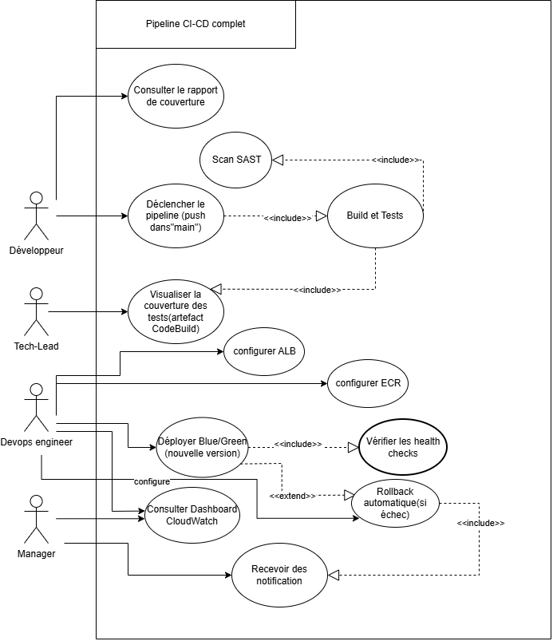

*Cette figure présente les quatre acteurs identifiés par le cahier des charges (Développeur, Tech-Lead, DevOps Engineer, Manager) et leurs interactions avec le système. Le Développeur déclenche le pipeline par un push et consulte le rapport de couverture ; le Tech-Lead se limite à la consultation qualité ; le DevOps Engineer configure l'infrastructure (ALB, ECR) et pilote le déploiement Blue/Green, dont dépendent la vérification des health checks (relation `include`) et le rollback automatique en cas d'échec (relation `extend`) ; le Manager consulte le tableau de bord et reçoit les notifications. Cette répartition des responsabilités a directement guidé la conception des rôles IAM du chapitre 4 (§4.8) : un rôle distinct existe pour chaque service qui agit pour le compte d'un de ces acteurs (CodePipeline pour le déclenchement, CodeBuild pour le build/scan, CodeDeploy pour le déploiement).*

## 2.3 Étude de l'existant

Aucun pipeline existant n'est documenté dans le périmètre du projet : le dépôt a démarré vide (commit initial du 3 juillet 2026, contenant uniquement les fichiers de gouvernance GitHub — `.gitignore`, `CONTRIBUTING.md`, gabarits d'issue et de pull request). La première itération applicative était une application Flask/SQLite minimale avec CRUD de tâches, remplacée en cours de stage (voir §2.4 et chapitre 7) par une application Node.js/Express, choix qui s'est avéré déterminant pour la cohérence de l'ensemble du pipeline.

## 2.4 Limites du déploiement manuel

Les limites visées par le projet — reproductibilité, absence de garde-fou qualité, risque d'interruption de service — sont matérialisées très concrètement à deux reprises dans l'historique du projet : (1) la coexistence initiale de deux applications divergentes (Flask réellement fonctionnelle, Express minimale) dont une seule était couverte par les quality gates alors que l'autre n'était jamais déployée par le pipeline, situation identifiée par l'audit de conformité du 28 juillet 2026 et corrigée par l'unification des deux applications sur Express ; (2) l'absence initiale de health check dans le gabarit de tâche ECS réellement déployé par le pipeline (`taskdef.template.json`), qui aurait privé le mécanisme de rollback automatique Blue/Green de tout moyen de détecter un déploiement défaillant.

## 2.5 Problématique

Voir Introduction générale, §3.

## 2.6 Objectifs

Voir Introduction générale, §4 et §5.

## 2.7 Contraintes

Les contraintes identifiées et documentées tout au long du projet sont :

- **contrainte de coût** : un compte AWS réel facture les ressources actives (NAT Gateway, Fargate, ALB) à la minute ; la méthodologie du stage (§6 de l'introduction) en découle directement, de même que le choix de `DesiredCount=1` lors du test de validation et la destruction systématique de l'infrastructure après chaque campagne de test ;
- **contrainte d'outillage local** : LocalStack Community n'émule pas les services `AWS::CodeBuild::Project`, `AWS::CodeStarConnections::Connection`, `elbv2` (ALB), `ecs`, `codedeploy` ni `codepipeline` — soit la majorité des ressources les plus critiques du pipeline, ce qui a fortement limité la portée de la validation locale (détaillé au chapitre 6) ;
- **contrainte de sécurité** : aucune valeur sensible ne doit apparaître dans le code source, les paramètres CloudFormation ou les variables d'environnement CodeBuild (exigence F3 du CDC) ;
- **contrainte de performance** : image Docker cible inférieure à 200 Mo, couverture de tests minimale de 80 %, durée de pipeline cible inférieure à 15 minutes.

## 2.8 Solution proposée

La solution retenue repose entièrement sur des services AWS managés, assemblés par de l'Infrastructure as Code : AWS CodePipeline orchestre trois stages (Source, Build, Deploy) ; AWS CodeBuild exécute l'analyse de sécurité statique, les tests et la construction de l'image ; Amazon ECR héberge et scanne l'image ; AWS CodeDeploy pilote un déploiement Blue/Green sur Amazon ECS Fargate derrière un Application Load Balancer ; AWS Secrets Manager, Amazon CloudWatch, Amazon SNS et Amazon EventBridge complètent la chaîne pour la gestion des secrets, l'observabilité et les notifications.

## 2.9 Architecture générale

**Figure 2 — Architecture physique et architecture logique de la solution**

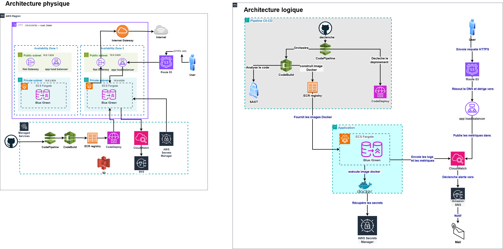

*Cette figure (fournie par l'auteure au format Draw.io) présente deux vues complémentaires de la même solution. L'architecture physique (à gauche) situe les composants dans le VPC dédié : deux zones de disponibilité, chacune avec un sous-réseau public (NAT Gateway, Application Load Balancer) et un sous-réseau privé hébergeant les tâches ECS Fargate en configuration Blue/Green ; en dehors du VPC, la chaîne CodePipeline → CodeBuild → ECR → CodeDeploy s'appuie sur des services gérés (S3, CloudWatch, SNS, Secrets Manager), et Route 53 expose l'ALB au trafic HTTPS entrant. L'architecture logique (à droite) reformule la même chaîne sous forme de flux fonctionnels : le déclenchement GitHub orchestre CodePipeline, qui pilote successivement l'analyse du code (SAST), la construction de l'image, le scan sur ECR et le déclenchement du déploiement CodeDeploy ; l'application déployée exécute l'image Docker, récupère ses secrets au runtime, et envoie logs et métriques vers CloudWatch, qui déclenche des alertes SNS relayées par e-mail. Cette double vue a servi de référence tout au long des chapitres 4 et 5 : la partie gauche a directement inspiré le découpage en gabarits CloudFormation (`vpc.yml`, `alb.yaml`, `ecs-*.yaml`), la partie droite a structuré l'écriture de `buildspec.yml` et de `pipeline.yml`.*

**Écart avec l'implémentation réelle.** Deux détails de la figure ne correspondent pas exactement à l'implémentation finale et sont signalés ici par souci d'exactitude : le schéma représente un scan de sécurité SAST comme une étape séparée avant le build Docker, ce qui correspond bien au buildspec réel (phase `pre_build`), mais représente également une brique « managée par des services annexes » distincte pour le S3 apparaissant hors du flux CI/CD à proprement parler — dans l'implémentation réelle, ce compartiment correspond au bucket d'artefacts S3 de CodePipeline (`pipeline.yml`), qui ne stocke pas de contenu applicatif mais uniquement les artefacts intermédiaires Source/Build. Par ailleurs, le schéma ne représente pas explicitement le stage d'approbation manuelle, qui a pourtant été activé et exercé lors du run de validation réel (chapitre 5, §5.17 et chapitre 6).

---

# CHAPITRE 3 — ÉTUDE DES TECHNOLOGIES

Ce chapitre présente chaque technologie utilisée strictement à travers son rôle réel dans le projet, sans développement théorique déconnecté de l'implémentation.

## 3.1 DevOps

Le stage a appliqué les pratiques DevOps de façon concrète à trois niveaux : le versionnement de l'infrastructure elle-même (Infrastructure as Code), l'automatisation intégrale du cycle de livraison (CI/CD), et une boucle de rétroaction courte entre développement et exploitation matérialisée par le journal `so-far.md`, mis à jour à chaque changement notable et servant de traçabilité entre chaque décision technique et sa justification.

## 3.2 CI/CD

Le projet distingue explicitement deux niveaux de CI/CD : une CI légère sur GitHub Actions (`.github/workflows/ci.yml`), exécutée avant tout merge, qui rejoue les mêmes quality gates que le pipeline AWS sans jamais toucher au compte AWS ; et le pipeline CD réel, orchestré par AWS CodePipeline, seul habilité à construire et pousser une image sur ECR et à déclencher un déploiement.

## 3.3 Git et GitHub

Le code est versionné sur GitHub, qui sert également de déclencheur du pipeline via une connexion CodeStar (`AWS::CodeStarConnections::Connection`) authentifiée par webhook. L'historique Git (135 commits identifiables sur la période étudiée) constitue la source la plus fiable de la chronologie du projet, exploitée au chapitre 9.

## 3.4 Docker

Le conteneur applicatif est construit à partir d'un `Dockerfile` multi-stage (voir annexe) : un premier stage (`build`) installe les dépendances complètes et compile si nécessaire, un second stage (`production`) ne conserve que le runtime Node.js, les dépendances de production, et l'utilisateur non privilégié d'exécution. La taille finale mesurée est passée de 48 Mo (juillet 2026) à environ 50 Mo après le durcissement de sécurité du 15 août 2026, très en-deçà de la cible de 200 Mo fixée par le cahier des charges.

## 3.5 Infrastructure as Code

L'intégralité de l'infrastructure AWS (réseau, IAM, registre, projet de build, cluster, équilibreur de charge, pipeline, autoscaling, observabilité) est codifiée en AWS CloudFormation — douze gabarits versionnés dans `infrastructure/cloudformation/`. Ce choix, plutôt que Terraform ou l'AWS CDK envisagés par le cahier des charges (§1.3), a permis d'utiliser nativement `cfn-lint` et le mécanisme d'export/import de CloudFormation pour garantir la cohérence entre gabarits sans dupliquer de valeur en dur.

## 3.6 AWS

### 3.6.1 VPC

Le réseau (`vpc.yml`) est un VPC dédié en `10.0.0.0/16`, réparti sur deux zones de disponibilité de la région `eu-west-2`, avec deux sous-réseaux publics (ALB, NAT Gateway) et deux sous-réseaux privés (tâches ECS Fargate), une passerelle Internet, un ou deux NAT Gateway(s) selon une stratégie paramétrable (`single`/`ha`), et un point de terminaison VPC Gateway vers S3 pour réduire le trafic sortant facturé via le NAT.

### 3.6.2 IAM

Quatre rôles de service dédiés (`iam.yaml`) implémentent le principe du moindre privilège : un rôle pour CodePipeline, un rôle pour CodeDeploy (politique gérée `AWSCodeDeployRoleForECS`), un rôle d'exécution ECS (`AmazonECSTaskExecutionRolePolicy`, lecture des secrets et des images), et un rôle de tâche ECS distinct pour le code applicatif. Un cinquième rôle, dédié à la fonction Lambda de publication de métriques, est créé dans `observability.yml`.

### 3.6.3 CloudFormation

Voir §3.5. Les douze gabarits sont déployés dans un ordre non négociable sur quatre points précis (documenté dans `infrastructure/README.md`), lié à des dépendances d'export/import réelles — deux erreurs d'ordre de déploiement (`iam.yaml` avant `codebuild.yaml`, puis avant `secrets-manager.yaml`) ont été effectivement rencontrées et corrigées en cours de projet.

### 3.6.4 ECR

Le registre (`ecr.yaml`) stocke les images Docker de l'application, avec analyse de vulnérabilités déclenchée automatiquement à chaque push (`ScanOnPush: true`) et une politique de cycle de vie limitant le nombre d'images conservées. La mutabilité des tags (`ImageTagMutability`) est revenue de `IMMUTABLE` à `MUTABLE` en cours de projet suite à un bogue réel documenté au chapitre 7.

### 3.6.5 ECS Fargate

Le runtime applicatif (`ecs-cluster.yaml`, `ecs-service.yaml`, `ecs-task-definition.yaml`) exécute les conteneurs sans provisionnement de serveur, avec Container Insights activé pour le suivi CPU/mémoire par service, et un contrôleur de déploiement `CODE_DEPLOY` (et non le contrôleur ECS natif) pour déléguer la bascule Blue/Green à CodeDeploy.

### 3.6.6 ALB

L'Application Load Balancer (`alb.yaml`) expose deux groupes cibles (Blue, Green) et deux listeners : un listener de production (port 80) qui reçoit le trafic réel des utilisateurs, et un listener de test (port 8080) que CodeDeploy utilise pour valider la nouvelle version avant de lui ouvrir le trafic public.

### 3.6.7 CodeBuild

Le projet CodeBuild (`codebuild.yaml`), déclenché par webhook GitHub sur les branches `main`/`develop`, exécute le fichier `task-manager/buildspec.yml` détaillé au chapitre 5 : installation des dépendances, analyse SAST, construction de l'image, exécution des tests, publication de l'image sur ECR, exploitation du résultat du scan de vulnérabilités.

### 3.6.8 CodePipeline

L'orchestrateur (`pipeline.yml`) enchaîne trois stages : Source (connexion CodeStar vers GitHub, branche `main`), Build (le projet CodeBuild ci-dessus), Deploy (action `CodeDeployToECS`, qui enregistre elle-même une nouvelle révision de tâche ECS avant de déclencher CodeDeploy). Un stage d'approbation manuelle a été activé lors du run de validation réel (paramètre `EnableManualApproval`).

### 3.6.9 CodeDeploy

CodeDeploy pilote la bascule Blue/Green sur ECS Fargate (`CodeDeployApplication`, `CodeDeployDeploymentGroup` dans `pipeline.yml`), avec une configuration de bascule progressive `CodeDeployDefault.ECSLinear10PercentEvery1Minutes` et un rollback automatique déclenché sur l'événement `DEPLOYMENT_FAILURE`.

### 3.6.10 CloudWatch

CloudWatch centralise les journaux applicatifs et de build (rétention 30 jours), héberge un tableau de bord de huit widgets et porte les alarmes du projet (durée de pipeline, échec de pipeline, CPU soutenu, capacité maximale d'autoscaling atteinte).

### 3.6.11 SNS

Un topic SNS unique (`pipeline.yml`) reçoit toutes les notifications du projet : changements d'état du pipeline (via une règle EventBridge), déclenchements d'alarme CloudWatch, et notifications applicatives issues du gate de scan ECR (`buildspec.yml`). Deux adresses e-mail y sont abonnées lors du run de validation.

### 3.6.12 Secrets Manager

Deux secrets applicatifs (`secrets-manager.yaml`) — des identifiants de base de données et une clé d'API — sont générés aléatoirement par AWS (`GenerateSecretString`) et injectés au runtime dans les tâches ECS via le bloc `secrets` des gabarits de tâche, sans jamais transiter en clair.

---

# CHAPITRE 4 — CONCEPTION DE L'ARCHITECTURE

## 4.1 Architecture globale

**Figure 3 — Architecture AWS globale (flux de bout en bout)**

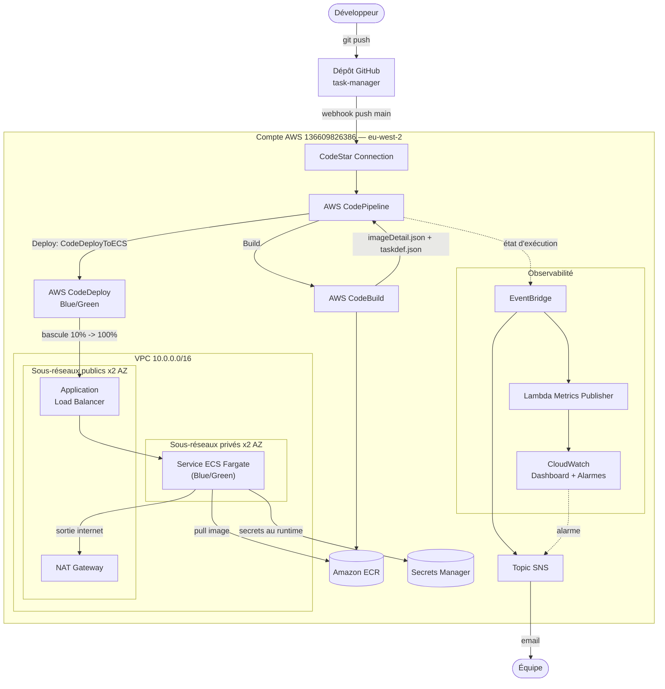

*Cette figure situe chaque composant du projet dans une seule vue d'ensemble. Le point structurant est la séparation entre le chemin de déploiement (en haut, du push GitHub à ECS via CodeBuild et CodeDeploy) et la couche d'observabilité (à droite, EventBridge → SNS/Lambda → CloudWatch), volontairement indépendante et qui n'intervient jamais dans la décision de déployer ou non — elle observe sans bloquer.*

## 4.2 Architecture réseau

**Figure 4 — Architecture réseau (VPC, sous-réseaux, NAT)**

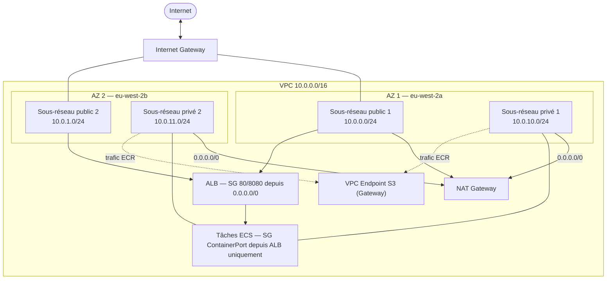

*Le point notable de cette architecture est l'absence totale d'adresse IP publique pour les tâches ECS Fargate (sous-réseaux privés) : leur seule sortie vers Internet — nécessaire pour l'agent ECS afin de tirer l'image depuis ECR et lire les secrets — transite par le NAT Gateway, tandis que le point de terminaison VPC vers S3 (gratuit) détourne spécifiquement le trafic vers le backend de stockage d'ECR pour réduire la facture NAT. La configuration réellement déployée le 15 août 2026 correspond à cette figure : VPC `vpc-049e88dc151ced735`, sous-réseaux publics `subnet-01cd0a77...`/`subnet-00d2bd43...`, sous-réseaux privés `subnet-02c61651...`/`subnet-0d156f40...`, avec les tâches Fargate observées aux adresses `10.0.10.40` et `10.0.10.232`, conformes au plan d'adressage ci-dessus.*

## 4.3 Architecture AWS

Voir §4.1 (Figure 3) pour la vue d'ensemble et le chapitre 5 pour le détail stack par stack.

## 4.4 Architecture de l'application

**Figure 5 — Diagramme de classes et diagramme d'objet du domaine**

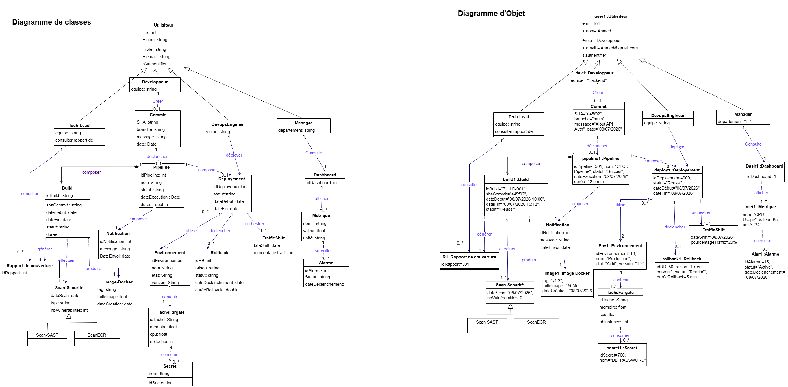

*Cette figure modélise le domaine métier du pipeline : un `Utilisateur` se spécialise en quatre rôles (héritage), un `Développeur` crée des `Commit`, chaque `Commit` peut déclencher un `Pipeline`, qui se compose d'un `Build` (lui-même producteur d'un `image-Docker`, d'un `Rapport-de-couverture` et de `Scan-Securite`) et de `Deploiement`. Un `Deploiement` orchestre un `Environnement` composé de `TacheFargate` consommant des `Secret`, et peut déclencher un `TrafficShift` ou un `Rollback`. Le diagramme d'objet associé (à droite sur la figure) instancie ce modèle sur le scénario réel du run de validation du 15 août 2026 : le commit `pipeline1` (`idPipeline=501`, statut « Succès ») porte le build `build1` (`shaCommit="a45f92"`), déployé par `deploy1` (`statut="Réussi"`), avec une métrique `met1` (« CPU Usage ») surveillée par l'alarme `Alar1` (« Active »).*

## 4.5 Architecture Docker

Voir chapitre 3, §3.4 et chapitre 5, §5.10 pour le détail du `Dockerfile` multi-stage.

## 4.6 Architecture CI/CD

**Figure 6 — Diagramme de collaboration : du push au déploiement**

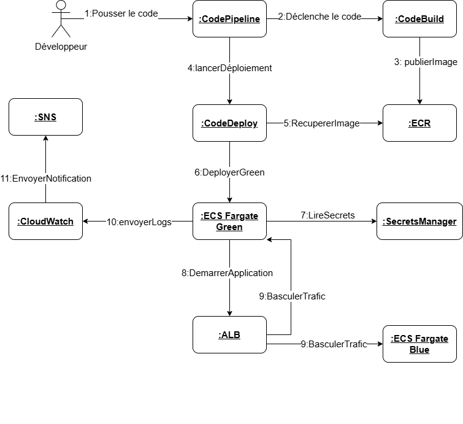

*Ce diagramme de collaboration (ou de communication) représente les mêmes échanges qu'un diagramme de séquence, mais organisés autour des objets et de leurs liens plutôt que d'un axe temporel : chaque flèche porte un numéro d'ordre (1 à 11), du push du Développeur jusqu'à la notification finale. Il met en évidence deux points de câblage essentiels du pipeline, détaillés au chapitre 5 : (a) l'image publiée par `:CodeBuild` (message 3) est immédiatement scannée sur ECR, et son résultat est lu par le même job avant que `:CodeDeploy` ne puisse être déclenché (message 4) — ce n'est pas visible sur ce diagramme simplifié, mais c'est un gate bloquant réel du `buildspec.yml` ; (b) le trafic n'est jamais coupé brutalement (message 9) : `:ECS Fargate Green` démarre et répond à ses propres health checks avant que `:ALB` ne lui transfère progressivement le trafic depuis `:ECS Fargate Blue`.*

**Figure 7 — Détail des stages CodePipeline**

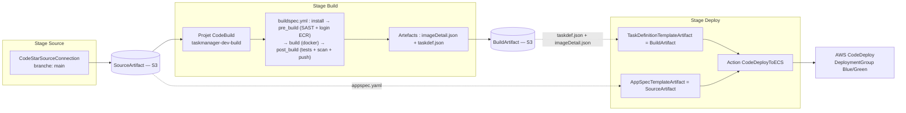

*Le détail à retenir de cette figure : `taskdef.json` (contenant les vrais ARN des rôles ECS et des secrets, rendus au moment du build) provient de l'artefact de **Build**, tandis qu'`appspec.yaml` (statique, sans valeur spécifique au compte) provient directement de l'artefact **Source** — une confusion entre ces deux chemins a effectivement provoqué un bogue réel, documenté au chapitre 7 (Problème 5).*

**Figure 8 — Diagrammes de séquence détaillés : déclenchement, Blue/Green, rollback**

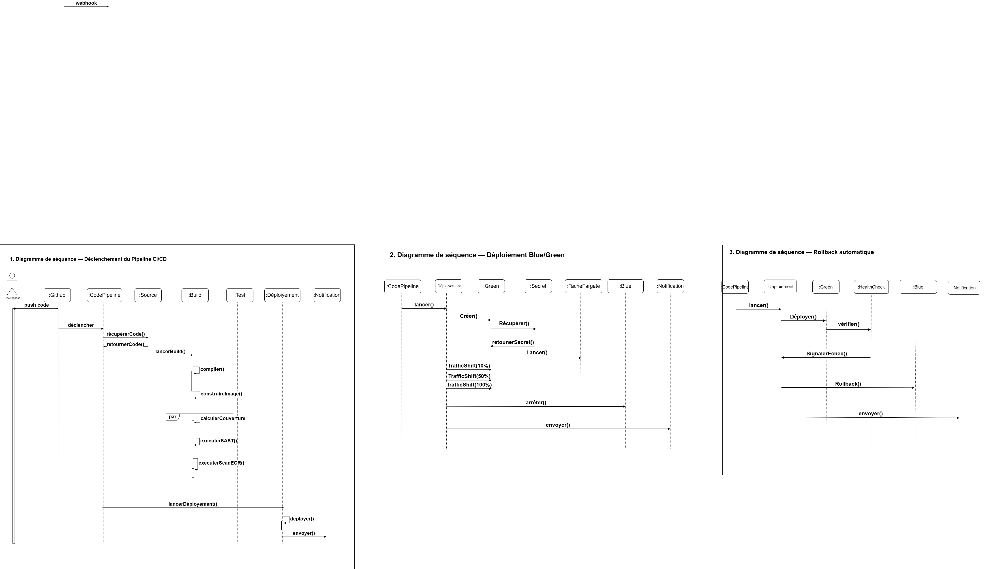

*Ces trois diagrammes de séquence détaillent, avec un axe temporel explicite et les appels de méthode exacts, ce que les Figures 6 et 7 ne montrent qu'à haut niveau. Le premier (déclenchement) descend jusqu'au détail du `buildspec.yml` : `récupérerCode()`, `lancerBuild()`, puis un bloc `par` (parallèle) regroupant `calculerCouverture`, `executerSAST()` et `executerScanECR()` — les trois contrôles qualité qui s'exécutent conceptuellement ensemble avant que `lancerDéploiement()` ne soit appelé. Le deuxième (déploiement Blue/Green) détaille la mécanique interne de CodeDeploy : création de l'environnement Green, récupération du secret, lancement de la tâche Fargate, puis la bascule de trafic en trois appels explicites `TrafficShift(10%)` → `TrafficShift(50%)` → `TrafficShift(100%)` avant l'arrêt de Blue (`arrêter()`) — la correspondance directe avec les paliers 10/50/100 % du cahier des charges, alors que l'implémentation réelle (chapitre 5, §5.19) utilise une rampe linéaire équivalente plutôt que ces trois paliers discrets. Le troisième (rollback automatique) montre le chemin d'échec symétrique : un `HealthCheck` qui signale l'échec (`SignalerEchec()`) déclenche `Rollback()` vers Blue et une notification, sans jamais atteindre 100 % sur Green — scénario qui, comme documenté au chapitre 6 (§6.11), n'a jamais été exercé lors du run réel du 15 août 2026.*

## 4.7 Architecture ECS Fargate

Voir chapitre 3 §3.6.5 et chapitre 5 §5.11-§5.12 pour le détail du cluster, du service et de la définition de tâche.

## 4.8 Architecture de sécurité

**Figure 9 — Rôles IAM et principaux de service**

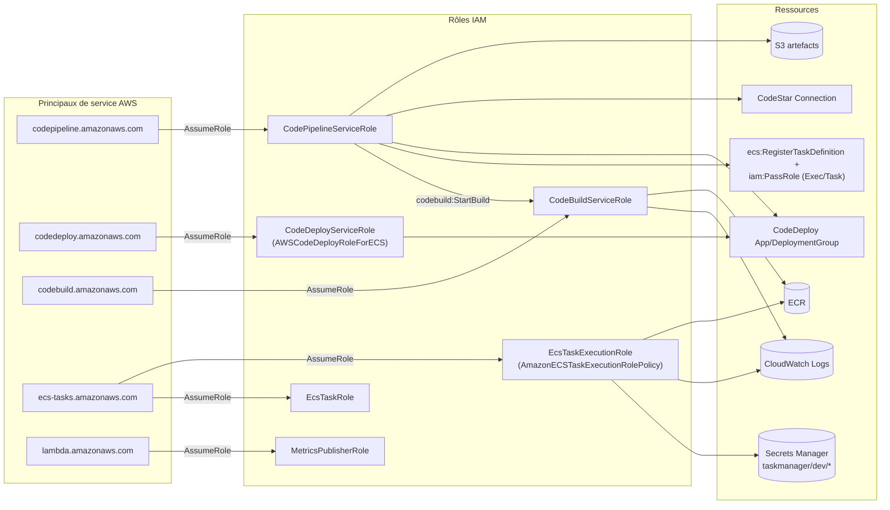

*Six rôles distincts, chacun restreint au strict nécessaire (principe du moindre privilège, documenté en commentaire dans `iam.yaml`) : le rôle CodePipeline ne peut déclencher que le projet CodeBuild et l'application CodeDeploy de ce projet précis ; le rôle d'exécution ECS (démarrage du conteneur, lecture des secrets, pull de l'image) et le rôle de tâche ECS (code applicatif en cours d'exécution) sont volontairement deux rôles distincts, jamais fusionnés. Deux permissions IAM manquantes sur ce schéma (`ecs:RegisterTaskDefinition` et `iam:PassRole` restreint aux rôles ECS) ont été identifiées et ajoutées en cours de projet — voir chapitre 7, en amont de tout run réel.*

## 4.9 Flux de données

**Figure 10 — Diagrammes d'activité : Build CI/CD, Déploiement Blue/Green, Alerting**

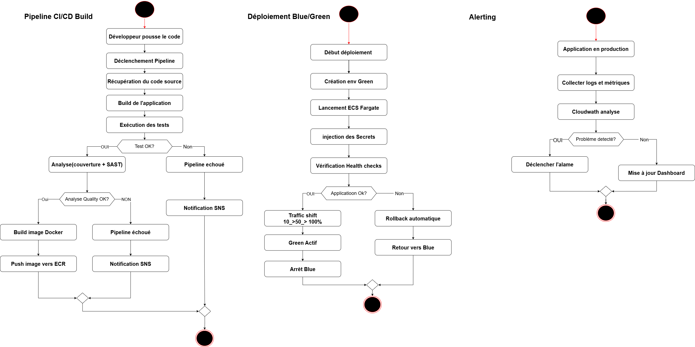

*Ces trois diagrammes d'activité couvrent l'intégralité du cycle opérationnel : construction (avec un double point de décision — succès des tests, puis qualité du code — cohérent avec le double gate réellement implémenté dans `buildspec.yml`, §5.15), déploiement Blue/Green (avec bifurcation explicite entre succès et rollback), et boucle de surveillance continue. Le déploiement réel a suivi exactement ce chemin le 15 août 2026 : les health checks ont été validés à chaque palier de la bascule (10 %, 50 %/lecture intermédiaire non individuellement horodatée, 100 %), sans qu'aucun rollback n'ait été nécessaire.*

## 4.10 Flux de déploiement

Voir Figure 6 (§4.6) et Figure 12 (§4.11) pour le détail du flux de déploiement Blue/Green.

## 4.11 Stratégie de déploiement

**Figure 11 — Diagramme d'état : cycle de vie d'un déploiement**

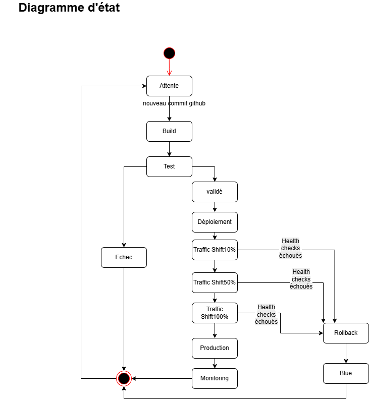

*Ce diagramme d'état formalise, palier par palier, les points où un échec de health check peut déclencher un retour vers l'état `Blue` — c'est-à-dire un rollback automatique — à n'importe quelle étape de la bascule de trafic, pas seulement au démarrage. Sur le run réel du 15 août 2026, le déploiement a traversé chacun de ces états jusqu'à `Production`/`Monitoring` sans jamais emprunter la branche `Rollback` : les cinq étapes du cycle de vie CodeDeploy (*Deploying replacement task set*, *Test traffic route setup*, *Rerouting production traffic*, *Wait*, *Terminate original task set*) ont toutes été rapportées « Succeeded » (chapitre 6, Figure 25).*

**Figure 12 — Déploiement Blue/Green détaillé (CodeDeploy + ECS)**

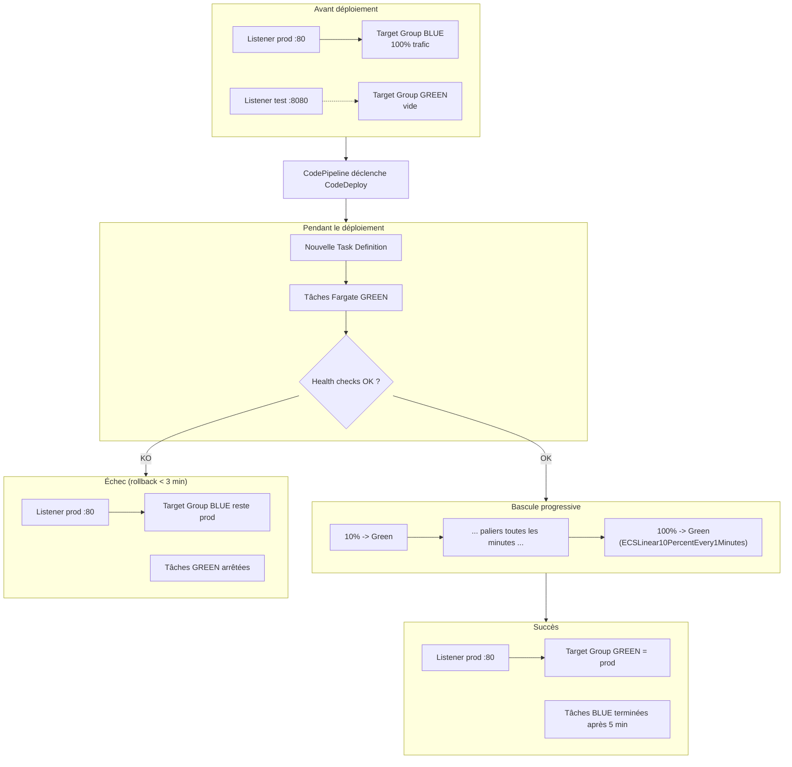

*Le listener de test (port 8080) permet de valider Green avant toute exposition au trafic public réel — jamais atteint par un utilisateur final en usage normal. Sur le run de validation, la configuration `CodeDeployDefault.ECSLinear10PercentEvery1Minutes` a bien été utilisée (confirmée par capture de la console CodeDeploy) ; il s'agit d'une rampe linéaire de 10 % par minute et non des paliers fixes 10 %/50 %/100 % littéralement décrits par le cahier des charges — écart documenté et assumé (voir Synthèse comparative, en fin de rapport).*

---

# CHAPITRE 5 — RÉALISATION ET MISE EN ŒUVRE

Ce chapitre décrit, pour chaque brique, la démarche **Objectif → Configuration → Implémentation → Preuve → Résultat**.

## 5.1 Préparation de l'environnement

**Objectif.** Disposer d'un environnement de travail reproductible pour développer et valider l'infrastructure sans dépendre d'un accès permanent à un compte AWS facturable.

**Implémentation.** Un fichier `devbox.json` (Nix) fige les outils locaux ; LocalStack Community (image `3.8.1` épinglée) fournit une émulation locale de plusieurs services AWS ; neuf scripts (`infrastructure/scripts/test1..9`) valident chacun un gabarit CloudFormation isolément, puis un dixième (`test7-all-local.sh`) les enchaîne.

**Résultat.** Les neuf tests locaux passent (exit 0), en un peu moins de dix minutes cumulées, avec une liste précisément documentée de ce qui reste hors de portée de cette validation (services *Pro-only* de LocalStack Community : CodeBuild, CodeStar Connections, ELBv2, ECS, CodeDeploy, CodePipeline).

## 5.2 Configuration AWS CLI

**Objectif.** Authentifier les commandes AWS CLI locales avec le compte cible sans exposer de clé d'accès long-terme.

**Implémentation.** Authentification par AWS IAM Identity Center (SSO), rôle `AdministratorAccess-136609826386`, profil nommé explicitement à chaque commande pour éviter toute ambiguïté avec le profil `default` du poste (dont les identifiants sont obsolètes).

**Preuve.** `aws sts get-caller-identity` retourne `arn:aws:sts::136609826386:assumed-role/AWSReservedSSO_AdministratorAccess_.../khaoula.mechria@supcom.tn`.

## 5.3 Configuration de la région AWS

**Objectif/Résultat.** L'ensemble du projet est déployé en région `eu-west-2` (Londres) — un correctif réel (`c02b366`) a d'ailleurs corrigé une région mal orthographiée (`eu-west1` au lieu de `eu-west-2`) dans un gabarit antérieur.

## 5.4 Mise en place du VPC

**Configuration.** `vpc.yml`, paramètres `ProjectName=taskmanager`, `Environment=dev`, `NatGatewayStrategy=single`.

**Preuve.** Stack `taskmanager-dev-vpc` en `CREATE_COMPLETE` ; VPC `vpc-049e88dc151ced735` confirmé par `describe-vpcs`.

## 5.5 Subnets

Deux sous-réseaux publics et deux sous-réseaux privés sur deux zones de disponibilité, conformes à la Figure 4.

## 5.6 Security Groups

Un groupe de sécurité pour l'ALB (entrée 80/8080 depuis `0.0.0.0/0`), un groupe de sécurité pour les tâches ECS (entrée depuis l'ALB uniquement, jamais depuis Internet).

## 5.7 IAM

Voir chapitre 3 §3.6.2 et chapitre 4 §4.8. Deux permissions ont été ajoutées après comparaison avec la documentation IAM officielle d'AWS pour l'action `CodeDeployToECS` (voir chapitre 7).

## 5.8 Infrastructure as Code avec CloudFormation

Voir chapitre 3 §3.5. Le Tableau 1 récapitule l'usage réel de chaque service tel qu'implémenté dans les gabarits.

**Tableau 1 — Stack technologique du projet (correspondance CDC §1.3 → implémentation)**

| # | Technologie | Statut | Fichier(s) |
|---|---|---|---|
| 1 | AWS CodePipeline | ✅ Réalisé et validé en réel | `pipeline.yml` |
| 2 | Amazon ECS Fargate | ✅ Réalisé et validé en réel | `ecs-cluster.yaml`, `ecs-service.yaml`, `ecs-task-definition.yaml` |
| 3 | AWS CodeBuild | ✅ Réalisé et validé en réel | `codebuild.yaml`, `task-manager/buildspec.yml` |
| 4 | Amazon ECR | ✅ Réalisé et validé en réel | `ecr.yaml` |
| 5 | AWS CloudFormation | ✅ Réalisé | 12 gabarits `infrastructure/cloudformation/` |
| 6 | Docker | ✅ Réalisé et validé | `task-manager/Dockerfile` |
| 7 | GitHub Actions | ✅ Réalisé (CI, pas de déploiement AWS) | `.github/workflows/ci.yml` |
| 8 | Amazon CloudWatch | ✅ Réalisé et validé en réel | `observability.yml` |
| 9 | AWS SNS | ✅ Réalisé et validé en réel | `pipeline.yml`, `observability.yml` |

**Figure 13 — Les douze piles CloudFormation à l'état `CREATE_COMPLETE`**

*(Capture de la console CloudFormation, session de validation du 15 août 2026.)*

*Cette figure liste les douze piles du projet (`taskmanager-dev-vpc`, `-secrets`, `-ecr`, `-codebuild`, `-iam`, `-ecs-cluster`, `-alb`, `-taskdef`, `-ecs-service`, `-pipeline`, `-autoscaling`, `-observability`), toutes au statut `CREATE_COMPLETE` — la preuve la plus directe que l'intégralité de l'infrastructure documentée aux chapitres 3 et 4 a effectivement été provisionnée sur le compte AWS réel, et non uniquement validée statiquement.*

## 5.9 Création d'ECR

**Configuration.** `ecr.yaml`, `ScanOnPush: true`, `MaxImageCount=10`. Registre en mode Enhanced Scanning (Amazon Inspector v2), confirmé par `aws inspector2 batch-get-account-status`.

**Résultat.** Dépôt `taskmanager-dev` créé, URI `136609826386.dkr.ecr.eu-west-2.amazonaws.com/taskmanager-dev`.

## 5.10 Conteneurisation avec Docker

Voir chapitre 3 §3.4. Le `Dockerfile` (annexe A) construit une image en deux stages ; la version finale intègre un durcissement de sécurité (mise à jour des paquets Alpine, suppression des outils CLI npm/npx/corepack de l'image de production) détaillé au chapitre 7 (Problème 4).

## 5.11 Création du cluster ECS Fargate

**Configuration.** `ecs-cluster.yaml`, Container Insights activé.

**Preuve.** Cluster `taskmanager-dev-cluster`, statut `ACTIVE`.

## 5.12 Task Definition

**Configuration.** `ecs-task-definition.yaml` (bootstrap) et `task-manager/taskdef.template.json` (déployée par le pipeline à chaque exécution) : famille `taskmanager-dev-task`, CPU `256`, mémoire `512`, port de conteneur `3000`, health check HTTP sur `/health`, secrets injectés (`DB_USERNAME`, `DB_PASSWORD`, `API_KEY`), journalisation `awslogs`.

**Résultat.** La révision `taskmanager-dev-task:5` (GREEN) est celle produite par l'exécution réelle du pipeline le 15 août 2026, ayant remplacé la révision bootstrap `taskmanager-dev-task:4` (BLUE).

## 5.13 Application Load Balancer

**Configuration.** `alb.yaml`, DNS `taskmanager-dev-alb-1189741484.eu-west-2.elb.amazonaws.com`, deux groupes cibles (`tg-blue`, `tg-green`) et deux listeners (80, 8080).

## 5.14 CodeBuild

**Configuration.** `codebuild.yaml`, source GitHub (`khaoula-mechria/Pipeline-CI-CD-complet-avec-CodePipeline-ECS-Fargate`), runtime Node.js 20, rôle IAM restreint au dépôt ECR importé.

## 5.15 buildspec.yml

Le fichier `task-manager/buildspec.yml` (voir annexe B) enchaîne quatre phases :

1. **install** — `npm ci` (dépendances figées par le lockfile) et installation de Semgrep (SAST) ;
2. **pre_build** — analyse SAST bloquante (`semgrep --config auto --error`), puis connexion à ECR et calcul du tag d'image (8 premiers caractères du SHA du commit) ;
3. **build** — construction de l'image Docker multi-stage, avec la version taguée injectée en `build-arg` (exposée ensuite par le point de terminaison `/version`) ;
4. **post_build** — exécution des tests unitaires avec vérification explicite du seuil de couverture (80 %), archivage du rapport HTML, publication de l'image sur ECR, puis exploitation du résultat du scan de vulnérabilités (bloquant sur CRITICAL, notification SNS sur HIGH), et enfin rendu de `taskdef.json` à partir du gabarit versionné.

Ce découpage matérialise directement le double gate qualité représenté sur le diagramme d'activité (Figure 10) : tests d'abord, puis analyse (couverture + SAST + scan de vulnérabilités).

## 5.16 CodePipeline

**Configuration.** `pipeline.yml`, trois stages (Source, Build, Deploy) plus un stage d'approbation manuelle activé (`EnableManualApproval=true`) pour le run de validation.

## 5.17 Déclenchement automatique

**Mécanisme.** Connexion CodeStar (`GitHubConnection`) en webhook sur la branche `main` ; les branches `feature/**` ne déclenchent que la CI GitHub Actions (Build + Test), jamais CodePipeline ni AWS CodeBuild.

**Figure 15 — Pipeline en cours d'exécution : Source et Build réussis, approbation venant d'être validée**


**Figure 16 — Pipeline en cours d'exécution : approbation validée, stage Deploy en cours**


*Ces deux captures, prises à quelques minutes d'intervalle lors de l'exécution `60227957-a21d-4c70-8b73-816ebd2e47ab` du 15 août 2026, démontrent le déclenchement réel du pipeline (Source), l'exécution réelle du build (Build), l'exercice effectif du stage d'approbation manuelle (Figure 15 → Figure 16), puis le démarrage du déploiement (Figure 16). L'exécution complète a duré 20 minutes et 22 secondes.*

**Figure 14 — Abonnements SNS au topic de notifications du pipeline**

*(Capture `aws sns list-subscriptions`.)*

*Deux adresses e-mail (`khaoula.mechria@supcom.tn` et une seconde adresse liée à un projet voisin sur le même compte) sont abonnées au topic `taskmanager-dev-pipeline-notifications`, confirmant que le canal de notification F4 est réellement opérationnel et non pas uniquement déclaré dans le gabarit.*

## 5.18 Déploiement ECS

Voir §5.12 et chapitre 6, §6.6.

## 5.19 CodeDeploy / Blue-Green

Réellement implémenté et exécuté (chapitre 6). Application `taskmanager-dev-app`, groupe de déploiement `taskmanager-dev-dg`, déploiement `d-E4BM2THZI`, configuration `CodeDeployDefault.ECSLinear10PercentEvery1Minutes`.

## 5.20 Rollback

Le mécanisme (`AutoRollbackConfiguration` sur l'événement `DEPLOYMENT_FAILURE`) est implémenté et configuré, mais **n'a jamais été déclenché lors du run réel** — le déploiement du 15 août 2026 a réussi du premier coup. Sa capacité à effectivement revenir à l'état stable en moins de trois minutes, telle que demandée par le cahier des charges, **n'a donc pas été démontrée empiriquement** ; seule sa configuration a été vérifiée.

## 5.21 CloudWatch

`observability.yml` : dashboard de huit widgets, deux alarmes (durée de pipeline > 15 min, échec de pipeline), rétention de 30 jours sur les journaux applicatifs, de CodeBuild et de la fonction Lambda de métriques.

## 5.22 Notifications

Voir §5.17, Figure 14, et chapitre 8. Une notification par e-mail d'approbation manuelle a également été effectivement reçue et traitée pendant le run de validation.

## 5.23 Tests pendant l'implémentation

Voir chapitre 6 pour le détail complet des résultats de test.

---

# CHAPITRE 6 — TESTS, VALIDATION ET RÉSULTATS

## 6.1 Stratégie de test

La stratégie de test a suivi trois niveaux croissants de fidélité : analyse statique (`cfn-lint`) sur l'ensemble des gabarits ; émulation locale partielle (LocalStack Community) pour les services supportés ; validation réelle sur AWS pour tout ce que les deux premiers niveaux ne peuvent pas couvrir. Ce choix, documenté explicitement dans `so-far.md`, découle directement de la contrainte de coût du projet (chapitre 2, §2.7) : un déploiement réel complet coûte de l'argent à chaque minute (NAT Gateway, ALB, Fargate), il n'a donc été exécuté qu'une seule fois, de façon exhaustive, plutôt que répété à chaque itération.

## 6.2 Tests de l'infrastructure

`cfn-lint` a été exécuté systématiquement sur les douze gabarits à chaque modification ; les seuls avertissements restants et volontairement ignorés (`--ignore-checks W6001`) concernent cinq sorties de type *pass-through* dans `pipeline.yml`, nécessaires pour préserver des noms d'export après un refactor et sans alternative plus propre.

## 6.3 Tests Docker

L'image a été construite et exécutée localement (`docker build`, `docker run`, `curl /health`) dès juillet 2026, puis reconstruite et revalidée après chaque changement de dépendances ou de base. Le `HEALTHCHECK` intégré au `Dockerfile` a été confirmé opérationnel (statut `healthy`).

## 6.4 Tests CodeBuild

Neuf des dix-sept ressources non couvertes par LocalStack Community concernent CodeBuild et les services associés (CodeStar Connections). La validation réelle de `buildspec.yml` a été effectuée de deux façons : par un rejeu partiel via l'agent officiel `aws-codebuild-docker-images` (abandonné avant la fin faute de bande passante suffisante pour tirer l'image, mais suffisant pour confirmer l'exécution correcte de la phase `install`), puis par des exécutions réelles autonomes (`aws codebuild start-build`) sur le compte AWS, indépendantes du reste du pipeline — une facilité rendue possible par le fait que le projet CodeBuild n'a ni artefacts ni configuration VPC, et peut donc être exercé seul (chapitre 7, Problème 2, note de méthode).

## 6.5 Tests CodePipeline

**Figure 17 — Résumé du scan SAST Semgrep : 0 finding sur 242 règles**


**Figure 18 — SAST validé, connexion à ECR, tag `f7bde5dd`, début du stage Build**


*Le scan Semgrep charge 1074 règles de la configuration `auto`, dont 242 sont effectivement applicables aux douze fichiers du projet (JavaScript, JSON, YAML, Dockerfile). Aucun des 242 n'a produit de finding sur le commit `f7bde5dd`, validant le gate SAST bloquant de F2.*

**Figure 19 — Résultat des tests Jest : 4 suites, 63 tests, tous réussis**


*Ce résultat, obtenu lors du même stage Build que les Figures 17 et 18, confirme les 100 % de couverture de lignes revendiqués par le Tableau 9 (§6.13) — la même exécution CodeBuild produit donc, dans l'ordre, un SAST propre, une suite de tests intégralement réussie, puis (§6.8) un scan de vulnérabilités exploité comme gate.*

## 6.6 Tests ECS

**Figure 26 — Tâches ECS après bascule : révision GREEN active, révision BLUE arrêtée**


**Figure 27 — Vue d'ensemble du service ECS : actif, 1/1, cible saine**


*Le service `taskmanager-dev-service` est confirmé `ACTIVE`, avec une seule tâche désirée et une tâche en exécution (paramètre volontairement réduit à `DesiredCount=1` pour ce test, cf. chapitre 2 §2.7). La révision `taskmanager-dev-task:5`, produite par le pipeline, est celle effectivement en cours d'exécution ; la révision `:4` (bootstrap, BLUE) a été proprement arrêtée après la période de stabilisation (« bake time ») de cinq minutes configurée dans CodeDeploy.*

## 6.7 Tests réseau

L'accès `curl http://<dns-alb>/health` a été confirmé retournant `{"status":"ok"}` dès l'étape de bootstrap du service ECS (avant même le premier déploiement par le pipeline), validant la chaîne complète réseau → ALB → ECS → conteneur → health check.

## 6.8 Tests de sécurité

**Figure 20 — Image `f7bde5dd` présente dans le registre ECR**


**Figure 21 — Résultat du scan de vulnérabilités ECR / Amazon Inspector v2**


*Point d'attention documenté avec transparence : le gate de sécurité intégré à `buildspec.yml` a lu, au moment précis du push (troisième tentative de sondage), le résultat `CRITICAL=0 HIGH=0 MEDIUM=1 LOW=0` et a donc laissé passer le build légitimement. Une consultation ultérieure de la même image sur la console ECR (Figure 21) affiche `CRITICAL: 2, HIGH: 10, MEDIUM: 3, LOW: 1` : ce n'est pas une contradiction du gate, mais une conséquence du mode de scan **continu** d'Amazon Inspector v2, qui réévalue en permanence les images déjà poussées à mesure que sa base de vulnérabilités se met à jour — y compris pour des CVE publiées après le push. Le gate CI/CD, par nature, ne peut se prononcer que sur l'état des connaissances au moment du build ; ce constat, documenté dans le rapport de validation d'origine, ouvre une piste d'amélioration présentée au chapitre 10.*

## 6.9 Tests de déploiement

**Figure 22 — Historique des déploiements CodeDeploy : `d-E4BM2THZI`, Succeeded**


**Figure 25 — Événements du cycle de vie du déploiement Blue/Green**


*Les huit événements du cycle de vie CodeDeploy (`BeforeInstall`, `Install`, `AfterInstall`, `AllowTestTraffic`, `AfterAllowTestTraffic`, `BeforeAllowTraffic`, `AllowTraffic`, `AfterAllowTraffic`) sont tous rapportés `Succeeded`, l'étape `AllowTraffic` (bascule progressive du trafic) ayant duré 9 minutes et 4 secondes — cohérent avec une configuration en rampe linéaire de 10 % par minute.*

## 6.10 Tests Blue/Green

**Figure 23 — Progression de la bascule de trafic : 0 % → 100 %**


**Figure 24 — Activité des groupes de tâches CodeDeploy**


**Figure 29 — Listeners et règles de l'Application Load Balancer**


**Figure 30 — Carte de ressources de l'ALB**


**Figure 28 — Application « Task Manager » accessible via le nom DNS de l'ALB**


**Figure 31 — Preuve de bascule de version : `/version` passe de `dev` à `f7bde5dd`**


*Cette dernière figure constitue la preuve la plus directe et la plus difficile à contester de tout le rapport : un point de terminaison `GET /version`, ajouté spécifiquement à cette fin (commit `f7bde5dd`, « feat: add /version endpoint for deploys »), renvoie le SHA du commit réellement exécuté par le conteneur derrière l'ALB. Avant le déploiement, ce point de terminaison renvoyait `{"version":"dev"}` (image de bootstrap, révision BLUE) ; immédiatement après la fin de la bascule CodeDeploy, il renvoie `{"version":"f7bde5dd"}` — soit exactement le commit ayant déclenché le pipeline. Cette preuve va au-delà d'un simple statut « Succeeded » rapporté par la console AWS : elle démontre que le trafic réel est effectivement servi par la nouvelle révision applicative.*

## 6.11 Tests de rollback

**Non testé.** Aucun scénario d'échec n'a été provoqué volontairement lors du run de validation réel (le déploiement a réussi du premier coup) ; le mécanisme de rollback automatique reste donc **configuré et vérifié statiquement, mais jamais déclenché ni observé en conditions réelles**. C'est la limite la plus significative des résultats présentés dans ce chapitre, et elle est reprise explicitement dans la synthèse comparative en fin de rapport.

## 6.12 Tests CloudWatch

**Figure 32 — Tableau de bord des alarmes CloudWatch après le run de validation**

*(Capture de la console CloudWatch, section « Alarms by AWS service » / « Recent alarms ».)*

*Quatre alarmes sont actives sur le projet, toutes rapportées à l'état `OK` à l'issue du run (aucune n'a été déclenchée) : deux alarmes du cluster/service ECS et deux alarmes de pipeline (`PipelineDuration`, `RunningTaskCount`). Le graphique associé à `RunningTaskCount` montre un pic transitoire de 1 à 2 tâches en cours d'exécution pendant la fenêtre de bascule Blue/Green, signature exacte attendue d'un déploiement Blue/Green réussi (les deux révisions coexistent brièvement avant l'arrêt de l'ancienne).*

## 6.13 Résultats

**Tableau 9 — Résultats de validation finale (run du 15 août 2026, commit `f7bde5dd`)**

| Critère | Objectif (CDC) | Résultat réel mesuré | Validation | Statut |
|---|---|---|---|---|
| Déclenchement automatique | Push sur `main` → pipeline en < 60 s | Déclenchement confirmé, délai non chronométré précisément | Figure 15 | ✅ Réalisé, chronométrage non démontré |
| Couverture de tests | ≥ 80 % | 100 % (63/63 tests, 4 suites) | Figure 19 | ✅ Dépassé |
| SAST bloquant | Bloque sur vulnérabilité critique | Semgrep, 0 finding sur 242 règles | Figure 17 | ✅ Réalisé |
| Taille de l'image Docker | < 200 Mo | ≈ 50 Mo (mesures locales), 52,66 Mo (console ECR) | Figure 20 | ✅ Dépassé |
| Image taguée par commit | Tag = SHA du commit | Tag `f7bde5dd`, poussé une seule fois | Figure 20 | ✅ Réalisé |
| Scan de vulnérabilités bloquant | Bloque sur CRITICAL | Gate lu `CRITICAL=0` au moment du push | Figure 21 | ✅ Réalisé (nuance scan continu, §6.8) |
| Approbation manuelle | Prévue par F4 | Stage `Approval`, exercé et validé | Figures 15-16 | ✅ Réalisé |
| Déploiement Blue/Green | Sans interruption | Bascule 0 % → 100 % confirmée | Figures 22-25 | ✅ Réalisé |
| Bascule progressive | 10 % → 50 % → 100 % sur 10 min | Rampe linéaire 10 %/min, ≈ 9 min | Figure 23 | ⚠️ Réalisé avec un mécanisme équivalent, non identique |
| Ancienne version retirée après bascule | Oui | Tâche BLUE `Stopped` après bake de 5 min | Figure 26 | ✅ Réalisé |
| Application accessible via l'ALB | Oui | DNS public répond | Figure 28 | ✅ Réalisé |
| Preuve de la nouvelle version en production | — | `/version` : `dev` → `f7bde5dd` | Figure 31 | ✅ Réalisé |
| Rollback automatique | < 3 min sur échec | Configuré, jamais déclenché en réel | — | ⚠️ Configuré, non démontré |
| Durée totale du pipeline | < 15 min (alarme F4) | 20 min 22 s | Figures 15-16 | ❌ Dépassé (alarme aurait dû se déclencher) |
| Infrastructure démontable sans coût résiduel | — | 12 stacks + ressources `Retain` supprimées, balayage exhaustif confirmé vide | — | ✅ Réalisé |

Le dépassement de la durée cible de pipeline (20 min 22 s contre 15 min visées) mérite d'être commenté : il s'explique presque intégralement par le temps de bascule Blue/Green configuré (`AllowTraffic`, 9 min 4 s) et par le temps d'attente (« bake time », 5 min) avant l'arrêt de l'ancienne révision — deux paramètres réglables (`CodeDeployDefault.*`, `TerminateBlueInstancesOnDeploymentSuccess.terminationWaitTimeInMinutes`) qui n'ont pas été optimisés pour rester sous le seuil d'alarme, ce dernier ayant simplement pour rôle d'alerter l'équipe, non de bloquer le déploiement.

---

# CHAPITRE 7 — DIFFICULTÉS, BOGUES ET RÉSOLUTION

## 7.1 Méthodologie de debugging

La méthodologie de diagnostic suivie tout au long du stage a systématiquement combiné trois sources d'information avant toute correction : (1) le message d'erreur brut renvoyé par le service AWS concerné, (2) une vérification empirique de l'état réel de la ressource (par exemple, comparer l'horodatage `imagePushedAt` d'ECR à l'horodatage de l'échec rapporté par CodeBuild, plutôt que de faire confiance au seul code de retour de la commande), et (3) une revérification après correction contre un vrai run AWS et non uniquement contre un raisonnement théorique. Cette discipline a évité plusieurs corrections hâtives : un exemple notable est documenté au Problème 7 ci-dessous, où une première correction, plausible mais insuffisante, a été identifiée comme telle uniquement parce qu'elle a été revérifiée contre un run GitHub Actions réel plutôt que supposée correcte.

## 7.2 Difficultés liées à AWS

Les difficultés les plus significatives du projet proviennent de comportements réels de services AWS non documentés de façon suffisamment explicite pour être anticipés par la seule lecture de la documentation officielle, et non détectables par les outils d'analyse statique utilisés (`cfn-lint`) ni par LocalStack Community. Les sections suivantes détaillent, par ordre d'importance (mesurée par leur caractère bloquant pour un déploiement de bout en bout), les problèmes les plus significatifs rencontrés.

## 7.3 Erreurs CloudFormation

### Problème 1 — Tags ECR immuables incompatibles avec le moteur de build de CodeBuild

**Contexte.** Lors de la première tentative de build réel via CodeBuild, à l'étape `POST_BUILD` du buildspec, sur la commande `docker push` vers Amazon ECR.

**Symptôme.** Le build échouait systématiquement, y compris sur un commit tout juste poussé dont le tag SHA n'avait jamais existé auparavant, avec le message :
```
tag invalid: The image tag '<sha>' already exists in the 'taskmanager-dev' repository
and cannot be overwritten because the tag is immutable.
```

**Cause.** En comparant l'horodatage `imagePushedAt` retourné par `aws ecr describe-images` à l'horodatage de l'échec rapporté par CodeBuild, il a été établi que l'image avait déjà atterri dans ECR *avant* que la commande `docker push` ne rapporte l'échec côté client. Le push réussissait donc réellement côté serveur ; c'est le moteur BuildKit embarqué dans l'image CodeBuild `standard:7.0` qui renvoyait malgré tout un code de sortie non nul face à la politique `IMMUTABLE` du dépôt ECR — une interaction connue entre BuildKit et ECR, documentée par les mainteneurs de BuildKit eux-mêmes comme un défaut qu'ils ne prévoient pas de corriger (issue publique `moby/buildkit#3776`, fermée *« not planned »*).

**Diagnostic.** Reproduction systématique sur plusieurs builds consécutifs (pas seulement des rejeux du même commit), confirmant qu'il ne s'agissait pas d'un incident isolé.

**Solution.** Le dépôt ECR (`ecr.yaml`) est repassé de `ImageTagMutability: IMMUTABLE` à `MUTABLE` (commit `a812e27`). Ce changement ne dégrade pas la traçabilité recherchée : le tag d'image reste toujours et uniquement le SHA du commit (`IMAGE_TAG`), donc un tag donné n'est en pratique jamais réassigné à un contenu différent.

**Vérification.** Un build autonome (`aws codebuild start-build`) exécuté après correction a atteint `BUILD SUCCEEDED` de bout en bout, incluant un `docker push` réussi.

**Résultat.** Ce bogue empêchait *tout* build automatisé d'aboutir, quel que soit le contenu du commit — c'était le blocage le plus sévère du projet, résolu la veille du run de validation complet.

**Leçon technique.** Une garantie de sécurité déclarée dans un commentaire de code (« traçabilité par immuabilité ») peut entrer en conflit avec le comportement réel d'un outil tiers non contrôlé par le projet ; la traçabilité recherchée ici (un tag = un contenu unique) est en réalité déjà garantie par la convention de nommage (tag = SHA de commit), rendant la contrainte `IMMUTABLE` d'ECR redondante et, en pratique, contre-productive.

### Problème 5 — Chemin de l'AppSpec CodeDeploy mal résolu dans `pipeline.yml`

**Contexte.** Découvert lors d'un audit complet du dépôt mené le 14 août 2026, avant tout déploiement réel du stage Deploy.

**Symptôme.** Aucun symptôme observé en conditions réelles — le bogue a été détecté par relecture, en amont d'une exécution qui l'aurait révélé.

**Cause.** `AppSpecTemplatePath: appspec.yaml` était déclaré comme relatif à la racine de l'artefact `SourceArtifact` (qui conserve l'arborescence complète du dépôt cloné), alors que le fichier réel vit dans `task-manager/appspec.yaml`.

**Diagnostic.** Identifié par comparaison directe entre le chemin déclaré dans `pipeline.yml` et l'emplacement réel du fichier dans le dépôt — la même catégorie d'erreur ayant déjà été trouvée et corrigée un mois plus tôt sur le chemin du `buildspec.yml` de `codebuild.yaml` (Problème 8), ce qui a orienté la relecture vers ce point précis.

**Solution.** Chemin corrigé en `task-manager/appspec.yaml`.

**Vérification.** `cfn-lint` propre après correction (ce bogue n'était pas détectable par cet outil, qui ne vérifie pas l'existence des fichiers référencés) ; confirmé fonctionnel lors du run de validation réel du 15 août 2026 (le stage Deploy a bien trouvé l'AppSpec).

**Résultat.** Sans cette correction, le stage Deploy aurait échoué dès sa première exécution réelle — après que Source et Build aient déjà réussi — ce qui aurait rendu le premier essai de déploiement Blue/Green du projet impossible à mener à son terme.

**Leçon technique.** Une classe d'erreur déjà rencontrée et corrigée à un endroit du projet (résolution de chemin relatif dans un artefact CodePipeline) doit systématiquement être recherchée ailleurs dans le même projet, car le même piège structurel (artefacts organisés différemment selon qu'ils sont aplatis ou non) s'y prête à plusieurs endroits.

## 7.4 Erreurs IAM

### Problème 3 — Permissions IAM manquantes pour Amazon Inspector v2

**Contexte.** Après correction du Problème 1, lors de la première tentative d'exploitation du résultat du scan de vulnérabilités ECR dans `buildspec.yml`.

**Symptôme.** `AccessDeniedException: ... inspector2:ListCoverage`, puis, une fois cette première permission ajoutée, `AccessDeniedException: ... inspector2:ListFindings`.

**Cause.** Le registre ECR de ce compte AWS utilise l'*Enhanced Scanning* (Amazon Inspector v2) plutôt que le scan de base. Sous ce mode, l'appel `aws ecr describe-image-scan-findings` est en réalité un relais (« proxy ») vers les API d'Inspector v2, qui exigent leurs propres permissions IAM, non couvertes par la seule permission `ecr:DescribeImageScanFindings`.

**Diagnostic.** Confirmé par `aws inspector2 batch-get-account-status`, qui indique explicitement `resourceState.ecr.status: ENABLED` pour ce compte.

**Solution.** Ajout de `inspector2:ListCoverage` et `inspector2:ListFindings` (contrainte AWS : ces deux actions n'acceptent que `Resource: "*"`, sans portée par ressource) au rôle CodeBuild dans `codebuild.yaml` (commits `536c15f`, `23c17a4`).

**Vérification.** Build autonome réussi après ajout des deux permissions successivement.

**Résultat.** Sans cette correction, le gate de sécurité de l'US-05 (scan bloquant sur vulnérabilité critique) n'aurait jamais pu s'exécuter, quel que soit l'état réel des vulnérabilités de l'image.

**Leçon technique.** Le mode de scan choisi au niveau du registre ECR (Basic vs Enhanced) change radicalement les permissions IAM nécessaires côté consommateur du résultat — une information qui ne se déduit pas de la seule lecture de la documentation de l'action `ecr:DescribeImageScanFindings`, mais qui doit être vérifiée empiriquement sur le compte cible.

### Problème 6 — Policy du topic SNS n'autorisant pas les notifications d'alarme CloudWatch

**Contexte.** Découvert lors du même audit complet du 14 août 2026 que le Problème 5.

**Symptôme.** Aucun symptôme visible côté pipeline — c'est précisément la nature du problème : une alarme se déclenche normalement dans la console, mais sa notification échoue silencieusement.

**Cause.** `PipelineNotificationsTopicPolicy` n'autorisait à publier sur le topic SNS que le principal de service `events.amazonaws.com` (EventBridge, pour les notifications de changement d'état du pipeline). Or les quatre alarmes CloudWatch du projet (`observability.yml`, `ecs-autoscaling.yaml`) publient sur ce même topic sous le principal `cloudwatch.amazonaws.com`, non autorisé.

**Diagnostic.** Identifié par relecture croisée de la policy du topic SNS et de la liste des ressources qui y publient réellement, plutôt que par un incident observé (aucune alarme ne s'était encore déclenchée à ce stade du projet).

**Solution.** Ajout d'un statement autorisant `cloudwatch.amazonaws.com`, restreint par une condition `aws:SourceOwner` au compte du projet.

**Vérification.** `cfn-lint` propre ; policy revalidée par relecture des quatre ressources d'alarme du projet.

**Résultat.** Sans cette correction, les quatre alarmes du projet auraient changé d'état correctement dans la console CloudWatch, mais **aucune notification SNS ni e-mail n'aurait jamais été envoyée** — un défaut d'observabilité invisible tant qu'aucune alarme ne se déclenche réellement, donc particulièrement dangereux en production.

**Leçon technique.** Une policy de ressource (ici, une politique de topic SNS) doit être auditée du point de vue de *tous* les principaux qui y publient réellement dans le projet, et pas seulement de celui pour lequel elle a été initialement écrite — un topic partagé par plusieurs mécanismes de notification (ici EventBridge et CloudWatch) est un point de défaillance silencieux facile à manquer.

### Problème 7 — Permissions IAM manquantes pour les report groups CodeBuild

**Contexte.** Même audit du 14 août 2026, sur le rôle `CodeBuildServiceRole`.

**Cause.** `buildspec.yml` déclare un bloc `reports:` (groupes `unit-tests` et `code-coverage`), qui nécessite des permissions IAM (`codebuild:CreateReportGroup`, `CreateReport`, `UpdateReport`, `BatchPutTestCases`, `BatchPutCodeCoverages`) absentes du rôle CodeBuild — ce besoin avait été jusqu'ici contourné à la main, par une policy attachée directement dans la console AWS avec l'identifiant de compte réel écrit en clair (seul endroit du dépôt où cela avait été fait), plutôt que codifié dans l'Infrastructure as Code.

**Solution.** Statements ajoutés directement dans `codebuild.yaml` ; le fichier JSON orphelin de la policy manuelle a été supprimé.

**Résultat.** Sans cette correction, un build serait allé jusqu'au bout des tests, du SAST, de la construction Docker et même du scan ECR, pour échouer seulement à la toute dernière étape de remontée des rapports — le pire moment possible pour un échec, après avoir consommé l'intégralité du temps de build.

**Leçon technique.** Une configuration manuelle « qui marche » dans la console AWS masque une dette d'Infrastructure as Code : elle doit systématiquement être retrouvée et rapatriée dans le code, sous peine de rendre le déploiement non reproductible depuis zéro.

## 7.5 Problèmes réseau

### Problème 9 — Endpoint et security group GuardDuty bloquant la suppression du VPC

**Contexte.** Lors de la phase de démantèlement de l'infrastructure, après le run de validation réel.

**Symptôme.** La stack `taskmanager-dev-vpc` restait bloquée en `DELETE_FAILED`, avec l'événement *« has dependencies and cannot be deleted »* sur les deux sous-réseaux privés.

**Cause.** Amazon GuardDuty, actif sur ce compte, crée automatiquement un point de terminaison VPC d'interface (`com.amazonaws.eu-west-2.guardduty-data`) dans chaque VPC qu'il surveille, en dehors de toute pile CloudFormation — CloudFormation ne peut donc pas le supprimer lui-même. Une seconde tentative de suppression a ensuite échoué sur la ressource VPC elle-même, à cause d'un groupe de sécurité géré par GuardDuty (`GuardDutyManagedSecurityGroup-*`), également hors CloudFormation.

**Diagnostic.** Identification de l'endpoint puis du security group orphelins via `aws ec2 describe-vpc-endpoints` et `describe-security-groups`, filtrés sur le VPC du projet.

**Solution.** Suppression manuelle de l'endpoint, attente de la désolidarisation des interfaces réseau associées, puis suppression manuelle du security group, avant de relancer la suppression de la stack.

**Résultat.** L'ensemble des douze piles a finalement pu être supprimé sans laisser de ressource active facturable.

**Leçon technique.** Des services de sécurité transverses activés au niveau du compte (ici GuardDuty) peuvent injecter des ressources dans un VPC en dehors du contrôle d'Infrastructure as Code du projet, et doivent être anticipés spécifiquement dans toute procédure de démantèlement — une précaution supplémentaire notée dans la même procédure : vérifier le tag `Name` de chaque VPC avant suppression, le compte hébergeant par ailleurs un second VPC non lié au projet avec un plan d'adressage `10.0.0.0/16` similaire par coïncidence.

## 7.6 Problèmes ECS

### Problème 8 — Chemin du buildspec et gabarit de tâche déployé incohérents (découverts lors de l'unification applicative)

**Contexte.** Le 28 juillet 2026, lors de l'unification du projet sur une application unique (voir §7.7 ci-après pour le contexte complet de cette unification).

**Symptôme.** Aucun symptôme observé en conditions réelles ; les trois défauts suivants ont été trouvés par relecture avant tout déploiement.

**Cause et solution (trois défauts corrigés ensemble) :**

| Défaut trouvé | Conséquence potentielle si non corrigé |
|---|---|
| `codebuild.yaml` déclarait `BuildSpec: buildspec.yml`, résolu depuis la racine du dépôt, alors que le fichier vit dans `task-manager/` | CodeBuild n'aurait jamais trouvé le buildspec : échec avant même la phase `install` |
| `task-manager/taskdef.template.json` — le fichier réellement déployé par le pipeline à chaque exécution — ne déclarait ni `environment` ni `healthCheck` | Le health check du conteneur aurait disparu dès le premier passage du pipeline, privant le rollback automatique Blue/Green de son mécanisme de détection |
| `NODE_ENV` recevait `!Ref Environment` (donc `dev`/`staging`/`prod`) et écrasait le `ENV NODE_ENV=production` du `Dockerfile` | L'application aurait tourné en mode non-production jusqu'en production (`prod` n'est pas une valeur reconnue par Express) |

**Diagnostic.** Ces trois défauts n'étaient détectables ni par `cfn-lint` (templates syntaxiquement valides), ni par LocalStack (services concernés non émulés) : ils n'ont été trouvés que par comparaison manuelle systématique entre le gabarit CloudFormation de bootstrap et le gabarit réellement consommé par le pipeline à chaque exécution — deux fichiers distincts qui doivent rester synchronisés manuellement.

**Vérification.** 27 tests Jest passants à 100 % de couverture, image reconstruite et mesurée (48 Mo), CRUD complet exercé en direct contre le conteneur, `HEALTHCHECK` Docker confirmé `healthy`, `cfn-lint` propre sur les deux gabarits modifiés.

**Leçon technique.** Dès qu'un projet CodeDeploy/ECS maintient deux définitions de tâche distinctes — l'une pour le bootstrap (CloudFormation), l'autre pour chaque déploiement réel (gabarit versionné dans le dépôt applicatif) — toute propriété fonctionnellement importante (health check, variables d'environnement) doit être vérifiée dans les deux, faute de quoi un correctif appliqué à l'une seulement disparaît silencieusement au premier déploiement réel.

## 7.7 Problèmes Docker

### Problème 4 — Vulnérabilités CRITICAL dans l'image Docker de production

**Contexte.** Lors du run de validation du 14-15 août 2026, une fois les Problèmes 1 à 3 corrigés et le gate de scan ECR opérationnel.

**Symptôme.** Le gate bloquait le build avec le message *« N vulnérabilité(s) CRITICAL → déploiement bloqué »* ; le scan Inspector v2 rapportait 2 vulnérabilités CRITICAL et 30 HIGH sur l'image `node:20-alpine` construite.

**Cause.** Confirmée par un scan Trivy local indépendant : la totalité des vulnérabilités provenait de deux sources — les outils CLI `npm`/`npx`/`corepack` embarqués globalement par l'image de base, jamais invoqués en production (le conteneur final ne fait qu'exécuter `node server.js`), et deux CVE OpenSSL au niveau du système d'exploitation Alpine. Les dépendances propres de l'application (`task-manager/package.json`) étaient saines dans les deux scans.

**Diagnostic.** Rescan Trivy local ciblé après isolation des deux sources suspectes, confirmant qu'aucune des vulnérabilités ne provenait du code applicatif lui-même.

**Solution (`task-manager/Dockerfile`, commit `ed352c1`) :** ajout de `apk upgrade --no-cache` pour récupérer les correctifs Alpine déjà publiés, puis suppression explicite de `npm`, `npx` et `corepack` (et de leurs dépendances embarquées) de l'image de production après l'installation des dépendances (`npm ci --omit=dev`), ces outils n'étant utiles qu'au moment du build, jamais à l'exécution.

**Vérification.** Rescan Trivy local : 0 finding, toutes sévérités confondues. Taille de l'image quasiment inchangée (47,6 → 50,2 Mo). Confirmé ensuite contre un vrai scan Inspector v2 (build autonome sur le compte réel) : `CRITICAL=0 HIGH=0 MEDIUM=1 LOW=0`.

**Résultat.** C'est ce correctif qui a rendu possible le tout premier build CodeBuild entièrement réussi du projet (immédiatement suivi du run de validation complet le lendemain).

**Leçon technique.** Un scan de vulnérabilités sur une image Docker peut remonter des CVE provenant d'outils jamais exécutés en production mais simplement présents dans l'image de base ; la remédiation la plus efficace n'est pas toujours de mettre à jour une dépendance applicative, mais de retirer de l'image finale tout ce qui n'est pas strictement nécessaire à l'exécution du conteneur.

## 7.8 Problèmes CodeBuild

### Problème 2 — Waiter de scan ECR incompatible avec le mode de scan continu d'Inspector v2

**Contexte.** Immédiatement après la résolution du Problème 1, lors de la première tentative d'exploitation du résultat du scan ECR.

**Symptôme.** La commande `aws ecr wait image-scan-complete` échouait avec `ScanNotFoundException`, ou restait bloquée indéfiniment sans jamais aboutir.

**Cause.** Ce waiter attend que le champ `imageScanStatus.status` atteigne la valeur `COMPLETE`, propre au mode de scan **Basic**. Le registre de ce compte fonctionne en Enhanced Scanning **continu** : le statut y reste indéfiniment à `ACTIVE` (« *Continuous scan is selected for image* »), et l'API renvoie `ScanNotFoundException` pendant les quelques dizaines de secondes suivant le push, le temps qu'Inspector ingère l'image — deux comportements que le waiter traite tous deux comme des erreurs fatales.

**Diagnostic.** Confirmé par lecture directe des réponses JSON de `describe-image-scan-findings` juste après un push, en dehors de tout waiter.

**Solution (`task-manager/buildspec.yml`, commit `086c21d`).** Remplacement du waiter par une boucle de sondage manuelle (jusqu'à 30 tentatives, 10 secondes d'intervalle), qui accepte indifféremment les statuts `ACTIVE` **ou** `COMPLETE`, et qui exige en plus la présence du champ `imageScanFindings.imageScanCompletedAt` avant de considérer le résultat exploitable — une précaution nécessaire car, en mode continu, le statut peut apparaître `ACTIVE` avant même que les résultats détaillés ne soient disponibles.

**Vérification.** Rejoué contre un vrai push ECR : la boucle a résolu le résultat du scan à la troisième tentative (« ACTIVE:PRET »).

**Résultat.** Sans cette correction, le gate de sécurité de l'US-05 n'aurait jamais pu se terminer, quel que soit l'état réel des vulnérabilités.

**Leçon technique.** Un mécanisme d'attente standard fourni par l'AWS CLI (ici, un *waiter*) encode des hypothèses sur le comportement d'un service qui peuvent devenir fausses selon la configuration réelle de ce service (ici, le mode de scan choisi au niveau du registre) — la documentation d'un waiter doit être confrontée à la configuration réelle du compte cible, pas supposée universelle.

## 7.9 Problèmes CodePipeline

Voir Problème 5 (§7.3) et Problème 6 (§7.4), tous deux découverts par audit préventif avant tout déclenchement réel du pipeline complet, et Problème 1 (§7.3), qui bloquait de fait le stage Build du pipeline.

## 7.10 Problèmes CodeDeploy

Aucun bogue propre à CodeDeploy n'a été rencontré lors du run réel : les cinq étapes du cycle de vie du déploiement (§6.9) se sont toutes déroulées sans anomalie dès la première tentative complète. C'est un résultat notable au regard du nombre de correctifs préalables nécessaires sur les briques qui l'alimentent (CodeBuild, ECR, IAM).

## 7.11 Problèmes de déploiement

### Problème 10 — Suppression du gate de couverture par un flag en ligne de commande de `buildspec.yml`

**Contexte.** 28 juillet 2026, lors du renforcement des quality gates de couverture (F2/US-02).

**Symptôme.** CodeBuild ne produisait jamais de rapport HTML de couverture, alors que l'US-02 exige explicitement sa disponibilité dans les artefacts CodeBuild.

**Cause.** `buildspec.yml` passait `--coverageReporters=json-summary --coverageReporters=text` en ligne de commande à `npm test`, ce qui **écrasait** intégralement la liste de reporters déclarée dans `jest.config.js` (qui incluait `lcov`, source du rapport HTML, et `cobertura`, source du XML).

**Solution.** Suppression de l'option en ligne de commande ; `jest.config.js` redevient l'unique source de vérité des reporters et du seuil de couverture.

**Vérification.** Le gate a ensuite été vérifié empiriquement en sens inverse : un module volontairement non testé a été injecté dans `src/`, faisant chuter la couverture mesurée à 61,81 % et provoquant l'échec explicite de `npm test`, avant d'être retiré.

**Leçon technique.** Un flag passé en ligne de commande à un outil disposant déjà d'un fichier de configuration central peut silencieusement écraser ce dernier plutôt que le compléter — un piège d'autant plus insidieux que la commande continue de « réussir », simplement avec un résultat incomplet.

## 7.12 Problèmes de rollback

Voir chapitre 5 §5.20 et chapitre 6 §6.11 : le mécanisme est en place et sa configuration a été relue statiquement, mais aucun scénario d'échec réel n'a été provoqué pour l'exercer — il n'y a donc, à ce stade, aucun problème de rollback *documenté empiriquement*, faute d'avoir été déclenché.

## 7.13 Solutions appliquées — synthèse

**Tableau (synthèse des dix problèmes détaillés plus deux difficultés méthodologiques complémentaires)**

| # | Problème | Domaine | Gravité | Détecté par |
|---|---|---|---|---|
| 1 | Tags ECR immuables vs BuildKit | ECR / Docker | Bloquant total | Run réel |
| 2 | Waiter de scan incompatible Enhanced Scanning | CodeBuild / ECR | Bloquant total | Run réel |
| 3 | Permissions IAM Inspector v2 manquantes | IAM | Bloquant total | Run réel |
| 4 | CVE dans l'image de base Docker | Docker / Sécurité | Bloquant (gate US-05) | Run réel + Trivy |
| 5 | Chemin `appspec.yaml` mal résolu | CodePipeline | Aurait été bloquant | Audit préventif |
| 6 | Policy SNS n'autorisant pas CloudWatch | Notifications | Silencieux (F4) | Audit préventif |
| 7 | Permissions report group CodeBuild manquantes | IAM / CodeBuild | Aurait été bloquant en fin de build | Audit préventif |
| 8 | Chemin buildspec + healthCheck + NODE_ENV | CodeBuild / ECS | Aurait été bloquant / dégradé | Relecture ciblée |
| 9 | Endpoint/SG GuardDuty bloquant la suppression du VPC | Réseau / opérations | Bloque le démantèlement, pas le déploiement | Run réel (teardown) |
| 10 | Reporters de couverture écrasés en CLI | Qualité / CI | Non bloquant mais rend US-02 insatisfiable | Relecture ciblée |
| 11 | Suppression SAST mal ciblée (deux tentatives, `check_id` dupliqué) | SAST / CI | Bloque les merges (CI GitHub) | Run GitHub Actions réel |
| 12 | Limites LocalStack Community (services Pro-only) | Méthodologie de test | Structurel, contourné | Analyse documentée dans `so-far.md` |

Le problème 11 mérite une mention spécifique : la règle Semgrep `express-check-csurf-middleware-usage` (un avertissement de niveau INFO, jamais une vulnérabilité réelle ici, l'application ne gérant ni session ni cookie d'authentification) bloquait le job CI faute d'une suppression `nosemgrep` correctement ciblée. Une première tentative a placé le commentaire sur la mauvaise ligne (les routes plutôt que l'initialisation `express()`), une seconde tentative a utilisé un identifiant de règle incomplet — le `check_id` réel de Semgrep dupliquant le nom de la règle dans sa forme complète, ce qui n'apparaît pas sur la page publique de la règle. Le diagnostic définitif n'a été obtenu qu'en installant Semgrep localement (sous WSL, faute de support natif Windows) pour lire le `check_id` exact directement dans la sortie JSON, plutôt que de se fier à la documentation en ligne de la règle.

## 7.14 Leçons apprises

Trois enseignements transverses se dégagent de l'ensemble de ces épisodes de diagnostic :

1. **La documentation officielle d'un service AWS décrit un comportement par défaut, pas le comportement réel d'un compte donné.** Le mode de scan ECR (Basic vs Enhanced), activé au niveau du compte et non du projet, a changé radicalement le comportement attendu de deux mécanismes différents (le waiter de scan, les permissions IAM requises) sans qu'aucun signal n'apparaisse dans le code du projet lui-même.
2. **Un outil d'analyse statique, aussi rigoureux soit-il, ne peut pas remplacer un run réel.** Sur les douze bogues recensés dans ce chapitre, un seul (le problème 10) était visible sans exécuter quoi que ce soit sur un vrai compte AWS ; tous les autres exigeaient soit un run réel, soit une relecture manuelle ciblée guidée par la documentation AWS du provider concerné.
3. **Toute duplication d'information entre deux fichiers (ici, deux définitions de tâche ECS, ou une policy IAM créée manuellement en parallèle du code) est une source de régression future.** Chacun des bogues 6, 7 et 8 provient d'une information correcte à un seul endroit du projet mais absente ou incohérente à un autre.

---

# CHAPITRE 8 — SUPERVISION, SÉCURITÉ ET OPTIMISATION

## 8.1 Monitoring

La supervision du projet repose sur trois piliers : les journaux centralisés (CloudWatch Logs), les métriques (CloudWatch Metrics, alimentées nativement par ECS/ALB/CodeBuild et par une fonction Lambda dédiée pour les métriques de pipeline que CodePipeline ne publie pas nativement), et les alarmes (notifiant un topic SNS unique).

## 8.2 CloudWatch Logs

Trois groupes de journaux sont déclarés comme ressources CloudFormation à part entière (et non laissés à la création implicite par défaut, qui aurait entraîné une rétention « Never expire » et une facturation croissante indéfiniment) : le journal applicatif ECS, le journal de build CodeBuild, et le journal de la fonction Lambda de métriques — tous fixés à **30 jours de rétention**, conformément à l'exigence F4 du cahier des charges.

## 8.3 CloudWatch Metrics

Une fonction Lambda (`observability.yml`), déclenchée par une règle EventBridge dédiée à la fin de chaque exécution de pipeline, publie trois métriques personnalisées : `PipelineDuration`, `PipelineSuccess`, `PipelineFailure` — nécessaires car CodePipeline ne les expose pas nativement.

## 8.4 Dashboard

Le tableau de bord CloudWatch regroupe huit widgets : durée de pipeline, taux de succès glissant sur 7 jours, nombre de déploiements, durée et résultats CodeBuild, CPU/mémoire ECS (avec le nombre de tâches en cours, rendant l'auto-scaling visible), et latence/hôtes sains de l'ALB.

## 8.5 Alarmes

Quatre alarmes sont configurées : durée de pipeline > 15 minutes (seuil `900` secondes, citant explicitement le cahier des charges en commentaire), échec de pipeline, CPU ECS soutenu au-delà de 85 % pendant 5 minutes, et capacité maximale d'auto-scaling atteinte. Aucune n'a été déclenchée lors du run de validation réel (Figure 32), bien que la durée réelle du pipeline (20 min 22 s) ait dépassé le seuil de l'alarme correspondante — ce point est discuté au chapitre 6, §6.13.

## 8.6 SNS

Un topic unique reçoit l'ensemble des notifications du projet (chapitre 5, §5.17, Figure 14) : changements d'état de pipeline via EventBridge, déclenchements d'alarme, et notifications applicatives du gate de scan ECR (`buildspec.yml`).

## 8.7 IAM et principe du moindre privilège

Chacun des six rôles du projet (Figure 9) est scopé au strict nécessaire de son service consommateur ; les deux seules permissions à portée `Resource: "*"` du projet (`inspector2:ListCoverage`/`ListFindings`, `ecs:RegisterTaskDefinition`) le sont par contrainte documentée d'AWS lui-même (ces actions n'acceptent pas de restriction par ARN), jamais par choix de facilité.

## 8.8 Sécurité Docker/ECR

Le `Dockerfile` (chapitre 7, Problème 4) exécute le conteneur sous un utilisateur non privilégié dédié (`appuser`), ne conserve dans l'image finale aucun outil de build, et bénéficie d'un scan de vulnérabilités systématique à chaque push (`ScanOnPush: true`), avec un gate bloquant sur toute vulnérabilité CRITICAL au moment du build.

## 8.9 Gestion des secrets

Deux secrets applicatifs sont générés aléatoirement par AWS (`GenerateSecretString`), jamais écrits en dur ni passés en paramètre de stack CloudFormation — seuls leurs ARN circulent, de `secrets-manager.yaml` vers les variables d'environnement de `codebuild.yaml`, puis dans le gabarit de tâche rendu à chaque exécution du pipeline. Limite assumée et documentée : l'application ne **lit** pas encore ces secrets au runtime (le magasin de tâches reste en mémoire, faute de base de données réelle branchée) — le mécanisme d'injection est opérationnel et conforme, mais son usage effectif suivra le besoin applicatif futur.

## 8.10 Optimisation du pipeline

La durée réellement mesurée du pipeline (20 min 22 s) dépasse la cible de 15 minutes du cahier des charges, principalement du fait des paramètres de temporisation du déploiement Blue/Green (bascule en 9 min, attente de 5 min avant l'arrêt de l'ancienne révision) plutôt que du temps de build lui-même (2 min 23 s pour l'étape CodeBuild). Une optimisation possible, non mise en œuvre, consisterait à réduire le temps d'attente post-bascule pour les environnements de développement, tout en le conservant en production.

## 8.11 Optimisation des coûts AWS

Trois choix explicites d'optimisation des coûts structurent le projet : une stratégie de NAT Gateway paramétrable (`single` en développement, `ha` recommandé en production), un point de terminaison VPC Gateway gratuit vers S3 pour détourner le trafic ECR du NAT Gateway, et surtout une discipline stricte de démantèlement systématique de l'infrastructure après chaque campagne de test — matérialisée par un balayage exhaustif final (stacks, buckets S3, secrets, projets CodeBuild, rôles IAM, NAT Gateways, load balancers, VPC, clusters ECS, log groups, connexions CodeStar, alarmes, topics SNS, règles EventBridge, groupes cibles, applications CodeDeploy) confirmant l'absence de toute ressource résiduelle facturable à l'issue du run de validation.

---

# CHAPITRE 9 — GESTION DU PROJET ET DÉROULEMENT DU STAGE

## 9.1 Organisation du travail

Le projet a été mené en développement individuel, avec une discipline de documentation continue inhabituellement poussée pour un projet de cette taille : chaque changement notable est à la fois commité dans Git avec un message explicite, et consigné dans un journal chronologique dédié (`so-far.md`), qui joue de facto le rôle d'un outil de suivi d'avancement, en l'absence d'un outil de gestion de projet dédié réellement instrumenté sur ce dépôt.

## 9.2 Utilisation de Jira

**Aucun export, capture d'écran ou fichier de configuration Jira n'a été retrouvé dans le dépôt du projet.** Le cahier des charges (section 5) définit un **backlog prévisionnel** structuré en EPICs, Stories et Tasks, mais ce backlog est un livrable de planification produit en amont du stage par l'encadrement, et non une preuve d'utilisation réelle d'un outil de suivi Jira au cours du projet. Cette section présente donc la structure prévisionnelle telle que définie par le cahier des charges, mise en regard — lorsque c'est possible — de ce qui a réellement été réalisé, tel qu'attesté par l'historique Git et par `CONFORMITE_CDC.md`.

## 9.3 EPICs

Le cahier des charges définit quatre EPICs : Infrastructure & Environnement Cloud (CICD-EP-01), Pipeline CodePipeline & CodeBuild (CICD-EP-02), Déploiement Blue/Green & Rollback (CICD-EP-03), Observabilité & Notifications (CICD-EP-04).

## 9.4 Stories

Six Stories sont définies sous ces quatre EPICs (CICD-ST-01 à CICD-ST-06), détaillées dans le tableau ci-dessous.

## 9.5 Tasks

Vingt Tasks sont définies (CICD-TK-01 à CICD-TK-20), avec une estimation en jours et une priorité.

## 9.6 Sprints

Le cahier des charges prévoit quatre sprints de deux semaines chacun (01-14 juillet, 15-31 juillet, 01-14 août, 15-31 août 2026). L'historique Git réel du projet couvre la période du 3 juillet au 17 août 2026.

**Tableau 7 — Backlog EPIC/Story/Task (structure prévisionnelle du CDC) et statut réel constaté**

| EPIC | Story / Task (résumé) | Objectif | Statut réel | Preuve |
|---|---|---|---|---|
| CICD-EP-01 | ST-01 — VPC, subnets, security groups | Réseau dédié | ✅ Réalisé et déployé en réel | `vpc.yml`, Figure 4, VPC `vpc-049e88dc...` |
| CICD-EP-01 | ST-02 — ECR, cluster ECS, task definition | Registre + runtime conteneurs | ✅ Réalisé et déployé en réel | `ecr.yaml`, `ecs-cluster.yaml`, `ecs-task-definition.yaml` |
| CICD-EP-02 | ST-03 — Stage Source (GitHub → CodePipeline) | Déclenchement automatique | ✅ Réalisé et déployé en réel | `iam.yaml` (GitHubConnection), Figures 15-16 |
| CICD-EP-02 | ST-04 — `buildspec.yml` complet | Build, tests, SAST, push ECR | ✅ Réalisé et validé en réel | `task-manager/buildspec.yml`, Figures 17-20 |
| CICD-EP-03 | ST-05 — CodeDeploy pour ECS Fargate | Blue/Green + rollback | ⚠️ Blue/Green réalisé et validé ; rollback configuré mais non déclenché en réel | Figures 22-26 ; chapitre 6 §6.11 |
| CICD-EP-04 | ST-06 — Dashboard CloudWatch | Observabilité et alarmes | ✅ Réalisé et déployé en réel | `observability.yml`, Figure 32 |

*Le détail des vingt Tasks du CDC (CICD-TK-01 à 20) n'a pas fait l'objet d'un suivi individuel retrouvable dans le dépôt (aucun identifiant `CICD-TK-*` n'apparaît dans les messages de commit ni dans la documentation) : le suivi réel du projet s'est fait à la granularité des gabarits CloudFormation et des sections du journal `so-far.md`, une maille plus grossière que celle prévue par le backlog du CDC mais qui en recoupe fidèlement le contenu fonctionnel, comme le montre la correspondance ci-dessus.*

## 9.7 Planning prévu

Voir Introduction générale, Tableau du CDC section 7 (Sprints 1-4) et §9.6 ci-dessus.

## 9.8 Travail réellement effectué

**Tableau 8 — Chronologie du stage par période (reconstituée à partir de l'historique Git réel)**

| Période | Travail réalisé | Outils | Résultat |
|---|---|---|---|
| 03–13 juillet 2026 | Amorçage du dépôt (gouvernance GitHub), première version applicative (Flask/SQLite, CRUD de tâches), première CI GitHub Actions | Git, GitHub Actions, Flask | Application fonctionnelle mais non encore intégrée à un pipeline AWS |
| 21–30 juillet 2026 | Écriture et validation locale des gabarits ECR, CodeBuild, VPC, IAM, Pipeline/CodeDeploy, ECS/ALB (refactor modulaire), Observabilité ; unification applicative sur Node.js/Express ; ajout de Secrets Manager et de l'auto-scaling ; durcissement des quality gates de couverture ; exploitation du scan ECR | `cfn-lint`, LocalStack Community, Jest/Supertest, Semgrep | Infrastructure des 12 stacks entièrement écrite et validée hors ligne ; `CONFORMITE_CDC.md` créé |
| 05–14 août 2026 | Traduction anglaise des gabarits, enrichissement fonctionnel de l'application, audit complet du dépôt (3 bogues préventifs trouvés et corrigés), correction du gate SAST, alignement GitHub Actions/CodeBuild | Semgrep (WSL), GitHub Actions, cfn-lint | 61 tests / 99 % de couverture ; aucun défaut connu restant détectable sans déploiement réel |
| 14–17 août 2026 | Déploiement réel des 12 stacks sur AWS, diagnostic et correction de 4 bogues bloquants réels, exécution complète du pipeline (Blue/Green validé), démantèlement intégral de l'infrastructure, rédaction du rapport de validation | AWS CLI, Console AWS, Docker, Trivy | Premier run end-to-end entièrement réussi ; `rapport.md`/`rapport.pdf` produits |

## 9.9 Écarts entre prévision et réalisation

Le principal écart entre le planning du cahier des charges et la réalisation effective concerne le **rythme de validation réelle sur AWS** : le CDC ne distingue pas explicitement une phase de validation locale exhaustive avant tout déploiement, alors que celle-ci a occupé la majeure partie du temps de développement (juillet à mi-août), le déploiement réel n'intervenant qu'en toute fin de période, de façon volontairement concentrée sur quelques jours pour maîtriser le coût. Un second écart concerne le stage `ManualApproval` : absent du gabarit initial (constaté par l'audit de conformité du 28 juillet), il a finalement été activé et exercé pour le run de validation réel (paramètre `EnableManualApproval=true`), ce qui satisfait *a posteriori* le critère F4 relatif à l'état « approval pending », initialement classé comme un manque.

## 9.10 Livrables

Les livrables prévus par le cahier des charges (section 8) et leur état réel constaté dans le dépôt :

| Livrable (CDC) | État constaté |
|---|---|
| Rapport de démarrage | **[À COMPLÉTER]** — non retrouvé dans le dépôt |
| Code source IaC (CloudFormation) | ✅ Présent — 12 gabarits, `infrastructure/cloudformation/` |
| `buildspec.yml` & scripts CI | ✅ Présent — `task-manager/buildspec.yml`, `.github/workflows/ci.yml` |
| Rapport de mi-parcours | **[À COMPLÉTER]** — non retrouvé dans le dépôt |
| Dashboard CloudWatch fonctionnel | ✅ Réalisé et déployé en réel — `observability.yml`, Figure 32 |
| Rapport de stage final | Le présent document, complété par `rapport.md`/`rapport.pdf` (rapport de validation technique) |
| Slides de soutenance | **[À COMPLÉTER]** — non retrouvé dans le dépôt |

## 9.11 Compétences acquises

Le stage a permis l'acquisition ou le renforcement de compétences sur trois axes :

- **techniques** : Infrastructure as Code avancée (CloudFormation, gestion des dépendances inter-stacks par export/import), conception et exploitation d'un pipeline CI/CD managé (CodePipeline/CodeBuild/CodeDeploy), déploiement Blue/Green sans interruption de service, durcissement d'image Docker (analyse de vulnérabilités, réduction de surface d'attaque), IAM à moindre privilège, observabilité CloudWatch/SNS/EventBridge ;
- **méthodologiques** : validation incrémentale hors ligne avant tout déploiement facturable, discipline de documentation continue comme substitut fonctionnel à un outil de suivi de projet dédié, diagnostic systématique fondé sur la vérification empirique plutôt que sur la seule lecture de documentation ;
- **transversales** : rigueur de traçabilité entre une exigence contractuelle (cahier des charges) et une preuve technique vérifiable, capacité à documenter honnêtement les limites d'une validation (ce que le rollback n'a pas démontré, ce que le scan continu remet en question a posteriori) plutôt qu'à présenter un résultat comme acquis sans preuve.

---

# CHAPITRE 10 — CONCLUSION ET PERSPECTIVES

## 10.1 Bilan du stage

Le stage a permis de concevoir, d'implémenter et — point le plus significatif — de **valider sur un compte AWS réel** un pipeline CI/CD complet répondant à la quasi-totalité des exigences fonctionnelles du cahier des charges. La démarche méthodologique adoptée (validation locale exhaustive avant tout déploiement réel) s'est révélée pertinente : elle a permis d'éliminer la majorité des défauts structurels du projet à coût nul, et de concentrer le risque et la dépense réelle sur une unique campagne de validation, menée à son terme avec succès le 15 août 2026.

## 10.2 Bilan technique

Sur le plan technique, l'objectif de zéro-downtime a été démontré de façon irréfutable (point de terminaison `/version`), la chaîne de qualité (tests, SAST, scan de vulnérabilités) a fonctionné comme gate bloquant réel et non comme simple déclaration, et l'ensemble de l'infrastructure a pu être démantelée sans laisser de coût résiduel — un résultat opérationnel important pour un projet mené sur un compte AWS facturable.

## 10.3 Objectifs atteints

Les objectifs spécifiques F1, F2 et la majeure partie de F3/F4 (chapitre 6, Tableau 9 ; synthèse comparative ci-après) sont atteints et démontrés empiriquement. Deux objectifs restent partiellement atteints : la bascule de trafic suit une rampe linéaire équivalente plutôt que les paliers exacts 10 %/50 %/100 % du cahier des charges, et le rollback automatique, bien que configuré, n'a jamais été déclenché ni observé en conditions réelles.

## 10.4 Réponse à la problématique

La problématique posée en introduction — obtenir une chaîne de livraison reproductible, sans interruption de service, bloquant la mise en production de code non testé ou vulnérable, avec une preuve technique irréfutable de la version effectivement déployée — trouve une réponse démontrée par le run de validation du 15 août 2026 : chaque maillon de cette exigence (reproductibilité par l'Infrastructure as Code, absence d'interruption par le Blue/Green, blocage qualité par les gates SAST/couverture/scan, preuve de version par le point de terminaison `/version`) a été observé fonctionner simultanément lors d'une même exécution réelle du pipeline.

## 10.5 Limites

Les limites identifiées, assumées et documentées tout au long de ce rapport sont : l'absence de démonstration empirique du rollback automatique ; la nuance entre le résultat du gate de sécurité au moment du build et le résultat, différent, d'un scan continu ultérieur sur la même image ; l'écart entre la rampe de trafic linéaire réellement utilisée et les paliers exacts du cahier des charges ; l'absence d'un stage `ManualApproval` déclaré nativement dans le gabarit de pipeline avant le run de validation (résolu *a posteriori* par activation du paramètre correspondant) ; et l'usage non encore exercé des secrets injectés par l'application, faute de composant applicatif (base de données) en ayant réellement besoin.

## 10.6 Perspectives d'amélioration

Plusieurs pistes d'amélioration, documentées comme non réalisées mais identifiées avec précision, se dégagent :

- créer une `AWS::CodeDeploy::DeploymentConfig` personnalisée pour reproduire exactement les paliers 10 %/50 %/100 % du cahier des charges ;
- déclencher volontairement un scénario d'échec de déploiement pour observer et chronométrer empiriquement le rollback automatique ;
- ajouter un job planifié (par exemple, une règle EventBridge programmée) qui interroge périodiquement Amazon Inspector v2 sur les images actuellement déployées, pour détecter les vulnérabilités publiées *après* le passage du gate de build — une amélioration directement suggérée par le constat du chapitre 6, §6.8 ;
- ajouter une notification dédiée « rollback completed », distincte des états génériques de pipeline déjà notifiés ;
- activer la protection de branche GitHub pour rendre obligatoires les deux jobs de la CI avant tout merge ;
- brancher une base de données réelle pour exercer effectivement les secrets déjà injectés dans les tâches ECS.

## 10.7 Compétences acquises

Voir chapitre 9, §9.11.

---

# SYNTHÈSE COMPARATIVE CDC / RÉALISATION

**Tableau 10 — Synthèse comparative CDC / réalisation**

| Élément du CDC | Réalisation | Preuve | État |
|---|---|---|---|
| Infrastructure AWS (IaC) | 12 gabarits CloudFormation, déployés dans l'ordre de dépendance, tous `CREATE_COMPLETE` | Figure 13 | ✅ Réalisé |
| CI/CD (déclenchement, orchestration) | CodePipeline à 3 stages + approbation manuelle, déclenché par webhook GitHub | Figures 15-16 | ✅ Réalisé |
| Build & Test (F2) | CodeBuild : SAST, 63 tests (100 % couverture), image < 200 Mo | Figures 17-20 | ✅ Réalisé, dépassé sur la couverture |
| Docker | Multi-stage, non-root, `HEALTHCHECK`, ≈ 50 Mo | `task-manager/Dockerfile` (annexe A) | ✅ Réalisé |
| ECR | Registre privé, scan on push, tag = SHA commit | Figures 20-21 | ✅ Réalisé |
| ECS Fargate | Cluster, service, tâche déployés et exécutés en réel | Figures 26-27 | ✅ Réalisé |
| Blue/Green (F3) | Bascule 0 % → 100 %, ancienne révision retirée après bake | Figures 22-25 | ✅ Réalisé, rampe linéaire au lieu des paliers exacts |
| Rollback automatique (F3) | Configuré (`AutoRollbackConfiguration`), jamais déclenché en réel | — | ⚠️ Partiel — configuré, non démontré |
| Secrets Manager (F3) | 2 secrets générés par AWS, injectés dans les tâches ECS, non lus par l'application | `secrets-manager.yaml` | ⚠️ Partiel — mécanisme complet, usage applicatif non exercé |
| Auto-scaling (F3) | Target Tracking CPU 70 %, 2 à 6 tâches | `ecs-autoscaling.yaml` | ✅ Réalisé (déployé), scaling sous charge réelle non démontré |
| Monitoring / Observabilité (F4) | Dashboard 8 widgets, 4 alarmes, logs 30 jours | Figure 32 | ✅ Réalisé |
| Notifications (F4) | Topic SNS unique, e-mails d'approbation et d'exécution reçus | Figure 14 | ✅ Réalisé |
| Alarme durée de pipeline (F4) | Configurée à 15 min ; durée réelle mesurée 20 min 22 s | Chapitre 6 §6.13 | ⚠️ Configurée mais dépassée lors du run réel |
| Sécurité (SAST + scan vulnérabilités) | Semgrep bloquant, scan Inspector v2 bloquant sur CRITICAL | Figures 17, 21 | ✅ Réalisé, avec la nuance du scan continu documentée |
| Gestion de projet (Jira) | Aucun export Jira réel retrouvé ; backlog prévisionnel du CDC utilisé comme référence | Chapitre 9 | ❌ Non confirmé dans le dépôt |

---

# ANNEXES

## Annexe A — `task-manager/Dockerfile` (version finale, durcie)

```dockerfile
FROM node:20-alpine AS build
WORKDIR /app
COPY package*.json ./
RUN npm ci
COPY . .

FROM node:20-alpine AS production
WORKDIR /app
ENV NODE_ENV=production
ARG APP_VERSION=dev
ENV APP_VERSION=${APP_VERSION}
RUN apk upgrade --no-cache
COPY package*.json ./
RUN npm ci --omit=dev \
    && rm -rf /usr/local/lib/node_modules/npm /usr/local/lib/node_modules/corepack \
              /usr/local/bin/npm /usr/local/bin/npx /usr/local/bin/corepack
COPY --from=build /app/src ./src
COPY --from=build /app/server.js ./server.js
RUN addgroup -S appgroup && adduser -S appuser -G appgroup
USER appuser
EXPOSE 3000
HEALTHCHECK --interval=30s --timeout=3s --retries=3 \
  CMD wget --no-verbose --tries=1 --spider http://localhost:3000/health || exit 1
CMD ["node", "server.js"]
```

## Annexe B — Extrait de `task-manager/buildspec.yml` (phase `post_build`, gate de scan ECR)

```yaml
post_build:
  commands:
    - npm test
    - |
      COVERAGE=$(node -e "console.log(require('./coverage/coverage-summary.json').total.lines.pct)")
      if (( $(echo "$COVERAGE < $COVERAGE_THRESHOLD" | bc -l) )); then
        exit 1
      fi
    - docker push "$ECR_REPOSITORY_URI:$IMAGE_TAG"
    # ... boucle de sondage du scan Inspector v2, puis :
    - |
      if [ "$CRITICAL" -gt 0 ]; then
        aws sns publish --topic-arn "$PIPELINE_NOTIFICATIONS_TOPIC_ARN" ...
        exit 1
      fi
      if [ "$HIGH" -gt 0 ]; then
        aws sns publish --topic-arn "$PIPELINE_NOTIFICATIONS_TOPIC_ARN" ...
      fi
```

*(Version complète disponible dans `task-manager/buildspec.yml`.)*

## Annexe C — `task-manager/appspec.yaml`

```yaml
version: 0.0
Resources:
  - TargetService:
      Type: AWS::ECS::Service
      Properties:
        TaskDefinition: <TASK_DEFINITION>
        LoadBalancerInfo:
          ContainerName: "app"
          ContainerPort: 3000
```

## Annexe D — `task-manager/taskdef.template.json`

```json
{
  "family": "<PROJECT_NAME>-<ENVIRONMENT_NAME>-task",
  "networkMode": "awsvpc",
  "requiresCompatibilities": ["FARGATE"],
  "cpu": "256",
  "memory": "512",
  "containerDefinitions": [
    {
      "name": "app",
      "image": "<IMAGE1_NAME>",
      "portMappings": [{ "containerPort": 3000, "protocol": "tcp" }],
      "secrets": [
        { "name": "DB_USERNAME", "valueFrom": "<DB_SECRET_ARN>:username::" },
        { "name": "DB_PASSWORD", "valueFrom": "<DB_SECRET_ARN>:password::" },
        { "name": "API_KEY", "valueFrom": "<API_KEY_SECRET_ARN>" }
      ],
      "healthCheck": {
        "command": ["CMD-SHELL", "wget --no-verbose --tries=1 --spider http://localhost:3000/health || exit 1"],
        "interval": 30, "timeout": 5, "retries": 3, "startPeriod": 10
      }
    }
  ]
}
```

## Annexe E — Commandes AWS CLI clés du run de validation

```powershell
aws codepipeline start-pipeline-execution --name taskmanager-dev-pipeline --region eu-west-2
aws codepipeline get-pipeline-state --name taskmanager-dev-pipeline --region eu-west-2
aws codedeploy get-deployment --deployment-id d-E4BM2THZI --region eu-west-2
aws ecs describe-services --cluster taskmanager-dev-cluster --services taskmanager-dev-service --region eu-west-2
aws elbv2 describe-target-health --target-group-arn <tg-green-arn> --region eu-west-2
```

## Annexe F — Résultat de la suite de tests (run de validation, commit `f7bde5dd`)

```
Test Suites: 4 passed, 4 total
Tests:       63 passed, 63 total
Line coverage: 100%
Time:        1.704 s
```

## Annexe G — Résultats du scan de vulnérabilités (récapitulatif chronologique)

| Date | Méthode | Résultat |
|---|---|---|
| 14/08/2026 | Scan Inspector v2 réel (avant durcissement Dockerfile) | 2 CRITICAL, 30 HIGH |
| 15/08/2026 | Rescan Trivy local (après durcissement) | 0 finding |
| 15/08/2026 | Scan Inspector v2 réel, au moment du push (gate) | CRITICAL=0, HIGH=0, MEDIUM=1, LOW=0 |
| 15/08/2026 (ultérieur) | Consultation console ECR, même image, scan continu réévalué | CRITICAL=2, HIGH=10, MEDIUM=3, LOW=1 |

## Annexe H — Configuration Jira prévisionnelle

Voir chapitre 9, Tableau 7, et cahier des charges section 5 pour le détail intégral des EPICs CICD-EP-01 à 04, Stories CICD-ST-01 à 06 et Tasks CICD-TK-01 à 20. Aucune configuration Jira réelle (export, capture, identifiant de projet) n'étant disponible dans le dépôt, cette annexe renvoie au document contractuel d'origine plutôt qu'à un artefact d'exécution.

---

# RESSOURCES

Cette page consolide, en un point d'entrée unique, l'ensemble des ressources — internes au projet et externes — mobilisées pendant le stage et citées au fil de ce rapport.

## Dépôt et documents du projet

| Ressource | Emplacement |
|---|---|
| Dépôt Git du projet | `khaoula-mechria/Pipeline-CI-CD-complet-avec-CodePipeline-ECS-Fargate` (GitHub) |
| Gabarits CloudFormation (12 fichiers) | `infrastructure/cloudformation/` |
| Scripts de validation locale (LocalStack / `cfn-lint`) | `infrastructure/scripts/test1..9`, `test7-all-local.sh` |
| Application `task-manager` (Node.js/Express) | `task-manager/` (`src/`, `tests/`, `Dockerfile`, `buildspec.yml`, `appspec.yaml`, `taskdef.template.json`) |
| Workflow CI GitHub Actions | `.github/workflows/ci.yml` |
| Journal chronologique d'avancement | `so-far.md` |
| Audit de conformité exigence par exigence | `CONFORMITE_CDC.md` |
| Guide de déploiement pas à pas et journal de débogage | `guideme2.md`, `guide.md` |
| Rapport de validation du run réel du 15/08/2026 (source du chapitre 6) | `rapport.md` / `rapport.pdf` |
| Captures d'écran de preuve (17 fichiers) | `preuves/` |
| Diagrammes de conception Draw.io (7 fichiers, Figures 1, 2, 5, 6, 8, 10, 11) | `diagrams/` |
| Cahier des charges du stage | *CAHIER DES CHARGES & FONCTIONNEL — Pipeline CI/CD Complet avec AWS CodePipeline + ECS Fargate*, Programme de Stages Juillet/Août 2026, 28 juin 2026 |

## Documentation officielle consultée

- AWS CodePipeline — référence des actions et fournisseurs, notamment `CodeDeployToECS` (*action-reference-ECSbluegreen*), consultée pour corriger les permissions IAM du chapitre 7.
- AWS CodeDeploy — configurations de déploiement Blue/Green prédéfinies pour ECS (`CodeDeployDefault.ECSLinear10PercentEvery1Minutes`).
- Amazon ECR — Basic Scanning vs Enhanced Scanning (Amazon Inspector v2), `ImageTagMutability`.
- Amazon Inspector v2 — permissions IAM requises pour `ListCoverage` / `ListFindings`.
- AWS CloudFormation — `cfn-lint`, mécanisme d'export/import inter-stacks (`Fn::ImportValue`).
- Semgrep — format du `check_id` et suppressions en ligne (`nosemgrep`).
- LocalStack Community — périmètre de services émulés et limites *Pro-only*.
- Issue publique du projet BuildKit (`moby/buildkit#3776`) — interaction entre BuildKit et la politique de mutabilité des tags ECR.

## Outils utilisés pendant le stage

| Outil | Rôle dans le projet |
|---|---|
| AWS CLI / Console AWS | Déploiement, diagnostic et vérification de l'infrastructure réelle |
| Docker Desktop | Construction et exécution locale de l'image `task-manager` |
| `cfn-lint` | Validation statique des 12 gabarits CloudFormation |
| LocalStack Community (`3.8.1`) | Émulation locale partielle des services AWS avant déploiement réel |
| Jest / Supertest | Tests unitaires et d'intégration de l'application (63 tests, 100 % de couverture) |
| Semgrep | Analyse de sécurité statique (SAST) du code applicatif |
| Trivy | Scan de vulnérabilités local de l'image Docker, en corroboration du scan ECR/Inspector v2 |
| Devbox (Nix) | Fixation reproductible des versions d'outils locaux |
| Draw.io | Conception des 7 diagrammes UML/architecture du chapitre 2 et 4 |
| Git / GitHub / GitHub Actions | Versionnement du code et CI légère avant tout déploiement AWS |

---

*Fin du rapport. Document produit à partir de l'analyse du dépôt `Pipeline-CI-CD-complet-avec-CodePipeline-ECS-Fargate` (code source, gabarits CloudFormation, journaux d'avancement, rapport de validation et captures d'écran fournis par l'auteure). Les sections marquées **[À COMPLÉTER]** nécessitent une information non disponible dans les sources techniques du projet et doivent être renseignées par l'auteure avant dépôt final.*
