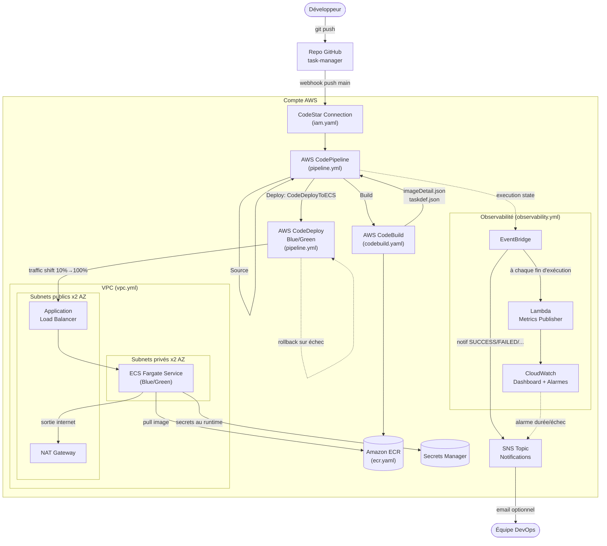
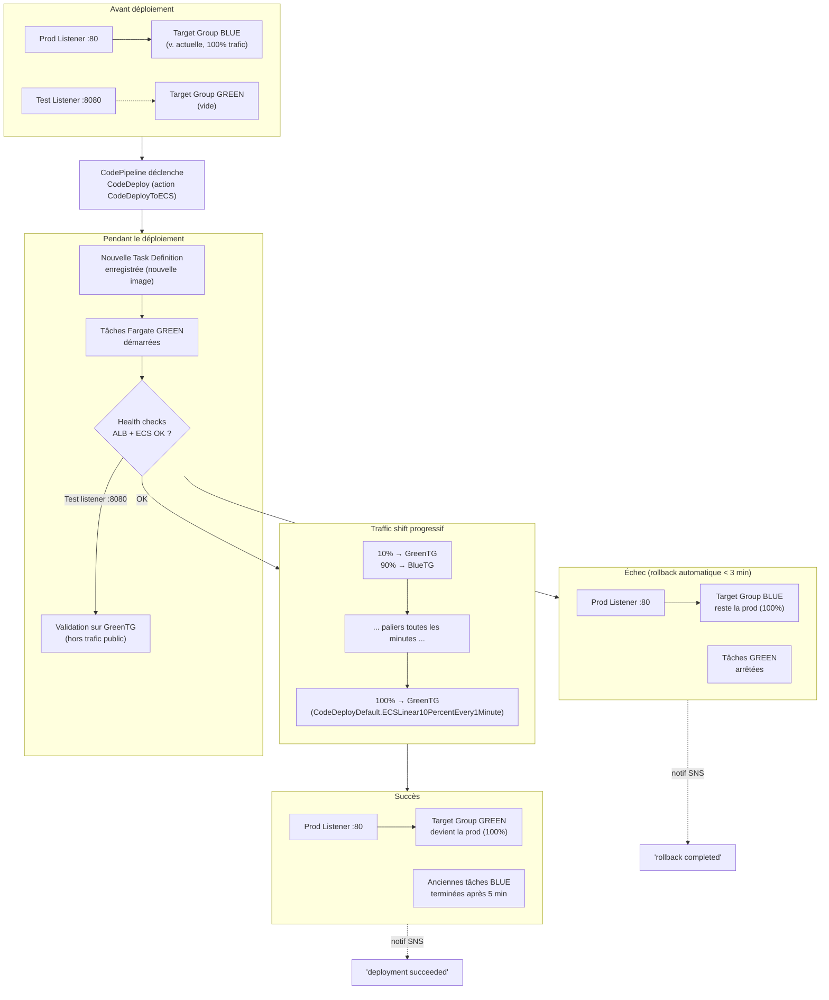

# Pipeline CI/CD complet avec AWS CodePipeline et ECS Fargate

Pipeline CI/CD de bout en bout pour une application web conteneurisée
(**Node.js / Express**), déployée sur AWS avec **CodePipeline**, **CodeBuild**,
**ECR**, **CodeDeploy Blue/Green** et **ECS Fargate**. L'infrastructure est
décrite en 12 stacks CloudFormation reliées par exports/imports.

Un push sur `main` déclenche : build → tests → SAST → image Docker → scan de
vulnérabilités → approbation manuelle → déploiement Blue/Green sans coupure.

**Deux documents, deux usages :**

| Document | Pour quoi |
|---|---|
| **Ce README** | Comprendre le projet : architecture, application, outils |
| **[`guide-local.md`](guide-local.md)** | Tout tester en local, sans AWS et sans coût |
| **[`guide-aws.md`](guide-aws.md)** | Déployer et tester sur un vrai compte AWS |

---

## Démarrage rapide

### L'application, en local

```bash
cd task-manager
npm ci
npm test              # 63 tests, couverture ~99 % (échoue sous 80 %)
npm start             # http://localhost:3000
```

### Les outils Python, sans AWS ni clé d'API

```bash
pip install -r requirements-modules.txt

python -m orchestrator graph          # ordre de déploiement des 12 stacks
python -m optimizer analyze --sample  # analyse de rightsizing (données d'exemple)
streamlit run dashboard/app.py        # tableau de bord

python -m pytest orchestrator/ optimizer/ explainer/ dashboard/   # 67 tests
```

### Aller plus loin

- **[`guide-local.md`](guide-local.md)** — 8 vérifications en local (tests,
  image Docker, templates, modules, garde-fous, SAST), sans AWS ni coût.
- **[`guide-aws.md`](guide-aws.md)** — déploiement réel en 20 étapes, du
  verrouillage de la région jusqu'à la suppression complète.

---

## État actuel

*(Mis à jour le 2026-09-07. Conformité exigence par exigence dans
[`CONFORMITE_CDC.md`](CONFORMITE_CDC.md), preuves du run réel dans
[`INTERNSHIP_REPORT.md`](INTERNSHIP_REPORT.md), annexe J.)*

### Fait

- **Un run end-to-end réel a réussi sur AWS** : push GitHub → CodePipeline →
  CodeBuild (SAST, tests, image) → ECR → scan Inspector v2 → approbation
  manuelle → CodeDeploy Blue/Green → ECS Fargate, avec bascule de 100 % du
  trafic vers GREEN derrière l'ALB. Déroulé dans
  [`INTERNSHIP_REPORT.md`](INTERNSHIP_REPORT.md) (annexe J), 17 captures dans
  [`preuves/`](preuves/).
- **Infrastructure** : 12 stacks CloudFormation, `cfn-lint` propre, graphe
  d'exports/imports cohérent de bout en bout.
- **Application** (`task-manager/`) : liste, ajout, édition, bascule,
  suppression, recherche plein texte, filtres (statut/priorité), tri, échéances
  avec indicateur de retard. 63 tests (Jest + Supertest), couverture ~99 %,
  seuil bloquant à 80 %.
- **Quality gates** : SAST Semgrep bloquant sur `main` et sur PR (vérifié dans
  les deux sens : bloque un vrai finding, passe une fois corrigé), image Docker
  multi-stage à **50,2 Mo** (cible < 200 Mo), scan ECR/Inspector v2 exploité
  (bloque sur CRITICAL, notifie sur HIGH).
- **Stage `ManualApproval`** conditionnel (`EnableManualApproval`), vu en
  fonctionnement pendant le run réel.
- **Secrets** injectés via Secrets Manager (jamais en clair) ; **autoscaling**
  Target Tracking CPU à 70 % (2 à 6 tâches) ; **observabilité** : dashboard
  CloudWatch, logs à rétention 30 jours, alarme si le pipeline dépasse 15 min.

### Connu et non bloquant

- Traffic shift en rampe linéaire (`ECSLinear10PercentEvery1Minute`) plutôt
  qu'en paliers exacts 10 % → 50 % → 100 % : AWS n'offre pas de configuration
  CodeDeploy ECS prédéfinie avec ces paliers, c'est l'équivalent le plus proche.
- Une image `:latest` doit être poussée manuellement **une fois** avant le
  premier déploiement du service ECS (bootstrap — étape 6 de [`guide-aws.md`](guide-aws.md)).
- Le test de rollback automatique (étape 18 de [`guide-aws.md`](guide-aws.md)) n'a pas encore été exécuté
  sur le compte réel.
- Pas de notification distincte « rollback completed ».
- Protection de branche GitHub à activer dans les paramètres du dépôt.
- Le store de tâches est en mémoire (choix assumé) : les secrets DB sont
  injectés dans le conteneur mais non utilisés, faute de base réelle branchée.

---

## Architecture

### Vue d'ensemble



**Lecture** : le code applicatif vit dans un dépôt GitHub dédié (pointé par
`FullRepositoryId`/`GitHubRepoUrl`). Un push sur `main` déclenche
CodePipeline via la connexion CodeStar ; CodeBuild construit, teste et
scanne l'image avant de la pousser sur ECR ; CodeDeploy pilote ensuite un
déploiement Blue/Green sans interruption vers ECS Fargate, derrière un ALB
dans les subnets publics. Toute la couche observabilité (EventBridge →
SNS/Lambda → CloudWatch) est indépendante du chemin de déploiement lui-même
— elle observe, elle ne bloque jamais un déploiement.

### Les 12 stacks, dans l'ordre de déploiement

| # | Stack | Rôle |
|---|---|---|
| 1 | [`vpc.yml`](infrastructure/cloudformation/vpc.yml) | Réseau : VPC, subnets publics/privés, NAT Gateway(s), VPC Endpoint S3 |
| 2 | [`secrets-manager.yaml`](infrastructure/cloudformation/secrets-manager.yaml) | Secrets applicatifs (credentials DB, clé d'API) générés par AWS |
| 3 | [`ecr.yaml`](infrastructure/cloudformation/ecr.yaml) | Registre Docker privé (scan on push, lifecycle policy) |
| 4 | [`codebuild.yaml`](infrastructure/cloudformation/codebuild.yaml) | Projet CodeBuild (build, tests, SAST, push ECR) |
| 5 | [`iam.yaml`](infrastructure/cloudformation/iam.yaml) | Rôles IAM du pipeline + connexion GitHub (CodeStar Connections) |
| 6 | [`ecs-cluster.yaml`](infrastructure/cloudformation/ecs-cluster.yaml) | Cluster ECS Fargate (Container Insights activé) |
| 7 | [`alb.yaml`](infrastructure/cloudformation/alb.yaml) | ALB + 2 target groups Blue/Green + listeners prod (80) et test (8080) |
| 8 | [`ecs-task-definition.yaml`](infrastructure/cloudformation/ecs-task-definition.yaml) | Task Definition (bootstrap) + log group applicatif + injection des secrets |
| 9 | [`ecs-service.yaml`](infrastructure/cloudformation/ecs-service.yaml) | Service ECS Fargate (`DeploymentController: CODE_DEPLOY`) |
| 10 | [`pipeline.yml`](infrastructure/cloudformation/pipeline.yml) | CodePipeline + CodeDeploy Blue/Green + bucket d'artefacts + notifications SNS |
| 11 | [`ecs-autoscaling.yaml`](infrastructure/cloudformation/ecs-autoscaling.yaml) | Auto scaling du nombre de tâches sur le CPU (cible 70 %) + 2 alarmes |
| 12 | [`observability.yml`](infrastructure/cloudformation/observability.yml) | Dashboard CloudWatch + alarmes + métriques custom |

> **Ordre non négociable sur quatre points.**
> 1. `codebuild.yaml` doit précéder `iam.yaml` : `iam.yaml` importe l'ARN du
>    projet CodeBuild (`codebuild:StartBuild`/`BatchGetBuilds` pour le rôle
>    CodePipeline). Inverser l'ordre produit concrètement
>    `No export named taskmanager-dev-codebuild-arn found` — erreur réellement
>    rencontrée avec une version antérieure de ce tableau, qui plaçait
>    `iam.yaml` en 2ᵉ position.
> 2. `secrets-manager.yaml` doit précéder `codebuild.yaml` (qui importe les ARN
>    des secrets pour les injecter dans `taskdef.json`) et
>    `ecs-task-definition.yaml` (qui les importe pour son bloc `Secrets`). Dès
>    qu'une task definition déclare des secrets, ECS refuse de démarrer la tâche
>    s'il ne peut pas les lire : cette stack n'est donc pas optionnelle.
> 3. `ecs-autoscaling.yaml` doit venir après `ecs-service.yaml` (son
>    `ScalableTarget` s'attache à un service qui doit exister) **et** après
>    `pipeline.yml` (ses alarmes notifient le topic SNS créé là-bas).
> 4. Une fois `ecs-autoscaling.yaml` déployée, le `DesiredCount` de
>    `ecs-service.yaml` n'est plus qu'une valeur initiale : c'est Application
>    Auto Scaling qui en devient propriétaire. Pour changer durablement le
>    nombre de tâches, ajuster `MinCapacity`/`MaxCapacity`.

### Déploiement Blue/Green (CodeDeploy + ECS)



**Lecture** : le listener de test (port 8080, `TestListener` dans
`pipeline.yml`) permet de valider la version Green avant de lui envoyer du
vrai trafic public — jamais exposé aux utilisateurs finaux en usage normal.
`AutoRollbackConfiguration` (Événement `DEPLOYMENT_FAILURE`) déclenche le
rollback automatiquement dès qu'un health check échoue pendant le shift,
sans action manuelle (critère US-03 du cahier des charges).

---

## Application — `task-manager/`

Seule application du dépôt. Il n'y a **pas** de manifeste Node à la racine.

| Fichier | Rôle |
|---|---|
| [`src/app.js`](task-manager/src/app.js) | Routes Express : `/` (UI HTML, recherche/filtres/tri en query string), `/add`, `/edit/:id`, `/toggle/:id`, `/delete/:id`, `/api/tasks`, `/health`, `/version` |
| [`src/tasks.js`](task-manager/src/tasks.js) | Store des tâches, en mémoire — CRUD, filtrage, tri |
| [`src/views.js`](task-manager/src/views.js) | Rendu HTML sans moteur de template (zéro dépendance ajoutée) |
| [`tests/`](task-manager/tests/) | 63 tests Jest + Supertest — couverture ~99 %, seuil bloquant 80 % |
| [`Dockerfile`](task-manager/Dockerfile) | Multi-stage, utilisateur non-root, `HEALTHCHECK` — **50,2 Mo** |
| [`buildspec.yml`](task-manager/buildspec.yml) | Phases CodeBuild : install → SAST → build → tests → push ECR |

`/health` est utilisé par **trois** mécanismes — le `HEALTHCHECK` du Dockerfile,
le health check du conteneur ECS, et les target groups Blue/Green de l'ALB dont
dépend le rollback automatique. Ne jamais le supprimer ni le faire dépendre de
l'état applicatif.

`/version` renvoie le SHA du commit embarqué à la construction de l'image :
c'est ce qui rend la bascule Blue/Green vérifiable de l'extérieur.

Les mêmes quality gates tournent dans
[`.github/workflows/ci.yml`](.github/workflows/ci.yml) (avant merge) et dans
`task-manager/buildspec.yml` (dans CodeBuild).

---

## Outils locaux (Python)

Quatre modules qui s'ajoutent au pipeline **sans rien y remplacer**. Ils tournent
en local ; le pipeline AWS ne dépend d'aucun d'eux. Tous les tests s'exécutent
hors ligne, sans AWS ni clé d'API.

```bash
pip install -r requirements-modules.txt
```

### `orchestrator/` — déploiement par vagues

Déduit l'ordre de déploiement en analysant les templates de
`infrastructure/cloudformation/`, puis déploie en parallèle ce qui peut l'être.
Résultat : **22 dépendances, 7 vagues** au lieu de 12 étapes séquentielles.

```bash
python -m orchestrator graph            # vagues et dépendances
python -m orchestrator graph --edges    # le motif de chaque dépendance
python -m orchestrator validate         # templates, cycles, paramètres manquants
python -m orchestrator deploy --dry-run # rejoue l'enchaînement, zéro appel AWS
python -m orchestrator deploy --profile <profil> --region eu-west-2
```

Deux types de dépendances sont détectés, et le second est indispensable **dans
ce dépôt** :

| Type | Source | Exemple |
|---|---|---|
| `import` | `Fn::ImportValue` → `Export.Name` | `iam.yaml` importe `taskmanager-dev-codebuild-arn` |
| `parameter` | paramètre alimenté par un export au déploiement | `alb.yaml` reçoit `VpcId` depuis `taskmanager-dev-vpc-id` |

`alb.yaml` et `ecs-service.yaml` ne font **aucun** `Fn::ImportValue` vers le VPC :
ils déclarent `VpcId`/`*SubnetIds` en paramètres, que le runbook résout via
`aws cloudformation list-exports`. Sans ce câblage (déclaré dans
[`orchestrator/stacks.py`](orchestrator/stacks.py)), le graphe placerait `alb` en
vague 1, en parallèle du VPC dont il dépend — et le déploiement échouerait.

Le parsing passe par un vrai loader YAML, pas par `grep` : `codebuild.yaml`,
`vpc.yml` et `pipeline.yml` contiennent le texte `Fn::ImportValue` dans des
**commentaires**, qu'un grep compterait à tort comme des dépendances.

**Variables d'environnement** : `PROJECT_NAME` (`taskmanager`), `ENVIRONMENT`
(`dev`), `AWS_REGION` (`eu-west-2`), `GITHUB_REPO_URL` *(obligatoire)*,
`FULL_REPOSITORY_ID`, `BRANCH_NAME` (`main`), `ALARM_EMAIL`.
`validate` liste ce qui manque avant tout appel AWS.

### `optimizer/` — rightsizing comparatif

Analyse le service ECS et compare une règle maison à **AWS Compute Optimizer**.
Lecture seule : ne modifie jamais l'infrastructure.

```bash
python -m optimizer analyze --sample                    # données d'exemple
python -m optimizer analyze --profile <profil> --window-days 14
python -m optimizer analyze --sample --json             # entrée du module suivant
```

Les deux avis ne portent **pas sur le même levier** — la règle maison ajuste le
*nombre de tâches*, Compute Optimizer la *taille de tâche* (CPU/mémoire). Un
écart n'est donc pas forcément un désaccord, et les économies ne s'additionnent
pas. Le tableau l'affiche explicitement.

La règle est explicite, sans ML : sous un seuil d'utilisation configurable
(40 % par défaut), elle propose le plus petit nombre de tâches qui garde
l'utilisation projetée sous un plafond de sécurité (70 %), sans descendre sous
`MinCapacity`. Si la fenêtre contient trop peu de points, elle refuse de
conclure.

### `explainer/` — explication en langage naturel

Traduit le rapport précédent en explication lisible via l'API Anthropic. Le
modèle **explique** une analyse déjà calculée ; il ne décide rien.

```bash
python -m explainer explain --sample --print-prompt   # voir le prompt, sans clé ni coût
python -m explainer explain --report rapport.json
python -m explainer apply --report rapport.json --apply --profile <profil>
```

`explain` est en lecture seule. `apply` exige le drapeau `--apply` **et** une
confirmation tapée au clavier, et refuse d'agir sur des données d'exemple, sur
une recommandation vide, ou sur une cible à zéro tâche. Seuls `o`/`oui`/`y`/`yes`
valent accord ; une ligne vide, un `Ctrl+C` ou toute autre saisie valent refus.
Aucun chemin de code n'enchaîne analyse → application.

**Variables** : `ANTHROPIC_API_KEY` *(obligatoire pour `explain`)*,
`ANTHROPIC_MODEL` (défaut `claude-opus-5`).

### `dashboard/` — tableau de bord Streamlit

```bash
streamlit run dashboard/app.py     # http://localhost:8501
```

Trois onglets : **Déploiement** (le graphe du module 1 redessiné toutes les
4 s, nœuds colorés par statut réel), **Optimisation** (module 2, seuils
réglables), **Explication** (module 3, avec un bouton d'application isolé
derrière une case à cocher *et* la saisie du mot `APPLIQUER`).

Sur le graphe : trait plein = `Fn::ImportValue`, **pointillés** = dépendance de
câblage paramètre, **orange** = arête menant à une stack en cours, c'est-à-dire
ce qui débloque la suite. Local, sans authentification ni base de données, ne
persiste rien.

---

## Tester sans compte AWS

```bash
# Templates CloudFormation
pip install cfn-lint
cfn-lint infrastructure/cloudformation/*.yaml infrastructure/cloudformation/*.yml

# Application + image Docker
cd task-manager && npm ci && npm test
docker build -t taskmanager:test . && docker run --rm -p 3000:3000 taskmanager:test
curl http://localhost:3000/health        # doit répondre 200

# Outils Python (67 tests, aucun appel réseau)
python -m pytest orchestrator/ optimizer/ explainer/ dashboard/

# Ordre de déploiement, sans rien créer
python -m orchestrator deploy --dry-run
```

Les scripts de [`infrastructure/scripts/`](infrastructure/scripts/) vont plus
loin (LocalStack, rejeu du buildspec via l'agent CodeBuild local) :
`./test7-all-local.sh` les enchaîne tous (~10 min).

> Limite connue : LocalStack en édition gratuite n'émule ni ALB, ni ECS, ni
> CodeDeploy, ni CodePipeline, ni CodeBuild, ni CodeStar Connections. Ces
> services ne sont validables que sur un vrai compte.

---

## Structure du dépôt

```
├── README.md                    ← ce fichier
├── guide-local.md               ← tout tester en local, sans AWS
├── guide-aws.md                 ← déploiement AWS, étape par étape
├── INTERNSHIP_REPORT.md         ← mémoire complet (annexe J = preuve du run)
├── CONFORMITE_CDC.md            ← conformité au cahier des charges
├── preuves/                     ← 17 captures du run réel
├── task-manager/                ← l'application (Node.js/Express)
├── infrastructure/
│   ├── cloudformation/          ← les 12 stacks
│   └── scripts/                 ← tests locaux (cfn-lint, LocalStack)
├── orchestrator/                ← déploiement par vagues
├── optimizer/                   ← rightsizing comparatif
├── explainer/                   ← explication LLM
├── dashboard/                   ← tableau de bord Streamlit
└── .github/workflows/ci.yml     ← quality gates avant merge
```

---

## Points de vigilance

- **L'ordre de déploiement fait autorité via `python -m orchestrator graph`**,
  pas via un ordre écrit à la main : il est dérivé des templates et ne peut pas
  dériver. `iam.yaml` importe `…-codebuild-arn`, donc CodeBuild précède IAM.
- **Coûts** : les postes dominants sont la NAT Gateway (~0,05 $/h) et l'ALB
  (~0,033 $/h), pas Fargate. Supprimer les stacks après chaque test (étape 19 de
  [`guide-aws.md`](guide-aws.md)).
- **Teardown** : la suppression de la stack VPC échoue tant que GuardDuty y
  laisse un VPC endpoint et un security group auto-créés — les supprimer
  d'abord (détaillé à l'étape 19 de [`guide-aws.md`](guide-aws.md)).
- **ECR est en `MUTABLE`** volontairement : en `IMMUTABLE`, chaque `docker push`
  échouait à cause d'une interaction connue BuildKit/ECR
  ([moby/buildkit#3776](https://github.com/moby/buildkit/issues/3776)). La
  traçabilité reste assurée, le tag étant toujours le SHA du commit.
