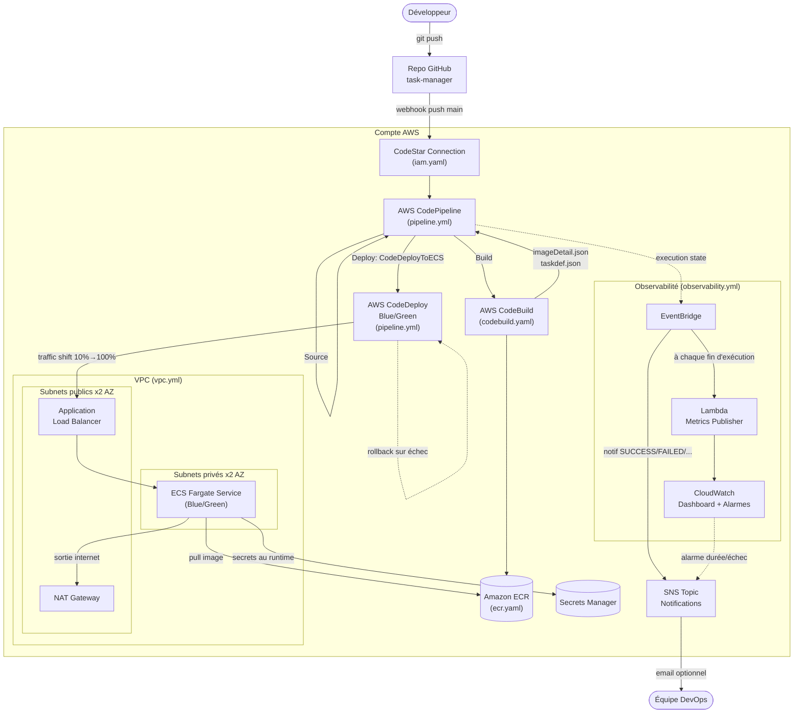
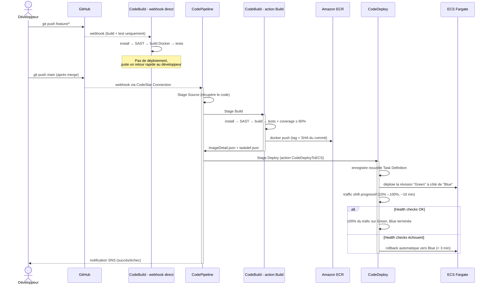
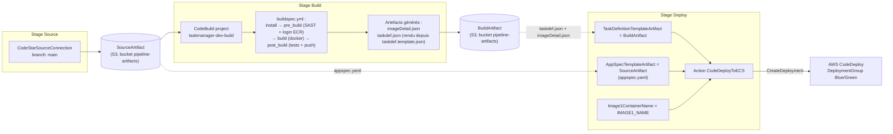
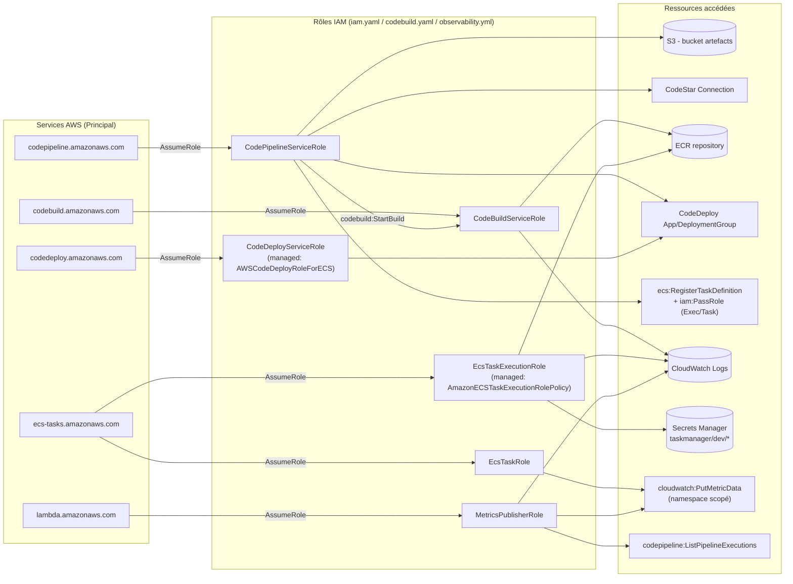
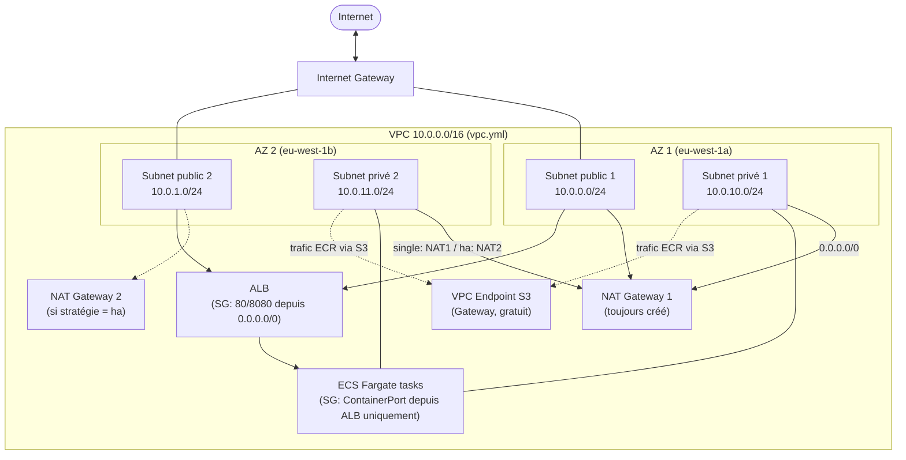
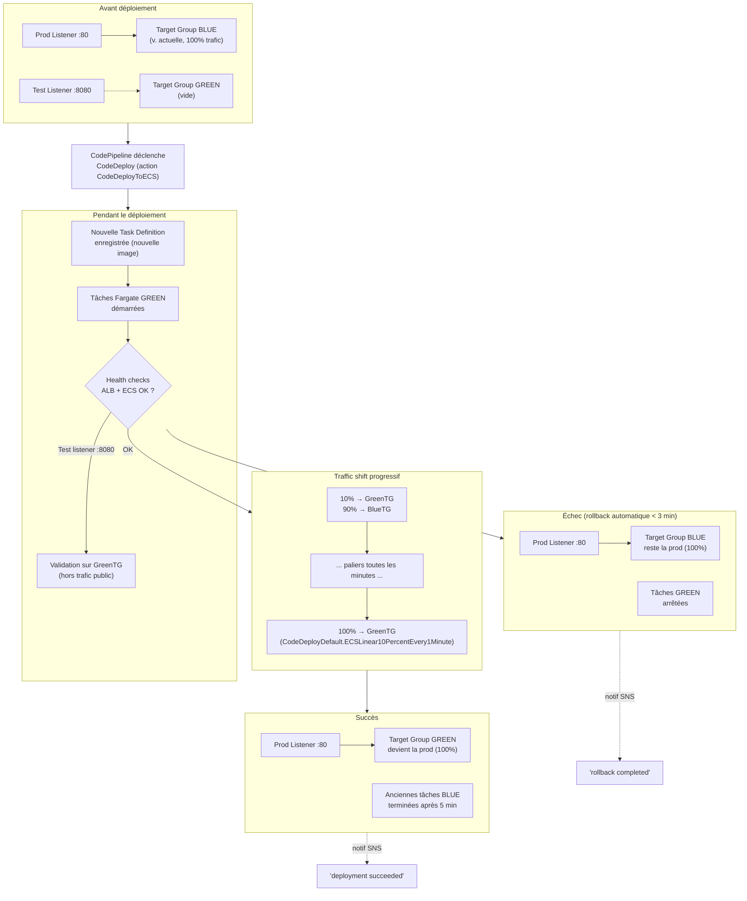

# Infrastructure — Documentation & Diagrammes

Documentation de l'infrastructure AWS du projet, entièrement définie en
CloudFormation (`infrastructure/cloudformation/`) et validée localement sans
accès AWS via LocalStack (`infrastructure/scripts/`, voir
[`scripts/testing-output.md`](scripts/testing-output.md) pour les résultats
détaillés de chaque test).

## Les 6 stacks, dans l'ordre de déploiement

| # | Stack | Rôle |
|---|---|---|
| 1 | [`vpc.yml`](cloudformation/vpc.yml) | Réseau : VPC, subnets publics/privés, NAT Gateway(s), VPC Endpoint S3 |
| 2 | [`ecr.yaml`](cloudformation/ecr.yaml) | Registre Docker privé (scan on push, lifecycle policy) |
| 3 | [`iam.yaml`](cloudformation/iam.yaml) | Rôles IAM du pipeline + connexion GitHub (CodeStar Connections) |
| 4 | [`codebuild.yaml`](cloudformation/codebuild.yaml) | Projet CodeBuild (build, tests, SAST, push ECR) |
| 5 | [`pipeline.yml`](cloudformation/pipeline.yml) | CodePipeline + CodeDeploy Blue/Green + ALB + ECS Fargate |
| 6 | [`observability.yml`](cloudformation/observability.yml) | Dashboard CloudWatch + alarmes + métriques custom |

---

## 1. Architecture AWS globale

**Lecture** : le code applicatif vit dans un dépôt GitHub dédié (pointé par
`FullRepositoryId`/`GitHubRepoUrl`). Un push sur `main` déclenche
CodePipeline via la connexion CodeStar ; CodeBuild construit, teste et
scanne l'image avant de la pousser sur ECR ; CodeDeploy pilote ensuite un
déploiement Blue/Green sans interruption vers ECS Fargate, derrière un ALB
dans les subnets publics. Toute la couche observabilité (EventBridge →
SNS/Lambda → CloudWatch) est indépendante du chemin de déploiement lui-même
— elle observe, elle ne bloque jamais un déploiement.

---

## 2. Flux de déploiement (Deployment flow)

**Lecture** : deux chemins distincts et volontairement découplés. Les
branches `feature/*` (et `develop`) sont validées par le webhook CodeBuild
existant depuis `codebuild.yaml` — rapide, sans toucher à la production.
Seul un push sur `main` déclenche le pipeline complet jusqu'au déploiement
Blue/Green réel.

---

## 3. Pipeline flow (stages CodePipeline détaillés)

**Lecture** : le point clé du câblage est que `taskdef.json` (contenant les
vrais ARN des rôles ECS, rendus au moment du build) vient de l'artefact de
**Build**, alors que `appspec.yaml` (statique, aucune valeur spécifique au
compte) vient directement de l'artefact **Source** — voir
`task-manager/buildspec.yml` et `task-manager/taskdef.template.json`.

---

## 4. Rôles IAM

**Lecture** : chaque rôle est restreint au strict nécessaire (principe du
moindre privilège documenté dans `iam.yaml`) — `RCP` (CodePipeline) ne peut
déclencher QUE le projet CodeBuild et l'application CodeDeploy de CE
projet ; `RExec` (démarrage du conteneur) et `RTask` (code applicatif) sont
volontairement deux rôles distincts, jamais fusionnés. Le seul `*` accepté
sans restriction est `cloudwatch:PutMetricData` (contrainte AWS — l'API
n'accepte pas de restriction par ARN), compensé par une `Condition` sur le
namespace.

---

## 5. Réseau (VPC)

**Lecture** : les tâches ECS Fargate n'ont jamais d'IP publique (subnets
privés) ; leur seule sortie internet passe par le(s) NAT Gateway(s) —
stratégie `single` (1 NAT partagé, ~32 $/mois, par défaut dev/staging) ou
`ha` (1 NAT par AZ, recommandé en prod). Le VPC Endpoint S3 (gratuit)
détourne le trafic vers le backend S3 d'ECR hors du NAT Gateway, pour
réduire les coûts. Le security group des tâches ECS n'autorise QUE l'ALB
en entrée — jamais 0.0.0.0/0 directement vers les conteneurs.

---

## 6. Déploiement Blue/Green (CodeDeploy + ECS)

**Lecture** : le listener de test (port 8080, `TestListener` dans
`pipeline.yml`) permet de valider la version Green avant de lui envoyer du
vrai trafic public — jamais exposé aux utilisateurs finaux en usage normal.
`AutoRollbackConfiguration` (Événement `DEPLOYMENT_FAILURE`) déclenche le
rollback automatiquement dès qu'un health check échoue pendant le shift,
sans action manuelle (critère US-03 du cahier des charges).

---

## Où voir tout ça testé concrètement

Chaque diagramme correspond à un ou plusieurs fichiers CloudFormation
listés en tête de ce document. Les scripts `infrastructure/scripts/test*.sh`
valident chacun une partie de cette architecture sans accès AWS (via
LocalStack) — `./scripts/test7-all-local.sh` les enchaîne tous en une seule
commande (~10 min) avec un rapport récapitulatif. Voir
[`scripts/testing-output.md`](scripts/testing-output.md) pour le détail
complet, résultat par résultat, y compris ce qui n'a pas pu être vérifié
localement (services Pro-only sur LocalStack Community : CodeStar
Connections, CodeBuild, ELBv2, ECS, CodeDeploy, CodePipeline) et pourquoi.

L'avancement global du projet (ce qui est fait, testé, et la prochaine
étape) est suivi dans [`so-far.md`](../so-far.md) à la racine du dépôt.
