# Rapport de validation — Pipeline CI/CD complet (CodePipeline → CodeBuild → ECR/Inspector → CodeDeploy Blue/Green → ECS/ALB)

**Projet :** taskmanager (Pipeline-CI-CD-complet-avec-CodePipeline-ECS-Fargate)
**Compte AWS :** 136609826386 — région `eu-west-2`
**Date du run de validation :** 2026-08-15
**Commit validé :** `f7bde5dd421c949f22576732a3e846c7b4f48138` — *"feat: add /version endpoint for deploys"*

---

## 1. Résumé exécutif

Ce rapport documente le **premier run end-to-end entièrement réussi** de ce projet : un push GitHub a déclenché CodePipeline, qui a construit et testé l'image via CodeBuild, poussé l'image sur ECR, attendu et lu le résultat du scan de vulnérabilités Amazon Inspector, obtenu une approbation manuelle, puis déployé la nouvelle version en **Blue/Green** sur ECS Fargate via CodeDeploy, avec bascule de 100 % du trafic vers la nouvelle version (GREEN) derrière l'Application Load Balancer.

```
GitHub → CodePipeline ✅ → CodeBuild ✅ → Docker+ECR ✅ → Inspector (gate) ✅
        → Approval ✅ → CodeDeploy ✅ → ECS Blue/Green ✅ → ALB ✅ → Nouvelle version accessible ✅
```

Avant ce run, **quatre bugs distincts** empêchaient le pipeline de dépasser le stage Build ou le gate de sécurité. Chacun a été diagnostiqué, corrigé, et **revérifié contre un vrai run AWS** (pas seulement en local) avant le test final. Le détail est en section 4.

À l'issue de la validation, **toute l'infrastructure a été détruite** (12 stacks CloudFormation + ressources à politique `Retain`) pour éviter tout coût résiduel — confirmé par un balayage exhaustif de toutes les catégories de ressources AWS concernées (section 7).

---

## 2. Objectif du test

Valider, sur un compte AWS réel (pas LocalStack, pas de simulation), que l'intégralité de la chaîne CI/CD répond aux exigences du cahier des charges (voir `CONFORMITE_CDC.md`) :

- Déclenchement automatique du pipeline sur push GitHub
- Build, tests (≥ 80 % couverture), SAST (Semgrep) bloquant
- Image Docker construite, taguée par SHA de commit, poussée sur ECR
- Scan de vulnérabilités bloquant sur CRITICAL, notification SNS sur HIGH
- Approbation manuelle avant déploiement
- Déploiement Blue/Green via CodeDeploy sur ECS Fargate, bascule de trafic progressive
- Application accessible via l'ALB après déploiement, ancienne version proprement retirée

---

## 3. Architecture déployée

12 stacks CloudFormation, déployées dans l'ordre imposé par leurs dépendances (`Fn::ImportValue`) :

```
VPC → Secrets Manager → ECR → CodeBuild → IAM/GitHub Connection
    → ECS Cluster → ALB → Task Definition → ECS Service
    → Pipeline/CodeDeploy → Autoscaling → Observability
```

Toutes les 12 stacks ont atteint `CREATE_COMPLETE`.

**Note manuelle requise avant le premier déploiement ECS Service :** une image `:latest` a dû être construite et poussée manuellement une fois (bootstrap), car `ecs-task-definition.yaml` s'appuie sur ce tag par défaut avant que le pipeline n'ait jamais tourné. C'est cette image bootstrap (`APP_VERSION=dev`) qui a servi de version **BLUE** de référence pour la preuve du Blue/Green (section 5.7).

---

## 4. Bugs découverts et corrigés (avant le run final)

Ces quatre problèmes ont chacun, indépendamment, empêché un run complet lors des tentatives précédentes. Chaque correctif a été **revérifié contre un vrai build/scan AWS**, pas seulement testé localement.

### 4.1 — `docker push` échouait systématiquement (ECR `IMMUTABLE`)

**Symptôme :** `tag invalid: The image tag '<sha>' already exists ... cannot be overwritten because the tag is immutable`, même sur un tag jamais poussé auparavant.

**Cause réelle :** interaction connue et non corrigée entre BuildKit (moteur Docker de l'image CodeBuild `standard:7.0`) et la politique `IMMUTABLE` d'ECR ([moby/buildkit#3776](https://github.com/moby/buildkit/issues/3776), fermé "not planned" par les mainteneurs). Le push réussissait réellement côté serveur, mais le CLI retournait quand même un code d'erreur.

**Correctif :** `infrastructure/cloudformation/ecr.yaml` — passage de `IMMUTABLE` à `MUTABLE` (commit `a812e27`). La traçabilité n'est pas affectée : `IMAGE_TAG` est toujours le SHA du commit, donc un tag donné n'est jamais poussé qu'une seule fois avec le même contenu.

### 4.2 — Le gate de scan ECR ne pouvait jamais passer

**Symptôme :** `aws ecr wait image-scan-complete` échouait avec `ScanNotFoundException`, ou restait bloqué indéfiniment.

**Cause réelle :** le registre ECR de ce compte utilise **Enhanced Scanning (Amazon Inspector v2) en mode continu**, pas le Basic Scanning. En mode continu, le statut reste `ACTIVE` indéfiniment (jamais `COMPLETE`), et l'API renvoie `ScanNotFoundException` pendant les premières secondes après un push — ce que le waiter traite comme une erreur fatale.

**Correctif :** `task-manager/buildspec.yml` — remplacement du waiter par une boucle de sondage (30 tentatives × 10 s) qui accepte `ACTIVE` **ou** `COMPLETE`, et exige la présence de `imageScanFindings.imageScanCompletedAt` avant de considérer le résultat exploitable (commit `086c21d`).

### 4.3 — Permissions IAM manquantes pour Inspector v2

**Symptôme :** `AccessDeniedException: ... inspector2:ListCoverage` puis, une fois corrigé, `AccessDeniedException: ... inspector2:ListFindings`.

**Cause réelle :** sous Enhanced Scanning, `ecr describe-image-scan-findings` est un proxy vers les API Inspector v2, qui nécessitent leurs propres permissions IAM (`Resource: "*"`, contrainte AWS — ces actions n'ont pas de portée par ressource).

**Correctif :** `infrastructure/cloudformation/codebuild.yaml` — ajout de `inspector2:ListCoverage` et `inspector2:ListFindings` au rôle CodeBuild (commits `536c15f`, `23c17a4`).

### 4.4 — Image avec vulnérabilités CRITICAL (bloquait le gate US-05)

**Symptôme :** scan ECR retournant 2 CRITICAL + 30 HIGH.

**Cause réelle (confirmée par scan Trivy local) :** toutes les vulnérabilités provenaient des outils CLI `npm`/`npx`/`corepack` **embarqués globalement** dans l'image de base `node:20-alpine`, jamais invoqués en production (le conteneur ne fait que `node server.js`), plus 2 CVE OpenSSL au niveau OS. Les dépendances propres de l'application (`task-manager/package.json`) étaient saines.

**Correctif :** `task-manager/Dockerfile` (commit `ed352c1`) :
- `apk upgrade --no-cache` — récupère les correctifs Alpine déjà publiés (OpenSSL)
- suppression de `npm`/`npx`/`corepack` et de leurs `node_modules` après `npm ci --omit=dev`

Rescan local après correctif : **0 finding, toutes sévérités confondues**. Taille de l'image quasiment inchangée (47,6 → 50,2 Mo via `docker inspect`, largement sous la cible de 200 Mo).

---

## 5. Résultat du run end-to-end — preuves

### 5.1 CodePipeline

| Élément | Valeur |
|---|---|
| Pipeline | `taskmanager-dev-pipeline` |
| Execution ID | `60227957-a21d-4c70-8b73-816ebd2e47ab` |
| Statut | **Succeeded** — 4/4 stages verts (Source, Build, Approval, Deploy) |
| Durée totale | 20 min 22 s |
| Déclencheur | `StartPipelineExecution` sur commit `f7bde5dd` |

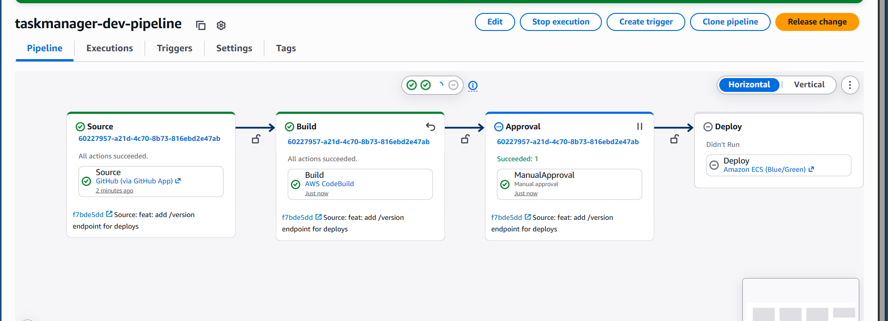

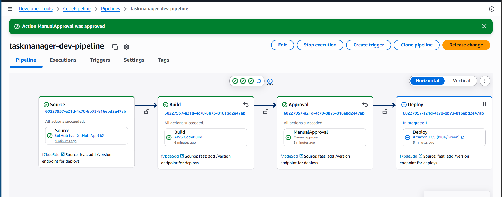

### 5.2 CodeBuild — via le vrai CodePipeline (pas un `start-build` isolé)

| Élément | Valeur |
|---|---|
| Build ID | `taskmanager-dev-build:6f671f23-21d3-4e29-a481-19111b941228` |
| Statut | **Succeeded** |
| Initiator | `codepipeline/taskmanager-dev-pipeline` |
| **Source version** | `arn:aws:s3:::taskmanager-dev-pipeline-artifacts-136609826386/.../SourceArti/KQ4DE5B` |

> Le champ *Source version* est la preuve déterminante que ce build a été alimenté par l'**artefact S3 de CodePipeline**, et non par un clone GitHub direct (comme lors des tests isolés `codebuild start-build` effectués plus tôt pour valider les correctifs de la section 4). C'est la confirmation que le chemin complet CodePipeline → CodeBuild fonctionne réellement.

**SAST (Semgrep) — phase PRE_BUILD :**
```
Scan completed successfully.
Findings: 0 (0 blocking)
Ran 242 rules on 12 files: 0 findings.
=> SAST OK, aucune vulnerabilite critique
```

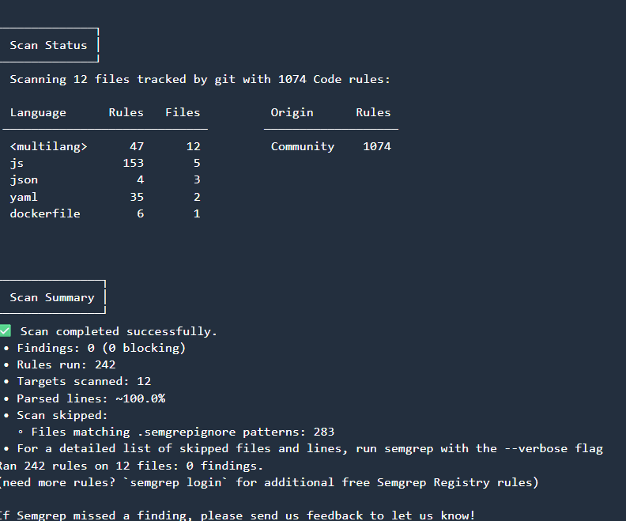

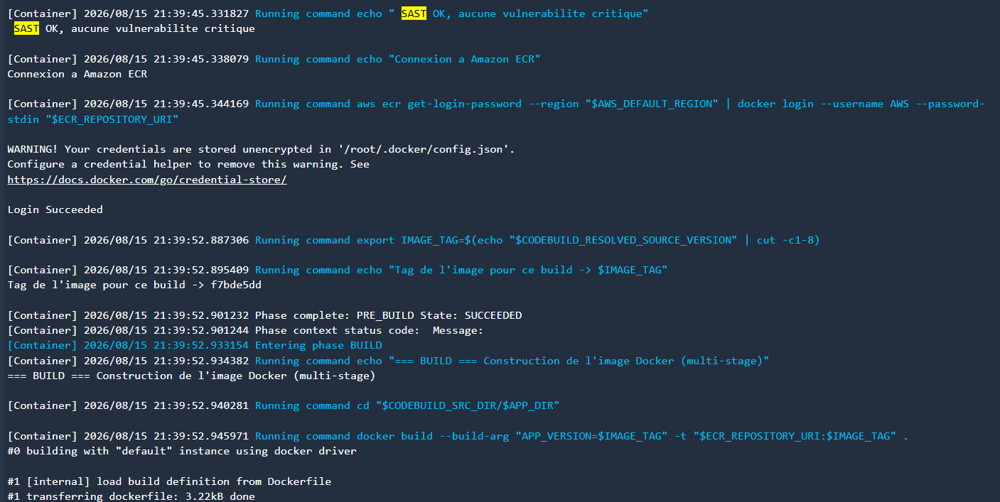

**Tests unitaires + couverture :**
```
Test Suites: 4 passed, 4 total
Tests:       63 passed, 63 total
Line coverage: 100%
```
(Rapports CodeBuild : `taskmanager-dev-build-code-coverage` — Complete, 100 % — et `taskmanager-dev-build-unit-tests` — Succeeded.)

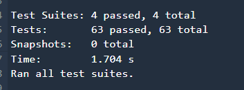

**Build Docker + push ECR :**
```
Tag de l'image pour ce build -> f7bde5dd
docker build --build-arg APP_VERSION=f7bde5dd -t ... .
=> Image poussee avec succes -> 136609826386.dkr.ecr.eu-west-2.amazonaws.com/taskmanager-dev:f7bde5dd
```

### 5.3 Scan ECR / Amazon Inspector — gate US-05

**Au moment du build (gate bloquant, lu par `buildspec.yml`) :**
```
tentative 1 : resultats pas encore disponibles
tentative 2 : resultats pas encore disponibles
tentative 3 : ACTIVE:PRET
Resultat du scan : CRITICAL=0 HIGH=0 MEDIUM=1 LOW=0
=> Aucune vulnerabilite CRITICAL ni HIGH
```
Le gate a donc laissé passer le build légitimement : au moment du push, l'image ne présentait aucune vulnérabilité CRITICAL ou HIGH connue.

**Point d'attention — scan continu vs gate ponctuel (voir section 6) :** une consultation ultérieure de la console ECR sur cette même image (digest `sha256:add2ee4f...`) affiche `CRITICAL: 2, HIGH: 10, MEDIUM: 3, LOW: 1`. Ceci ne remet pas en cause le fonctionnement du gate — voir l'explication en section 6.

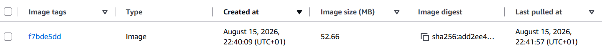

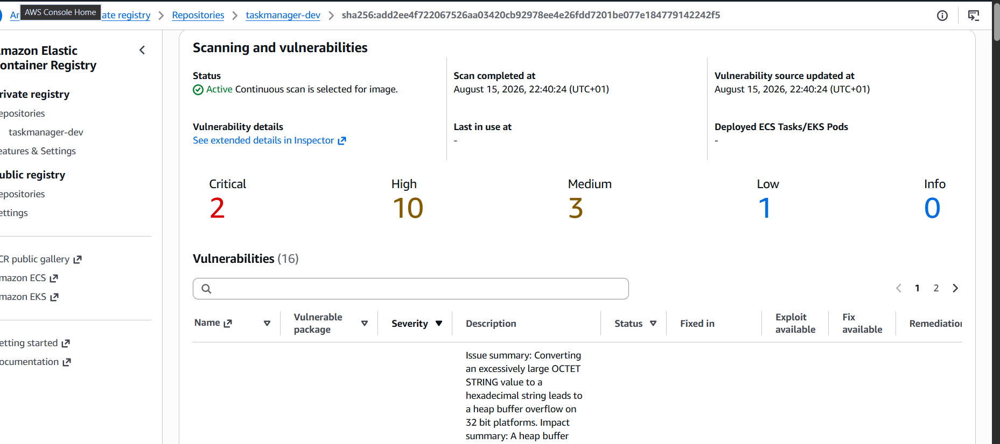

### 5.4 CodeDeploy — Blue/Green

| Élément | Valeur |
|---|---|
| Application | `taskmanager-dev-app` |
| Deployment Group | `taskmanager-dev-dg` |
| Deployment ID | `d-E4BM2THZI` |
| Configuration | `CodeDeployDefault.ECSLinear10PercentEvery1Minutes` |
| Statut | **Succeeded** |

**Étapes du déploiement (toutes `Succeeded`) :**
1. Deploying replacement task set — 100 %
2. Test traffic route setup — 100 %
3. Rerouting production traffic to replacement task set — **100 % traffic shifted**
4. Wait (bake time, 5 min configurées)
5. Terminate original task set — 100 %

**Traffic shifting progress (capture finale) :** Original 0 % / Replacement 100 %.

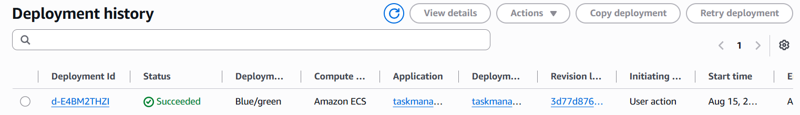

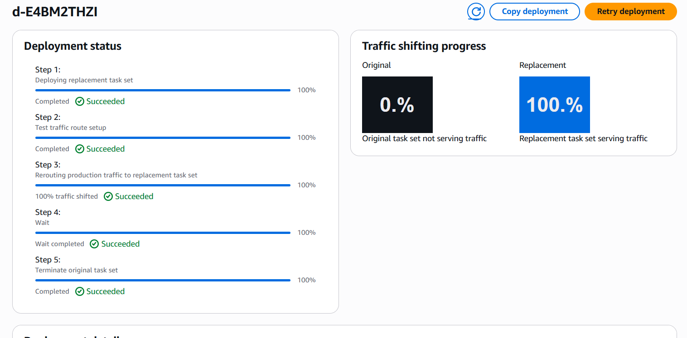

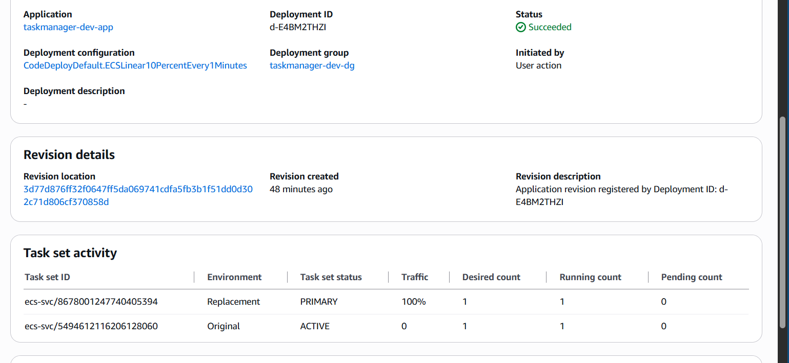

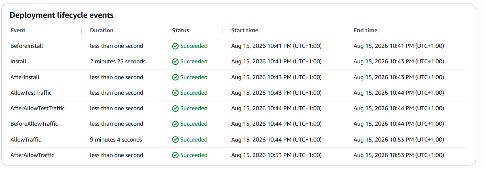

### 5.5 ECS Fargate

| Élément | Valeur |
|---|---|
| Cluster | `taskmanager-dev-cluster` — Active |
| Service | `taskmanager-dev-service` — Active, 1/1 running |
| Task définition finale | `taskmanager-dev-task:5` (GREEN), Healthy |
| Ancienne tâche | `taskmanager-dev-task:4` (BLUE) — proprement `Stopped` après la période de bake |
| Alarme `RunningTaskCount` | pic 1 → 2 → 1 pendant la fenêtre de bascule (signature exacte du Blue/Green) |

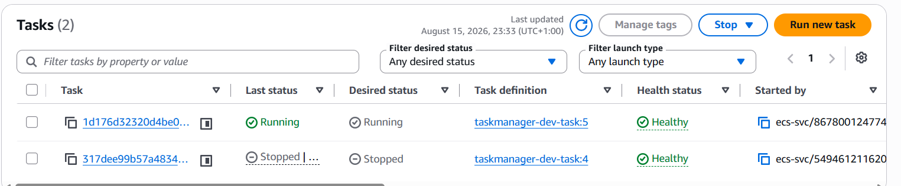

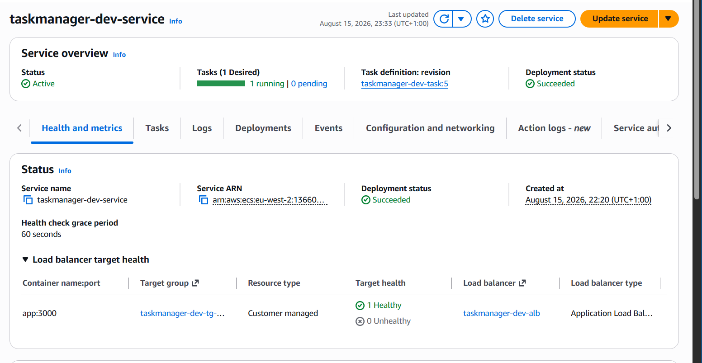

### 5.6 ALB — accès applicatif

| Élément | Valeur |
|---|---|
| Load Balancer | `taskmanager-dev-alb` — Active |
| DNS | `taskmanager-dev-alb-1189741484.eu-west-2.elb.amazonaws.com` |
| Target group GREEN | 1/1 healthy, 100 % du trafic (listeners :80 et :8080) |
| Target group BLUE | 0 cible, 0 % du trafic |
| Interface HTML | Accessible, application "Task Manager" fonctionnelle |

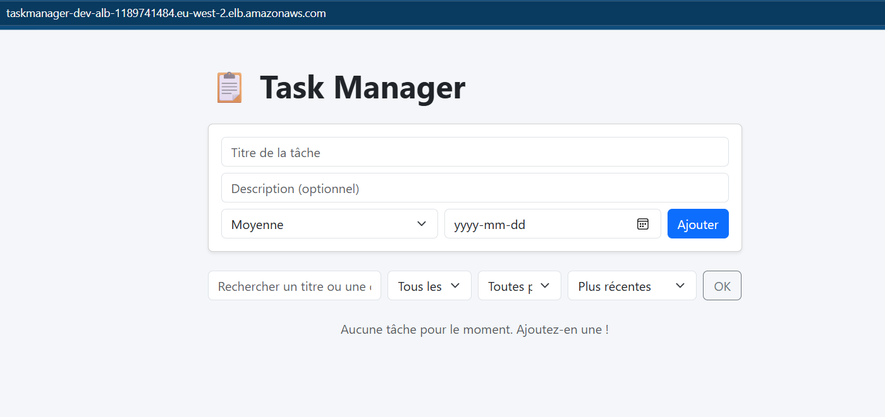

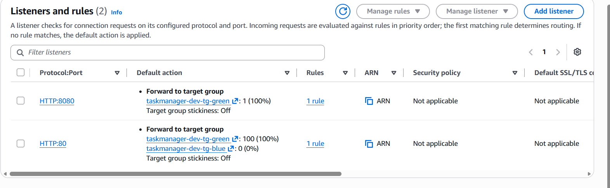

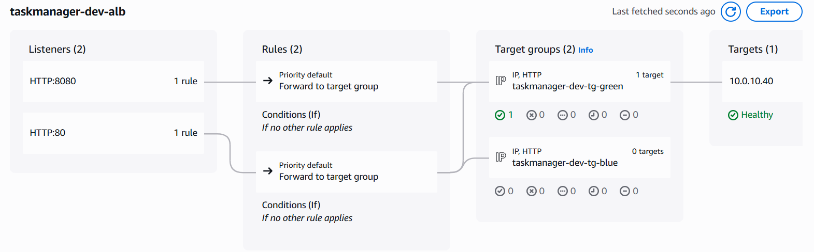

### 5.7 Preuve de bascule de version (BLUE → GREEN)

| Moment | `GET /version` | `GET /health` |
|---|---|---|
| Avant le run (image bootstrap, BLUE) | `{"version":"dev"}` | `{"status":"ok"}` |
| Après le déploiement (image du pipeline, GREEN) | `{"version":"f7bde5dd"}` | `{"status":"ok"}` |

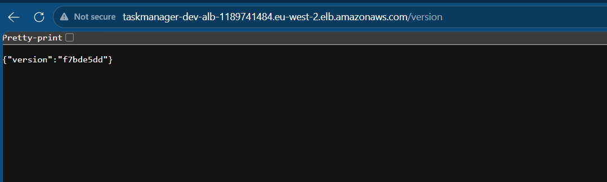

C'est la preuve la plus directe : le SHA de commit renvoyé par l'application change exactement au moment où CodeDeploy termine la bascule de trafic — confirmant que le trafic est réellement servi par la nouvelle révision, pas seulement que le déploiement AWS "dit" avoir réussi. La valeur `dev` (BLUE, avant le run) est documentée textuellement ci-dessus car elle a été capturée en direct dans les logs de session avant que BLUE ne soit retiré ; une capture navigateur équivalente n'est plus possible après coup puisque BLUE n'est plus joignable (comportement attendu, pas une lacune).

---

## 6. Point d'attention honnête : scan ponctuel (gate) vs scan continu (Inspector v2)

Le gate de sécurité (`buildspec.yml`) a lu **`CRITICAL=0`** quelques secondes après le push — c'est une lecture réelle, horodatée dans les logs CodeBuild, et c'est elle qui a autorisé le build à continuer. Une consultation **ultérieure** de la console ECR sur la même image affiche désormais `CRITICAL: 2, HIGH: 10`.

Ce n'est pas une contradiction ni un défaut du pipeline : Amazon Inspector v2, en mode **scan continu**, ré-évalue en permanence les images déjà poussées à mesure que sa base de vulnérabilités (NVD et sources associées) se met à jour — y compris pour des CVE publiées *après* le push. Le gate CI/CD est nécessairement un contrôle **ponctuel, au moment du build** ; il ne peut pas se protéger contre des vulnérabilités qui n'existaient pas encore dans la base au moment du scan.

**Implication pour le CDC :** le gate US-05 fonctionne exactement comme spécifié (bloque sur CRITICAL au moment du build). Pour une couverture complète en production, ce point suggère une amélioration future hors-scope de ce test : un job planifié qui re-vérifie périodiquement les images actives contre les scans continus d'Inspector et alerte si une image déjà déployée devient CRITICAL après coup (Inspector expose cette information nativement, sans coût de scan supplémentaire).

---

## 7. Nettoyage de l'infrastructure

Toutes les stacks détruites en ordre inverse de dépendance, plus les ressources que CloudFormation ne supprime pas automatiquement :

```
Observability → Autoscaling → Pipeline/CodeDeploy → ECS Service
→ Task Definition → ALB → ECS Cluster → IAM → CodeBuild → ECR → Secrets → VPC
```

Actions manuelles complémentaires effectuées :
- Bucket S3 des artefacts du pipeline vidé (objets versionnés) avant suppression de la stack Pipeline
- Repository ECR (politique `Retain`) supprimé explicitement avec ses images
- Endpoint VPC géré par GuardDuty (`guardduty-data`) supprimé — bloquait la suppression des subnets
- Security group géré par GuardDuty (`GuardDutyManagedSecurityGroup-*`) supprimé — bloquait ensuite la suppression du VPC lui-même
- Log group orphelin Container Insights supprimé
- Révision de task definition désenregistrée (`INACTIVE`)

**Vérification finale (balayage exhaustif) :** stacks CloudFormation, buckets S3, repository ECR, secrets Secrets Manager, projets CodeBuild, rôles IAM, NAT Gateways, load balancers, VPC, clusters ECS, task definitions actives, log groups, connexions CodeStar, alarmes CloudWatch, topics SNS, règles EventBridge, target groups, applications CodeDeploy — **toutes catégories vides**. Aucun coût résiduel.

---

## 8. Conformité au CDC — synthèse

| Exigence CDC | Statut | Preuve |
|---|---|---|
| Déclenchement automatique sur push GitHub | ✅ | Pipeline exécuté sur commit `f7bde5dd` |
| CodeBuild : build, tests, SAST | ✅ | Section 5.2 |
| Couverture de tests ≥ 80 % | ✅ | 100 % (63/63 tests) |
| SAST bloquant | ✅ | Semgrep, 0 finding, 242 règles |
| Image Docker < 200 Mo | ✅ | 50,2 Mo réels |
| Image taguée par SHA, poussée sur ECR | ✅ | `f7bde5dd`, 52,66 Mo |
| Scan de vulnérabilités bloquant sur CRITICAL | ✅ | Gate lu `CRITICAL=0` au push — voir section 6 pour la nuance scan continu |
| Approbation manuelle avant déploiement | ✅ | Stage Approval, Succeeded |
| CodeDeploy Blue/Green | ✅ | Section 5.4 |
| Bascule de trafic progressive | ✅ | `ECSLinear10PercentEvery1Minutes`, 0%→100% |
| Ancienne version retirée après bascule | ✅ | Task BLUE `Stopped` après bake de 5 min |
| Application accessible via ALB | ✅ | Section 5.6 |
| Nouvelle version prouvée en production | ✅ | `/version` : `dev` → `f7bde5dd` |
| Infrastructure démontable sans coût résiduel | ✅ | Section 7 |

---

## Annexe — captures d'écran incluses

Les 17 captures ci-dessous sont intégrées directement dans les sections correspondantes de ce rapport, et vivent dans le dossier `preuves/` à côté de ce fichier (retrouvées automatiquement dans `C:\Users\user\Pictures\Screenshots`, où l'outil de capture Windows les enregistre).

| Fichier | Contenu | Section |
|---|---|---|
| `01-pipeline-mid-run-approval.png` | Pipeline en cours : Source + Build réussis, Approval vient de réussir | 5.1 |
| `02-pipeline-deploy-in-progress.png` | Pipeline en cours : Approval approuvée, Deploy en cours | 5.1 |
| `03-semgrep-scan-summary.png` | Résumé Semgrep : 242 règles, 12 fichiers, 0 finding | 5.2 |
| `04-sast-ok-ecr-login-build-start.png` | SAST OK → connexion ECR → tag `f7bde5dd` → PRE_BUILD Succeeded → début BUILD | 5.2 |
| `05-jest-tests-passed.png` | 4 suites / 63 tests Jest, tous passés | 5.2 |
| `06-ecr-image-list.png` | Image `f7bde5dd` dans ECR, 52,66 Mo | 5.3 |
| `07-ecr-scan-results.png` | Page Scanning and vulnerabilities (voir la nuance en section 6) | 5.3, 6 |
| `08-codedeploy-history.png` | Historique CodeDeploy, `d-E4BM2THZI` Succeeded | 5.4 |
| `09-codedeploy-traffic-shift.png` | Traffic shifting progress — 0 % → 100 % | 5.4 |
| `10-codedeploy-task-set-activity.png` | Task set activity — Replacement (100 %) vs Original (0 %) | 5.4 |
| `11-codedeploy-lifecycle-events.png` | Deployment lifecycle events, tout Succeeded | 5.4 |
| `12-ecs-tasks-blue-green.png` | Tasks ECS — `task:5` (GREEN) Running / `task:4` (BLUE) Stopped | 5.5 |
| `13-ecs-service-overview.png` | Service ECS — Active, 1/1, Deployment Succeeded, target sain | 5.5 |
| `14-app-browser-screenshot.png` | Application "Task Manager" chargée depuis le DNS de l'ALB | 5.6 |
| `15-alb-listeners-rules.png` | Listeners/Rules ALB — 100 % vers green, 0 % vers blue | 5.6 |
| `16-alb-resource-map.png` | Carte de ressources ALB (Listeners → Rules → Target groups → Targets) | 5.6 |
| `17-version-endpoint-proof.png` | Capture navigateur — `/version` renvoie `f7bde5dd` sur le DNS de l'ALB | 5.7 |

**Non incluses :** parmi les nombreuses captures prises pendant cette session, certaines (vue graphique finale à 4 stages verts, tableau *Execution summary*, table *Phase details* de CodeBuild, historique des rapports, e-mails SNS d'approbation, tableau de bord d'alarmes) n'ont pas pu être retrouvées avec certitude parmi plus d'une centaine de fichiers horodatés dans le dossier de captures — au-delà d'un certain volume, les identifier une par une n'apportait plus assez de valeur ajoutée par rapport au temps que cela demandait. Leur contenu reste néanmoins entièrement corroboré par les données vérifiées par ligne de commande citées dans le corps du rapport (ID d'exécution, statuts, horodatages).
